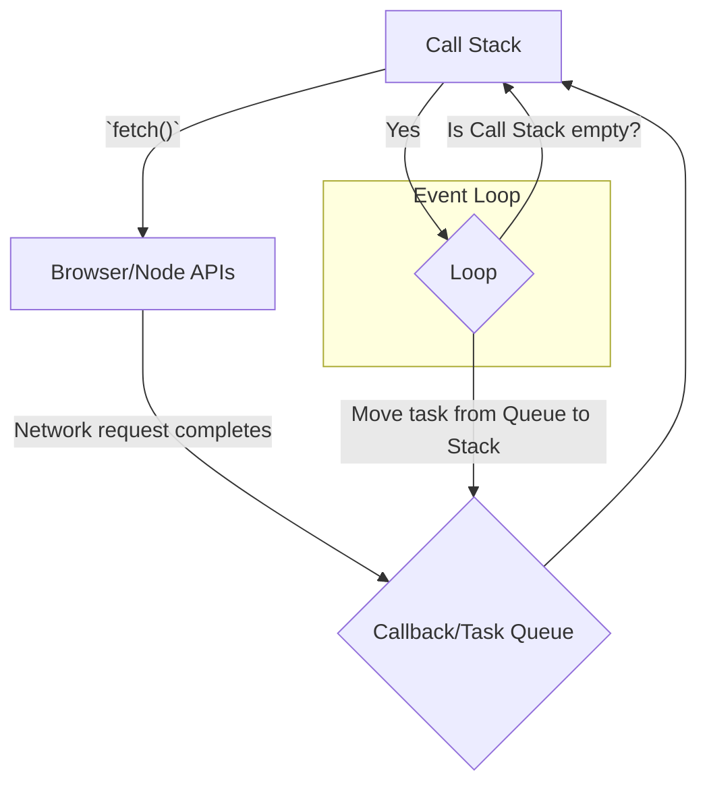

# Asynchronous JavaScript Deep Dive

JavaScript is a single-threaded language, meaning it can only execute one piece of code at a time. However, many operations (like fetching data from a network, reading a file, or waiting for a timer) can take a long time. If these were synchronous, the entire application would freeze until they completed.

Asynchronous programming is the solution. It allows the program to start a long-running task and continue to do other things, handling the result of the first task when it's ready. This is achieved through a combination of the **Event Loop**, **Callbacks**, **Promises**, and **`async/await`**.

## The Event Loop (Recap)

The JavaScript runtime uses an event loop to handle asynchronous operations without blocking the main thread.


1.  Long-running operations are handed off to browser/Node.js APIs.
2.  The main JavaScript thread continues running.
3.  When the operation finishes, its handler function is placed in the Task Queue.
4.  The Event Loop continuously checks if the Call Stack is empty. If it is, it moves the first task from the queue to the stack to be executed.

## 1. Callbacks (The Old Way)

The original way to handle async operations was with callback functions. You would pass a function as an argument to another function, and that function would be "called back" when the operation was complete.

```javascript
function fetchData(url, callback) {
    console.log("Starting fetch...");
    setTimeout(() => { // Simulate a network request
        const data = { message: "Data received!" };
        callback(null, data); // 'null' for the error argument
    }, 1500);
}

fetchData('/api/data', (error, data) => {
    if (error) {
        console.error("Error:", error);
    } else {
        console.log("Success:", data);
    }
});
```
**Problem**: For sequential asynchronous operations, this leads to deeply nested callbacks, known as **"Callback Hell"** or the "Pyramid of Doom," which is hard to read and maintain.

## 2. Promises (The Foundation)

Promises provide a cleaner way to handle async operations. A `Promise` is an object representing the eventual completion or failure of an asynchronous operation.

A promise has `.then()` for success cases and `.catch()` for failure cases. The key feature is that they are **chainable**.

```javascript
function fetchDataPromise(url) {
    return new Promise((resolve, reject) => {
        console.log("Starting fetch...");
        setTimeout(() => {
            if (Math.random() > 0.2) {
                resolve({ message: "Data received!" });
            } else {
                reject(new Error("Network failed!"));
            }
        }, 1500);
    });
}

fetchDataPromise('/api/data')
    .then(data => {
        console.log("First .then:", data);
        return "Processed: " + data.message;
    })
    .then(processedData => {
        console.log("Second .then:", processedData);
    })
    .catch(error => {
        console.error("Caught an error:", error.message);
    })
    .finally(() => {
        console.log("Fetch attempt finished.");
    });
```
This is much more readable than nested callbacks. `Promise.all` and `Promise.race` are powerful methods for handling multiple promises concurrently.

## 3. `async/await` (The Modern Way)

`async/await` is syntactic sugar built on top of Promises. It lets you write asynchronous code that looks and feels synchronous, making it far easier to read and debug.

*   `async`: A keyword that marks a function as asynchronous. An `async` function always returns a Promise.
*   `await`: A keyword that can only be used inside an `async` function. It pauses the function execution and waits for a Promise to resolve or reject.

```javascript
// Using the same fetchDataPromise from the previous example

async function processData() {
    try {
        console.log("Attempting to fetch data...");
        
        // The code "pauses" here until the promise settles
        const data = await fetchDataPromise('/api/data');
        console.log("Data:", data);

        const processedData = "Processed: " + data.message;
        console.log("Processed Data:", processedData);
        
        return processedData;

    } catch (error) {
        // If the promise rejects, the error is caught here
        console.error("Error during fetch:", error.message);
    } finally {
        console.log("Fetch attempt finished.");
    }
}

processData();
```
This code is functionally equivalent to the promise chain example but is structured in a much more linear and intuitive way. `async/await` is the preferred method for handling asynchronous operations in modern JavaScript.

<div class="further-reading">
<h3>Further Reading</h3>
<ul>
  <li><a href="https://developer.mozilla.org/en-US/docs/Web/JavaScript/Guide/Using_promises" target="_blank" rel="noopener noreferrer">MDN: Using promises</a></li>
  <li><a href="https://developer.mozilla.org/en-US/docs/Web/JavaScript/Reference/Statements/async_function" target="_blank" rel="noopener noreferrer">MDN: async function</a></li>
</ul>
</div>