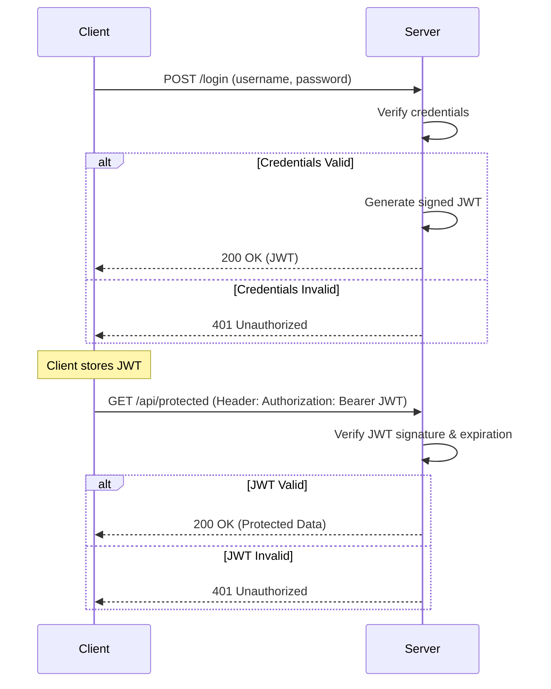

# Authentication

## Introduction

Authentication is the process of verifying the identity of a user, system, or application. It answers the question, "Who are you?". In the context of backend systems, it's the mechanism that allows a user to prove they are who they claim to be, typically by providing some form of credentials.

Authentication is the first step in most security models and is a prerequisite for authorization (determining what an authenticated user is allowed to do). A robust authentication system is critical for protecting user data and securing your application's resources.

## Core Concepts and Methods

### Session-based vs. Token-based Authentication

This is the most fundamental distinction in modern web authentication.

*   **Session-based Authentication (Stateful)**:
    1.  A user submits their credentials (e.g., username and password).
    2.  The server verifies the credentials.
    3.  The server creates a "session" and stores it in its database or cache (e.g., Redis).
    4.  The server sends a unique Session ID back to the client, usually stored in a cookie.
    5.  For subsequent requests, the client sends the Session ID cookie.
    6.  The server looks up the session using the ID to identify the user.
    *   **Pros**: Simple to implement, easy to revoke sessions on the server side (e.g., on logout).
    *   **Cons**: Requires server-side storage, which can be a bottleneck and complicates horizontal scaling. Each server in a cluster needs access to the session store.

*   **Token-based Authentication (Stateless)**:
    1.  A user submits their credentials.
    2.  The server verifies the credentials.
    3.  The server generates a signed, self-contained token (like a JWT) that includes user identity information ("claims").
    4.  The server sends the token to the client. The server does *not* store the token.
    5.  The client stores the token (e.g., in localStorage or an HttpOnly cookie) and includes it in the `Authorization` header of subsequent requests (e.g., `Authorization: Bearer <token>`).
    6.  The server verifies the token's signature on each request to authenticate the user.
    *   **Pros**: Stateless (no server-side storage needed), scales well horizontally, can be used across different domains and services (e.g., microservices).
    *   **Cons**: Tokens can be harder to revoke immediately (they are valid until they expire). Storing tokens on the client requires careful security considerations (e.g., XSS vulnerabilities if stored in localStorage).

### Token-Based Authentication Flow

### Common Authentication Methods

*   **Basic Authentication**: The client sends the username and password, base64-encoded, in the `Authorization` header. It's simple but insecure as credentials are sent with every request and are easily decoded. It should only be used over HTTPS.

*   **JSON Web Tokens (JWT)**: An open standard (RFC 7519) for creating self-contained access tokens. A JWT consists of three parts: a header, a payload (containing claims about the user), and a signature. The signature ensures the token's integrity. It's the most common method for stateless authentication in modern APIs.

*   **OAuth (Open Authorization)**: An open standard for access delegation. It's not an authentication protocol itself, but it's often used for it. OAuth allows a user to grant a third-party application limited access to their resources on another service, without sharing their credentials. For example, when you "Log in with Google," you are using OAuth to authorize an application to access your basic Google profile information. The flow typically results in the application receiving an access token to make API calls on your behalf.

*   **OpenID Connect (OIDC)**: A simple identity layer built on top of the OAuth 2.0 protocol. It allows clients to verify the identity of the end-user based on the authentication performed by an Authorization Server, as well as to obtain basic profile information about the end-user. It adds an `ID Token` (a JWT) to the OAuth flow, which explicitly contains identity information. "Log in with Google" is technically OIDC. For a deeper dive, see the topic on **OAuth2 and OpenID Connect**.

*   **Multi-factor Authentication (MFA)**: A security enhancement that requires users to provide two or more verification factors to gain access to a resource. Factors include:
    1.  **Knowledge**: Something you know (e.g., password, PIN).
    2.  **Possession**: Something you have (e.g., a phone for SMS codes, an authenticator app like Google Authenticator, a hardware key).
    3.  **Inherence**: Something you are (e.g., fingerprint, face scan).

## Best Practices

*   **Store Passwords Securely**: Never store passwords in plaintext. Always use a strong, one-way hashing algorithm like **bcrypt** or **Argon2**. Include a unique "salt" for each user to prevent rainbow table attacks.
*   **Use HTTPS Everywhere**: Encrypt all communication between the client and server to prevent man-in-the-middle attacks.
*   **Implement Secure Logout**: For session-based auth, invalidate the session on the server. For token-based auth, if using cookies, clear the cookie. If storing tokens on the client-side, simply delete the token. For immediate revocation, a server-side token blocklist is needed, which reintroduces some state.
*   **Protect Against Credential Stuffing**: Implement rate limiting on login endpoints and monitor for failed login attempts to protect against brute-force and credential stuffing attacks.
*   **Use HttpOnly Cookies for Web Clients**: If you are using tokens or session IDs in a web browser, storing them in an `HttpOnly` cookie prevents them from being accessed by client-side JavaScript, mitigating XSS attacks.
*   **Keep Tokens Short-Lived**: Access tokens (like JWTs) should have a short expiration time (e.g., 15 minutes). Use a long-lived "refresh token" to obtain new access tokens without requiring the user to log in again.

<h3>Further Reading</h3>
<ul>
  <li><a href="https://jwt.io/introduction/" target="_blank" rel="noopener noreferrer">Introduction to JSON Web Tokens (JWT)</a></li>
  <li><a href="https://oauth.net/2/" target="_blank" rel="noopener noreferrer">OAuth 2.0 Official Site</a></li>
  <li><a href="https://openid.net/connect/" target="_blank" rel="noopener noreferrer">OpenID Connect Official Site</a></li>
  <li><a href="https://cheatsheetseries.owasp.org/cheatsheets/Authentication_Cheat_Sheet.html" target="_blank" rel="noopener noreferrer">OWASP Authentication Cheat Sheet</a></li>
</ul>

