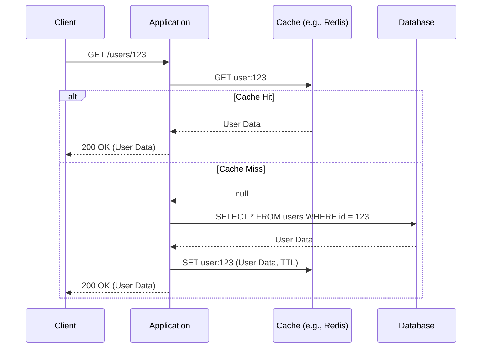

# Caching

## Introduction

Caching is the process of storing copies of data in a temporary, fast-access storage location (a "cache") to serve future requests for that data more quickly. In backend systems, caching is one of the most effective strategies for improving performance, reducing latency, and decreasing the load on your primary data sources, such as databases or external APIs.

By serving frequently accessed data from a cache instead of re-computing or re-fetching it every time, you can dramatically speed up response times and build more scalable applications.

## Core Concepts

### Why Use a Cache?

*   **Performance**: Reading data from an in-memory cache (like Redis) is orders of magnitude faster than reading from a disk-based database. This leads to lower latency for your users.
*   **Reduced Load**: Caching reduces the number of requests to your backend resources. This lightens the load on your database, preventing it from becoming a bottleneck, and can lower costs associated with third-party API calls.
*   **Increased Availability**: If your primary database goes down, your application might still be able to serve some requests using cached data, providing a degree of fault tolerance.

### Common Caching Strategies

#### Cache-Aside (Lazy Loading)

This is the most common caching strategy. The application logic is responsible for checking the cache before falling back to the data source.


*   **Pros**: Resilient to cache failures. The application can still get data from the DB if the cache is down.
*   **Cons**: Higher latency on the first read (a "cache miss"). Data in the cache can become stale if it's updated in the database directly.

#### Read-Through

Similar to cache-aside, but the logic is encapsulated within the cache provider itself. The application talks to the cache as if it were the main data store. The cache is responsible for fetching data from the database on a miss and storing it.

#### Write-Through

When the application writes data, it writes it to the cache *and* the database simultaneously. The operation is only considered complete when both writes are successful.
*   **Pros**: Ensures the cache and database are always consistent.
*   **Cons**: Adds latency to all write operations, as it has to wait for both systems.

#### Write-Back (or Write-Behind)

The application writes data only to the cache, which acknowledges the write immediately for low latency. The cache then asynchronously writes the data to the database after a delay.
*   **Pros**: Extremely fast for write-heavy workloads.
*   **Cons**: Risks data loss if the cache fails before the data is persisted to the database.

### Cache Eviction Strategies

Since a cache has limited size, you need a policy to decide which items to remove when the cache is full.

*   **Least Recently Used (LRU)**: Discards the item that has not been accessed for the longest time. A very common and often effective strategy.
*   **Least Frequently Used (LFU)**: Discards the item that has been accessed the fewest number of times.
*   **First-In, First-Out (FIFO)**: Discards the oldest item in the cache, regardless of how often it was accessed.
*   **Time To Live (TTL)**: Each item in the cache is given an expiration time. Once the time is up, the item is automatically evicted. This is essential for data that becomes stale over time.

## Cache Invalidation Strategies

"There are only two hard things in Computer Science: cache invalidation and naming things." - Phil Karlton.

When data is updated in your database, how do you ensure the corresponding stale data is removed or updated in the cache?

1.  **Write-Through Caching**: As mentioned above, this solves the problem by updating the cache at the same time as the database.
2.  **Explicit Invalidation**: When your application logic updates a piece of data in the database, it also explicitly sends a `DELETE` command to the cache for the corresponding key. This is a common and effective approach for the Cache-Aside pattern.
3.  **Time-To-Live (TTL)**: Relying on a TTL is the simplest strategy. The data will be stale for a period, but it guarantees eventual consistency. This is often acceptable for non-critical data.

## Practical Example: Cache-Aside with Invalidation in Node.js

```javascript
// Assume 'redisClient' and 'db' are already configured and connected.

// READ operation
app.get('/users/:id', async (req, res) => {
  const userId = req.params.id;
  const cacheKey = `user:${userId}`;
  // ... Cache-Aside logic as shown in the previous section ...
});


// UPDATE operation with explicit invalidation
app.patch('/users/:id', async (req, res) => {
    const userId = req.params.id;
    const cacheKey = `user:${userId}`;

    try {
        // 1. Update the database first
        const updatedUser = await db.users.update(req.body, { where: { id: userId } });

        // 2. Invalidate (delete) the cache key
        console.log(`Invalidating cache for key: ${cacheKey}`);
        await redisClient.del(cacheKey);

        res.json(updatedUser);
    } catch (error) {
        // ... error handling ...
    }
});
```

<div class="further-reading">
<h3>Further Reading</h3>
<ul>
  <li><a href="https://redis.io/docs/manual/eviction/" target="_blank" rel="noopener noreferrer">Redis Eviction Policies</a></li>
  <li><a href="https://aws.amazon.com/caching/best-practices/" target="_blank" rel="noopener noreferrer">Caching Best Practices (AWS)</a></li>
  <li><a href="https://www.mongodb.com/developer/products/redis/caching-challenges-and-patterns-with-redis/" target="_blank" rel="noopener noreferrer">Caching Patterns and Challenges with Redis</a></li>
</ul>
</div>