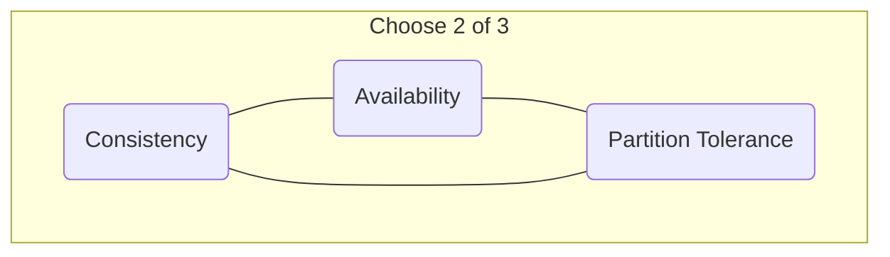

# CAP Theorem

## Introduction

The CAP Theorem, also known as Brewer's theorem after computer scientist Eric Brewer, is a fundamental principle for designing distributed systems. It states that it is **impossible** for a distributed data store to simultaneously provide more than two out of the following three guarantees:

1.  **Consistency (C)**: Every read receives the most recent write or an error. In a consistent system, all nodes in the cluster see the same data at the same time.
2.  **Availability (A)**: Every request receives a (non-error) response, without the guarantee that it contains the most recent write.
3.  **Partition Tolerance (P)**: The system continues to operate despite an arbitrary number of messages being dropped (or delayed) by the network between nodes.

## The C-A-P Triangle

You can visualize the theorem as a choice of two out of the three properties.



## The Real-World Trade-off: C vs. A

In a distributed system, network partitions (a loss of communication between nodes) are a fact of life. You cannot design a system that assumes the network will always be perfectly reliable. Therefore, **Partition Tolerance (P) is a must-have**.

This means the real-world trade-off for any distributed system is between **Consistency** and **Availability**. When a network partition occurs, you must choose one:
*   Do you cancel the operation to ensure consistency (sacrificing availability)?
*   Or do you proceed with the operation, knowing that some nodes might have stale data (sacrificing consistency)?

### CP: Consistent and Partition-Tolerant

When a partition occurs, a CP system chooses to sacrifice availability to prevent inconsistency. It does this by making the nodes on one side of the partition unavailable until the partition is resolved.

```mermaid
graph TD
    subgraph "CP System Under Partition"
        N1[Node 1<br>Data: {x:1}];
        N2[Node 2<br>Data: {x:1}];
        C1(Client 1) --> N1;
        C2(Client 2) --> N2;

        N1 -- X -- N2;
        linkStyle 2 stroke:red,stroke-width:2px,stroke-dasharray: 5 5;
        
        C1 -- "Write {x:2}" --> N1;
        N1 -- "Updates to {x:2}" --> N1;
        
        C2 -- "Read x" --> N2;
        note right of N2 "Node 2 becomes unavailable.<br>It cannot guarantee it has the latest data,<br>so it returns an error to uphold Consistency."
    end
```
*   **Use Cases**: Systems where data correctness is paramount, such as banking systems, financial ledgers, and e-commerce transactions.

### AP: Available and Partition-Tolerant

When a partition occurs, an AP system chooses to sacrifice consistency to remain available. Nodes on both sides of the partition will continue to operate and respond to requests, even if they can't communicate with each other. This can result in clients reading stale data. These systems typically aim for **eventual consistency**, where the data will become consistent across all nodes once the partition is resolved.

```mermaid
graph TD
    subgraph "AP System Under Partition"
        N1[Node 1<br>Data: {x:1}];
        N2[Node 2<br>Data: {x:1}];
        C1(Client 1) --> N1;
        C2(Client 2) --> N2;

        N1 -- X -- N2;
        linkStyle 2 stroke:red,stroke-width:2px,stroke-dasharray: 5 5;
        
        C1 -- "Write {x:2}" --> N1;
        N1 -- "Updates to {x:2}" --> N1;
        
        C2 -- "Read x" --> N2;
        N2 -- "Returns stale data {x:1}" --> C2;
        note right of N2 "Node 2 remains available.<br>It responds with the best data it has,<br>even if it's not the most recent."
    end
```
*   **Use Cases**: Systems where high availability is more important than perfect, up-to-the-millisecond consistency. Examples include social media feeds, user session stores, and some NoSQL databases like Cassandra and DynamoDB.

## Conclusion
The CAP theorem is not about picking two letters and forgetting the third. It's a tool for framing the conversation about trade-offs. Since P is a given in distributed systems, the theorem forces architects to decide what the system should do *when* a partition happens: fail gracefully to maintain consistency (CP) or continue serving potentially stale data to remain available (AP).

<div class="further-reading">
<h3>Further Reading</h3>
<ul>
  <li><a href="https://www.infoq.com/articles/cap-twelve-years-later-how-the-rules-have-changed/" target="_blank" rel="noopener noreferrer">CAP Twelve Years Later: How the "Rules" Have Changed (by Eric Brewer)</a></li>
  <li><a href="https://martin.kleppmann.com/2015/05/11/please-stop-calling-databases-cp-or-ap.html" target="_blank" rel="noopener noreferrer">A Critique of the CAP Theorem by Martin Kleppmann</a></li>
</ul>
</div>