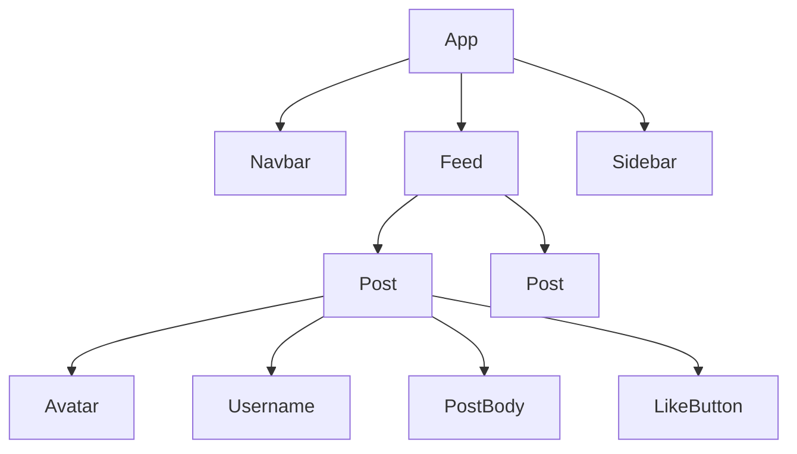

# Component-Based Architecture

## Introduction

As web applications grew more complex, manipulating the DOM directly with vanilla JavaScript became difficult to manage. A change in one part of the application could unintentionally break another, leading to what's known as "spaghetti code."

**Component-Based Architecture** is a paradigm that solves this problem by breaking down the user interface into small, independent, and reusable pieces called "components." Each component has its own structure (HTML), style (CSS), and logic (JavaScript), and is responsible for rendering a specific part of the UI.

This approach, popularized by libraries like **React**, Vue, and Angular, has become the standard for building modern, scalable frontend applications.

## The Core Idea: Reusable Building Blocks

Think of a web page like a set of LEGO bricks. Instead of building a single, monolithic structure, you build smaller, standard bricks that can be composed together to create a larger whole.

A social media feed could be broken down like this:


Each box in this diagram could be a component. You build the `LikeButton` component once and can reuse it in every `Post`. The `Post` component is built once and can be used to render every post in the `Feed`.

## A React Example

React is a popular JavaScript library for building user interfaces based on this component model. In React, a component is typically a JavaScript function that returns JSX (a syntax extension that looks like HTML).

### A Simple `Button` Component
```javascript
// Button.jsx
function Button({ label, onClick }) {
  // The component receives 'props' (properties) as an argument
  return (
    <button className="custom-button" onClick={onClick}>
      {label}
    </button>
  );
}
```
This `Button` component is:
*   **Self-Contained**: Its logic and structure are all in one place.
*   **Configurable**: You can change its text (`label`) and behavior (`onClick`) via props.
*   **Reusable**: You can use it anywhere in your application.

### State and Interactivity

Components can have their own internal memory, or **"state."** When a component's state changes, the library (e.g., React) automatically and efficiently re-renders that component to reflect the new state.

This is a declarative approach. You don't tell the component *how* to change (e.g., "find this DOM element and change its text"). You just declare *what* the UI should look like for a given state, and the library figures out the rest.

Here is a `Counter` component with its own state:

```javascript
// Counter.jsx
import React, { useState } from 'react';

function Counter() {
  // 'useState' is a React "Hook" to add state to a component
  // It returns the current state value and a function to update it.
  const [count, setCount] = useState(0);

  const increment = () => {
    setCount(count + 1);
  };

  return (
    <div>
      <p>Current count: {count}</p>
      <button onClick={increment}>Increment</button>
    </div>
  );
}
```
When the button is clicked, `setCount` is called. React detects this state change and re-renders the `Counter` component, updating the `<p>` tag with the new count.

## Benefits of Component-Based Architecture

1.  **Reusability**: Write a component once, use it everywhere. This saves time and reduces code duplication.
2.  **Maintainability**: Components are small and isolated. This makes them easier to understand, debug, and modify without breaking other parts of the application.
3.  **Scalability**: It's easier for large teams to work on the same project, as different developers can own different components.
4.  **Testability**: Each component can be tested in isolation, which simplifies the testing process.

<div class="further-reading">
<h3>Further Reading</h3>
<ul>
  <li><a href="https://react.dev/learn" target="_blank" rel="noopener noreferrer">React Docs: Quick Start</a></li>
  <li><a href="https://vuejs.org/guide/essentials/application.html" target="_blank" rel="noopener noreferrer">Vue.js Components Basics</a></li>
</ul>
</div>