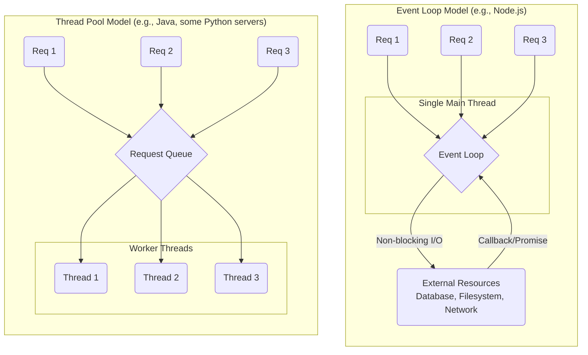

# Concurrency and Parallelism

## Introduction

Concurrency and parallelism are fundamental concepts in backend engineering for building high-performance, scalable applications. Though often used interchangeably, they describe different ideas:

-   **Concurrency**: Refers to the ability of a system to handle multiple tasks *at the same time*. These tasks might be executing in an interleaved manner on a single CPU core. The focus is on *structuring* the program to deal with many things at once.
-   **Parallelism**: Refers to the ability of a system to execute multiple tasks *simultaneously*. This requires a multi-core processor, where each core can run a separate task at the exact same instant. The focus is on *doing* many things at once to speed up computations.

## Concurrency Models: Event Loop vs. Thread Pool

Most modern backend systems use one of two models to handle concurrent requests.

*   **Event Loop**: Highly efficient for I/O-bound workloads. A single thread manages all connections, handing off long-running I/O operations to the system's kernel and reacting to their completion. This avoids the overhead of creating threads for each request.
*   **Thread Pool**: A pool of threads is available to handle requests. Each incoming request is assigned to an available thread. This can be simpler for CPU-bound tasks but has higher memory overhead.

## Code Examples

### I/O-Bound Task (Concurrency)
Fetching data from multiple URLs is a classic I/O-bound task. The program spends most of its time waiting for the network. Asynchronous patterns are ideal here.

  

    <button class="tab-button active" data-lang="nodejs">Node.js (Async/Await)</button>
    <button class="tab-button" data-lang="python">Python (AsyncIO)</button>
    <button class="tab-button" data-lang="go">Go (Goroutines)</button>
  

  

<pre><code class="language-javascript">
async function fetchAll(urls) {
    const promises = urls.map(url => fetch(url).then(res => res.json()));
    // All fetch requests are initiated concurrently
    const results = await Promise.all(promises);
    console.log('All fetches complete.');
    return results;
}

const urls = ['https://api.example.com/1', 'https://api.example.com/2'];
fetchAll(urls);
</code></pre>
  

  

<pre><code class="language-python">
import asyncio
import httpx

async def fetch_all(urls):
    async with httpx.AsyncClient() as client:
        tasks = [client.get(url) for url in urls]
        # All requests are sent concurrently
        responses = await asyncio.gather(*tasks)
    print("All fetches complete.")
    return [res.json() for res in responses]

urls = ['https://api.example.com/1', 'https://api.example.com/2']
asyncio.run(fetch_all(urls))
</code></pre>
  

  

<pre><code class="language-go">
package main

import (
	"fmt"
	"net/http"
	"sync"
)

func fetchAll(urls []string) {
	var wg sync.WaitGroup
	for _, url := range urls {
		wg.Add(1)
		// Launch a new goroutine for each URL
		go func(u string) {
			defer wg.Done()
			http.Get(u)
			fmt.Printf("Fetched %s\n", u)
		}(url)
	}
	// Wait for all goroutines to complete
	wg.Wait()
	fmt.Println("All fetches complete.")
}

func main() {
	urls := []string{"https://api.example.com/1", "https://api.example.com/2"}
	fetchAll(urls)
}
</code></pre>
  

### CPU-Bound Task (Parallelism)
A task like calculating Fibonacci numbers is CPU-bound. To speed this up, we need to run calculations in parallel on multiple CPU cores.

  

    <button class="tab-button active" data-lang="nodejs">Node.js (Worker Threads)</button>
    <button class="tab-button" data-lang="python">Python (Multiprocessing)</button>
    <button class="tab-button" data-lang="go">Go (Goroutines)</button>
  

  

<pre><code class="language-javascript">
// main.js
const { Worker } = require('worker_threads');

function runFibInWorker(n) {
  return new Promise((resolve, reject) => {
    const worker = new Worker('./fib-worker.js', { workerData: n });
    worker.on('message', resolve);
    worker.on('error', reject);
  });
}

async function calculateInParallel() {
    const numbers = [40, 41, 42];
    const results = await Promise.all(numbers.map(runFibInWorker));
    console.log(results);
}
calculateInParallel();

// fib-worker.js (in a separate file)
// const { parentPort, workerData } = require('worker_threads');
// function fib(n) { ... }
// parentPort.postMessage(fib(workerData));
</code></pre>
  

  

<pre><code class="language-python">
import multiprocessing

def fib(n):
    if n <= 1:
        return n
    return fib(n - 1) + fib(n - 2)

def calculate_in_parallel():
    numbers = [35, 36, 37]
    # Create a pool of worker processes
    with multiprocessing.Pool(processes=len(numbers)) as pool:
        results = pool.map(fib, numbers)
    print(results)

if __name__ == '__main__':
    calculate_in_parallel()
</code></pre>
  

  

<pre><code class="language-go">
package main
import "fmt"

// Go's scheduler runs goroutines on available OS threads, achieving parallelism.
func fib(n int) int {
	if n <= 1 { return n }
	return fib(n-1) + fib(n-2)
}

func worker(jobs <-chan int, results chan<- int) {
	for n := range jobs {
		results <- fib(n)
	}
}

func main() {
	numbers := []int{40, 41, 42}
	jobs := make(chan int, len(numbers))
	results := make(chan int, len(numbers))

	// Start 3 worker goroutines
	for w := 1; w <= 3; w++ {
		go worker(jobs, results)
	}

	for _, n := range numbers {
		jobs <- n
	}
	close(jobs)

	for a := 1; a <= len(numbers); a++ {
		fmt.Println(<-results)
	}
}
</code></pre>
  

## Best Practices
*   **Choose the Right Model**: For I/O-bound applications, async is usually best. For CPU-bound work, you need parallelism.
*   **Avoid Blocking the Event Loop**: In Node.js, never run long, synchronous, CPU-intensive code in the main thread. Offload it to a worker.
*   **Prefer Statelessness**: Stateless services are much easier to scale horizontally and reason about in a concurrent environment.