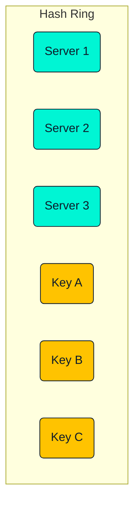
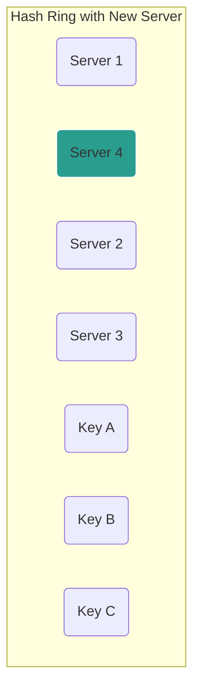

# Consistent Hashing

## Introduction

Consistent hashing is a special kind of hashing that is essential for distributed systems, particularly for distributed caches and databases. Its key benefit is that when the number of servers (the hash table size) changes, it minimizes the number of keys that need to be remapped. This is crucial for systems that need to scale horizontally by adding or removing servers without causing a massive data reshuffling.

## The Problem with Standard Hashing

Imagine you have a distributed cache with `N` servers. A common way to decide which server should store a piece of data is to use a simple hash modulo function:
`server_index = hash(key) % N`

Let's say we have 4 servers. A key `my_key` hashes to `12345`.
`server_index = 12345 % 4 = 1`. So, `my_key` is stored on Server 1.

**The problem arises when we add or remove a server.**
Let's add a 5th server, so `N` is now 5.
`server_index = 12345 % 5 = 0`. Now, `my_key` maps to Server 0.

When the number of servers `N` changes, `hash(key) % N` changes for nearly **all** keys. This would mean that almost all of our cached data becomes invalid, leading to a "thundering herd" problem where all requests miss the cache and hit the database simultaneously.

## How Consistent Hashing Solves This

Consistent hashing maps both the servers and the keys onto a conceptual "hash ring." The range of the hash function (e.g., 0 to `2^32 - 1`) is imagined as a circle.

1.  **Map Servers**: Each server is hashed (e.g., using its IP address or name) to get its position on the ring.
2.  **Map Keys**: To find out which server a key belongs to, we hash the key to get its position on the ring.
3.  **Find the Server**: We then travel clockwise around the ring from the key's position until we find the first server. That server is responsible for that key.
    *   In the diagram above (assuming clockwise travel), Key A would belong to Server 2, Key B to Server 3, and Key C to Server 1.

### Adding a Server

Now, let's see what happens when we add `Server 4` to the ring.

Only the keys that fall between `Server 1` and the new `Server 4` on the ring need to be moved. In this case, only `Key C` needs to be remapped from `Server 1` to `Server 4`. Keys A and B are unaffected.

### Removing a Server

Similarly, if `Server 2` is removed, only the keys that were mapped to it (`Key A`) need to be remapped to the next server clockwise (`Server 3`).

**Conclusion**: With consistent hashing, when a server is added or removed, only `K/N` keys need to be remapped on average, where `K` is the number of keys and `N` is the number of servers. This is a massive improvement over the standard modulo approach.

## Virtual Nodes
A potential issue with the basic approach is that servers might not be evenly distributed on the ring, leading to an unbalanced load. To solve this, we use **virtual nodes**.

Instead of mapping each server to a single point on the ring, we map it to multiple virtual nodes. For example, `Server 1` might be mapped to `server-1a`, `server-1b`, `server-1c`, etc., at different points on the ring. This results in a much more uniform distribution of keys, ensuring that each physical server gets a roughly equal share of the load.

<h3>Further Reading</h3>
<ul>
  <li><a href="https://www.ably.com/blog/implementing-consistent-hashing" target="_blank" rel="noopener noreferrer">A Guide to Consistent Hashing</a></li>
  <li><a href="https://www.youtube.com/watch?v=zaRkONvyGr8" target="_blank" rel="noopener noreferrer">Consistent Hashing - System Design Concepts (Video)</a></li>
</ul>

