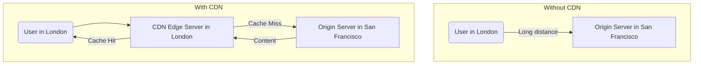

# Content Delivery Network (CDN)

## Introduction

A Content Delivery Network (CDN) is a geographically distributed group of servers that work together to provide fast delivery of internet content. The primary goal of a CDN is to improve performance and availability by reducing the physical distance between the server and the user.

When a user requests content from a website, the CDN redirects the request from the website's origin server to a server in the CDN that is closest to the user. This server, known as an **edge server**, delivers the cached content. This process is much faster than having the user's request travel all the way to the origin server, especially if that server is on a different continent.

## How a CDN Works

1.  **The Request**: A user in London tries to access a resource (e.g., an image) from your website, whose origin server is in San Francisco.
2.  **DNS Redirection**: The website's DNS is configured to point to the CDN provider. The CDN's DNS service detects that the request is coming from London and resolves the domain name to the IP address of its nearest edge server, which is also in London.
3.  **Cache Check**: The London edge server receives the request. It checks if it has a copy of the requested image in its cache.
4.  **Cache Hit**: If it does, the edge server serves the image directly to the user. This is extremely fast because the data travels a very short distance.
5.  **Cache Miss**: If the edge server does not have the image, it forwards the request to the origin server in San Francisco, retrieves the image, **stores a copy in its cache** for a configured amount of time (TTL), and then serves it to the user. The next user in London who requests the same image will get a cache hit.

## Benefits of Using a CDN

1.  **Improved Performance (Lower Latency)**: By serving content from edge servers closer to users, CDNs significantly reduce the round-trip time, making websites load faster. This is the primary benefit.
2.  **Reduced Load on the Origin Server**: Since the CDN handles a large portion of the traffic, the origin server has to serve fewer requests. This reduces its load and can lower hosting costs.
3.  **Increased Availability and Reliability**: CDNs distribute traffic across many servers. If one edge server goes down, traffic can be automatically rerouted to another. This built-in redundancy makes your application more resilient.
4.  **Enhanced Security**: Many CDNs offer security features like DDoS (Distributed Denial of Service) mitigation and Web Application Firewalls (WAFs). By sitting in front of your origin server, the CDN can absorb and filter out large volumes of malicious traffic before it ever reaches your infrastructure.

## What Should You Cache on a CDN?

*   **Static Assets (Primary Use Case)**: Large files that don't change often are perfect for CDNs.
    *   Images (JPG, PNG, GIF)
    *   Videos and audio streams
    *   CSS stylesheets
    *   JavaScript libraries
*   **Dynamic Content**: Modern CDNs can also cache dynamic content, such as API responses. This is more complex, as the cacheability of the content needs to be carefully managed (e.g., caching a public list of products, but not a specific user's shopping cart). This is controlled via HTTP headers like `Cache-Control` and `Vary`.

**Popular CDN Providers**:
*   Cloudflare
*   Amazon CloudFront (part of AWS)
*   Google Cloud CDN
*   Fastly
*   Akamai

<h3>Further Reading</h3>
<ul>
  <li><a href="https://www.cloudflare.com/learning/cdn/what-is-a-cdn/" target="_blank" rel="noopener noreferrer">What is a CDN? by Cloudflare</a></li>
  <li><a href="https://aws.amazon.com/what-is/cdn/" target="_blank" rel="noopener noreferrer">What is a CDN? by AWS</a></li>
</ul>

