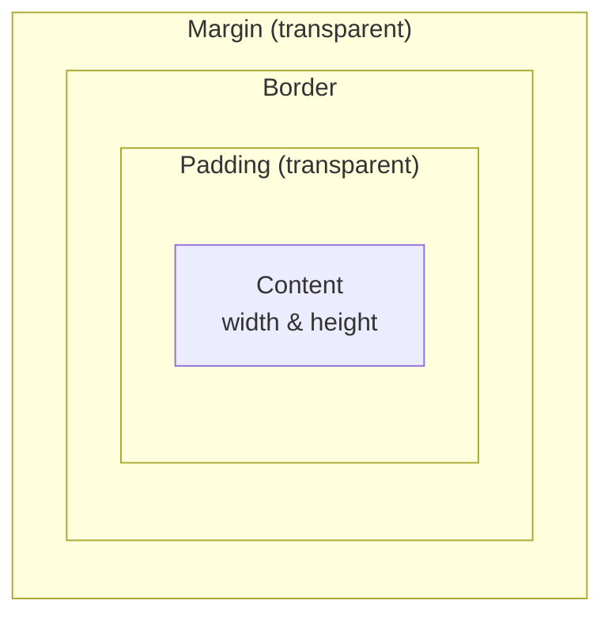

# CSS Fundamentals

## Introduction

CSS (Cascading Style Sheets) is the language used to describe the presentation and styling of a document written in HTML. While HTML provides the structure, CSS provides the aesthetics—everything from colors and fonts to layout and responsiveness.

Mastering CSS requires understanding its core concepts: the cascade, specificity, the box model, and modern layout systems like Flexbox and Grid.

## The Cascade and Specificity

"Cascading" means that styles can come from multiple sources and are applied in a specific order of precedence.
1.  **Origin**: Browser default styles are applied first, then user-defined styles, and finally the author's (your) styles.
2.  **Specificity**: If multiple rules from the same origin target the same element, the most *specific* selector wins.
    *   Inline styles (e.g., `<div style="color: red;">`) have the highest specificity.
    *   ID selectors (`#my-id`) are more specific than class selectors (`.my-class`).
    *   Class selectors are more specific than type selectors (`div`).
3.  **Source Order**: If two selectors have the same specificity, the one that appears later in the stylesheet wins.

## The Box Model

Every element in HTML is a rectangular box. The CSS box model describes how this box is composed.



*   **Content**: The actual content of the box, where text and images appear. Its size is defined by `width` and `height`.
*   **Padding**: The transparent space between the content and the border.
*   **Border**: The line that goes around the padding and content.
*   **Margin**: The transparent space outside the border, which separates the element from other elements.

By default, `width` and `height` apply only to the content box. This can be confusing. It's a common best practice to change this behavior with `box-sizing: border-box;`, which makes `width` and `height` apply to the total area including padding and border.

```css
/* A common reset */
* {
  box-sizing: border-box;
}
```

## Modern Layout: Flexbox and Grid

For years, creating complex layouts in CSS was difficult. Flexbox and Grid are modern layout systems that have made it much easier.

### Flexbox (Flexible Box Layout)

Flexbox is a one-dimensional layout model. It's designed for laying out items in a single row or a single column.

To use Flexbox, you declare a container as a flex container.

```css
.container {
  display: flex; /* This makes the direct children flex items */
  justify-content: space-between; /* Horizontal alignment */
  align-items: center; /* Vertical alignment */
}
```
*   `display: flex`: The most important property.
*   `flex-direction`: `row` (default) or `column`.
*   `justify-content`: Controls alignment on the main axis (e.g., `center`, `space-between`).
*   `align-items`: Controls alignment on the cross axis (e.g., `center`, `stretch`).

Flexbox is excellent for aligning items in a navigation bar, centering content within a container, or distributing a set of cards evenly.

### Grid Layout

Grid is a two-dimensional layout model. It's designed for laying out items in both rows and columns simultaneously.

```css
.grid-container {
  display: grid;
  grid-template-columns: 1fr 2fr 1fr; /* Three columns */
  grid-template-rows: auto 100px; /* Two rows */
  gap: 20px; /* Space between items */
}
```
*   `display: grid`: Turns an element into a grid container.
*   `grid-template-columns` / `grid-template-rows`: Define the size and number of columns and rows. The `fr` unit represents a fraction of the available space.
*   `gap`: Defines the size of the space between grid items.

Grid is perfect for overall page layouts, like creating a traditional header, main content, sidebar, and footer structure.

## Responsive Design

Responsive design is the practice of building websites that work on a variety of devices and screen sizes. The primary tool for this is the **media query**.

A media query allows you to apply a block of CSS properties only if a certain condition is true, usually related to the viewport width.

```css
/* Default styles for mobile */
.container {
  width: 100%;
}

/* Styles for tablets and larger */
@media (min-width: 768px) {
  .container {
    display: flex;
    width: 90%;
  }
}

/* Styles for desktops and larger */
@media (min-width: 1024px) {
  .container {
    max-width: 960px;
    margin: 0 auto;
  }
}
```
This "mobile-first" approach is a common best practice: design for the smallest screen first, then use media queries to add complexity for larger screens.

<div class="further-reading">
<h3>Further Reading</h3>
<ul>
  <li><a href="https://developer.mozilla.org/en-US/docs/Learn/CSS/First_steps" target="_blank" rel="noopener noreferrer">MDN CSS First Steps</a></li>
  <li><a href="https://css-tricks.com/a-complete-guide-to-flexbox/" target="_blank" rel="noopener noreferrer">A Complete Guide to Flexbox (CSS-Tricks)</a></li>
  <li><a href="https://css-tricks.com/a-complete-guide-to-grid/" target="_blank" rel="noopener noreferrer">A Complete Guide to Grid (CSS-Tricks)</a></li>
</ul>
</div>