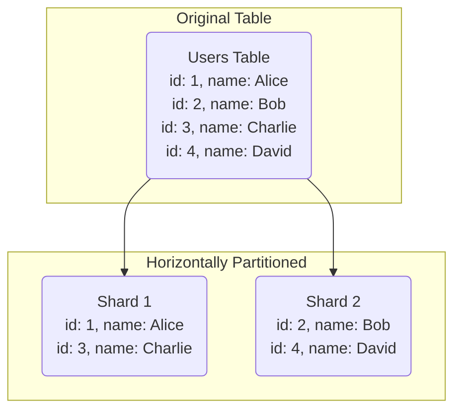
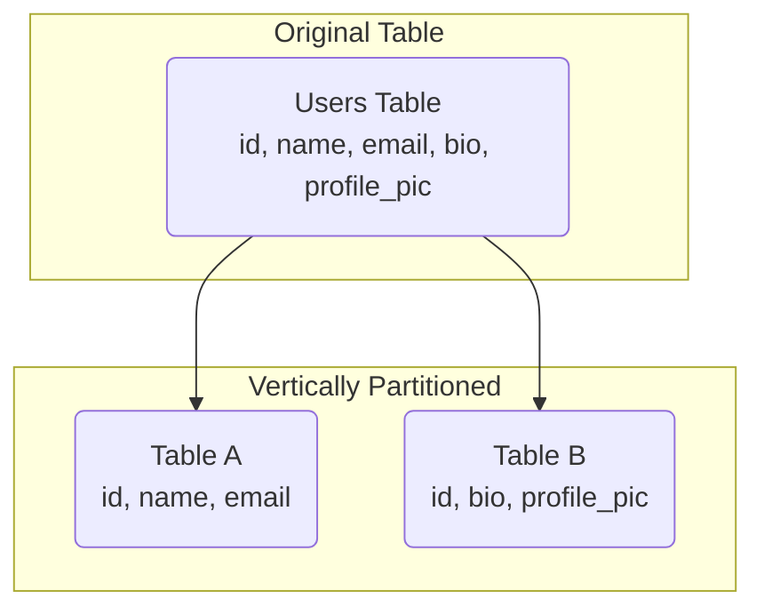

# Data Partitioning

## Introduction

As an application's dataset grows, a single database server can become a bottleneck. It can run out of storage space, or its CPU/RAM can be overwhelmed by the volume of queries, leading to slow performance. **Data partitioning**, also known as **sharding**, is a database architecture pattern for breaking up a very large database into smaller, more manageable pieces called "partitions" or "shards."

Each shard is an independent database, and together they make up a single logical database. Partitioning is the primary method for achieving horizontal scalability for databases, allowing them to store massive amounts of data and handle high throughput.

## Partitioning Methods

### Horizontal Partitioning (Sharding)

This is the most common type of partitioning. The database table is split by rows. Each shard contains the same schema, but a different subset of the data.

### Vertical Partitioning

The database table is split by columns. Some columns are stored in one table, and the remaining columns are stored in another. This is less common and is typically used when certain columns are very large (like a `BLOB`) or are accessed much less frequently than others.

For the rest of this topic, "partitioning" will refer to the more common horizontal partitioning (sharding).

## Sharding Strategies

To implement sharding, you need a **partitioning key** (or **shard key**), which is a column in the table that determines which shard a given row will belong to. A routing layer (either in your application or a proxy) uses this key to direct queries to the correct shard.

### 1. Algorithmic Sharding (Key/Hash-Based)
*   **How it works**: A hashing function is applied to the shard key. The result of the hash determines which shard the data goes to. For example, `shard_id = hash(user_id) % number_of_shards`.
*   **Pros**: Evenly distributes data across shards.
*   **Cons**: Can be difficult to add or remove shards (resizing). Changing the number of shards requires re-hashing and moving a large amount of data. This problem is often solved using **Consistent Hashing**.

### 2. Range-Based Sharding
*   **How it works**: Data is partitioned based on a range of values in the shard key. For example, users with IDs 1-1,000,000 go to Shard A, users with IDs 1,000,001-2,000,000 go to Shard B, and so on.
*   **Pros**: Simple to implement.
*   **Cons**: Can lead to "hot spots." If certain ranges are more active than others (e.g., new users are all being written to the last shard), that shard can become overloaded.

### 3. Directory-Based Sharding
*   **How it works**: A separate "lookup table" or service maintains the mapping between the shard key and the shard location.
*   **Pros**: Very flexible. You can move data between shards and just update the lookup table.
*   **Cons**: The lookup table itself can become a bottleneck or a single point of failure.

## Challenges of Sharding

Sharding is powerful but introduces significant complexity.
*   **Cross-Shard Joins**: Performing joins on tables that are on different shards is very difficult and inefficient. This is why it's crucial to design your schema and choose a shard key that keeps related data together on the same shard.
*   **Rebalancing/Resharding**: As your data grows, you will eventually need to add more shards. Rebalancing the data across the new set of shards is a complex and resource-intensive operation.
*   **Transactions**: Maintaining ACID transaction guarantees across multiple shards is extremely complex. This often requires a "two-phase commit" protocol, which is slow. Most sharded systems relax this constraint.

<h3>Further Reading</h3>
<ul>
  <li><a href="https://www.digitalocean.com/community/tutorials/understanding-database-sharding" target="_blank" rel="noopener noreferrer">Understanding Database Sharding</a></li>
  <li><a href="https://aws.amazon.com/what-is/sharding/" target="_blank" rel="noopener noreferrer">What is Sharding? by AWS</a></li>
</ul>

