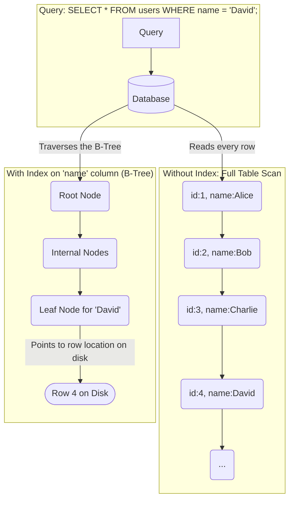

# Database Indexes

## Introduction

A database index is a data structure that improves the speed of data retrieval operations on a database table. It's one of the most powerful tools you have for optimizing database performance. Without indexes, your database would have to perform a "full table scan"—reading every single row in a table—to find the data you're looking for. This is extremely slow for large tables.

An index provides a shortcut. It works much like the index at the back of a book. Instead of reading the entire book to find a topic, you look up the topic in the index, which tells you the exact page numbers where it's mentioned.

## How Indexes Work: The B-Tree

Most relational databases use a **B-Tree** (or a variation like a B+ Tree) as their primary index structure. A B-Tree is a self-balancing tree data structure that keeps data sorted and allows for searches, sequential access, insertions, and deletions in logarithmic time.


By traversing the sorted B-Tree, the database can find the location of the desired row on disk very quickly, often with just a few disk reads, instead of potentially millions.

## When to Use Indexes

Indexes are not free. They come with trade-offs. You should create indexes on columns that are frequently used in:
*   **`WHERE` clauses**: The most common use case. `SELECT * FROM users WHERE email = '...';`
*   **`JOIN` conditions**: Indexing the foreign key columns used in joins is crucial for performance. `SELECT * FROM orders o JOIN users u ON o.user_id = u.id;` (The `o.user_id` column should be indexed).
*   **`ORDER BY` clauses**: An index can store data in a sorted order, which can make sorting operations much faster.

## The Trade-Offs

While indexes make reads much faster, they have costs:
1.  **Slower Writes**: Every time you `INSERT`, `UPDATE`, or `DELETE` a row, the database must also update any indexes that contain that row. With many indexes, write operations can become significantly slower.
2.  **Increased Storage**: An index is a separate data structure that takes up disk space.

The general rule is to only create indexes that you know your application's query patterns will use. Adding indexes indiscriminately will harm your write performance.

## Types of Indexes

*   **Single-Column Index**: The most common type, an index on a single column.
*   **Composite (or Compound) Index**: An index on two or more columns. The order of columns in the index matters. An index on `(last_name, first_name)` is useful for queries that filter by `last_name` or by both `last_name` and `first_name`, but it's not very helpful for queries that only filter by `first_name`.
*   **Unique Index**: Enforces that the value in the indexed column (or combination of columns) must be unique. Primary keys are automatically given a unique index.
*   **Covering Index**: A special type of composite index that includes all the columns requested in a query. If a query can be answered using only the data in the index, the database doesn't have to read the table data from disk at all. This is extremely fast.

## How to Find Slow Queries
Most databases provide a tool to analyze how a query will be executed. In SQL, this is the `EXPLAIN` command.
```sql
EXPLAIN ANALYZE SELECT * FROM users WHERE email = 'test@example.com';
```
The output of `EXPLAIN ANALYZE` will show you the "query plan" and tell you if the database is using an index or performing a slow sequential scan. This is the primary tool for identifying missing indexes and debugging query performance.

<div class="further-reading">
<h3>Further Reading</h3>
<ul>
  <li><a href="https://use-the-index-luke.com/" target="_blank" rel="noopener noreferrer">Use The Index, Luke! - A Guide to Database Performance for Developers</a></li>
  <li><a href="https://www.postgresql.org/docs/current/using-explain.html" target="_blank" rel="noopener noreferrer">Using EXPLAIN in PostgreSQL</a></li>
</ul>
</div>