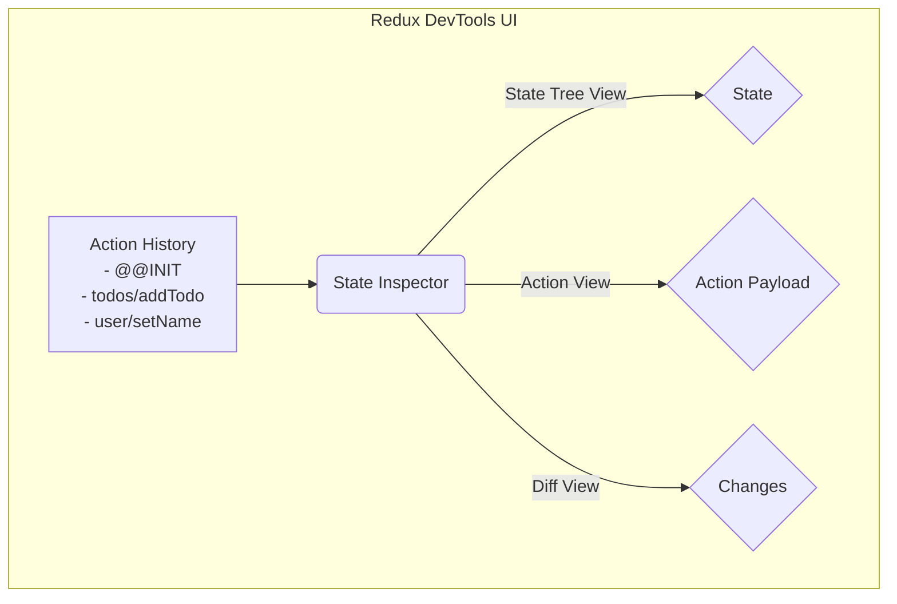

# Debugging with Redux DevTools

## Introduction

Redux is a powerful state management library that enforces a strict, one-way data flow. While this makes state changes predictable, it can still be challenging to trace how and why your state changed in a complex application.

**Redux DevTools** is an essential browser extension and companion package that provides a "time-traveling" debugger for Redux applications. It allows you to inspect every action that has been dispatched, see the state before and after each action, and even "rewind" your application's state, making debugging incredibly efficient.

## Why It's So Powerful

The DevTools provide unparalleled insight into your application's state lifecycle.

*   **Action History**: See a log of every action dispatched, in order.
*   **State Inspection**: For any action, you can inspect the entire state tree before and after the action was processed by the reducer.
*   **Action "Diffing"**: See exactly which parts of your state tree were changed by a specific action.
*   **Time Travel**: "Cancel" actions or jump back to a previous state, and your UI will update to reflect that state. This is invaluable for debugging complex UI issues.
*   **Dispatching Actions**: You can manually dispatch actions from the DevTools to test how your reducers and UI will react.

## How to Set It Up

Setting up the DevTools involves two steps:
1.  **Install the Browser Extension**: Install the Redux DevTools extension for your browser (Chrome, Firefox, etc.).
2.  **Connect Your Redux Store**: When you configure your Redux store, you need to add the DevTools "enhancer." With **Redux Toolkit**, this is done automatically in development mode.

### Example with Redux Toolkit

Redux Toolkit's `configureStore` function handles the setup for you by default. You typically don't need to do any extra configuration in your code.

```javascript
// store.js
import { configureStore } from '@reduxjs/toolkit';
import rootReducer from './reducers'; // Your combined reducers

// `configureStore` automatically enables the Redux DevTools extension
// in development mode.
const store = configureStore({
  reducer: rootReducer,
});

export default store;
```

When you run your application in development, the Redux DevTools extension will automatically detect your store and connect to it.

## Using the DevTools Interface

When you open your browser's developer tools, you'll see a "Redux" tab.



*   **Left Pane (Action History)**: Shows a list of all actions that have been dispatched. You can click on any action to inspect it.
*   **Right Pane (State Inspector)**: Shows the details for the selected action.
    *   The **Action** tab shows the payload of the action object itself.
    *   The **State** tab shows your entire Redux state tree at that point in time.
    *   The **Diff** tab shows what specifically changed in the state tree as a result of this action.

### The "Time Travel" Slider

At the bottom of the DevTools, there is a slider that allows you to scrub back and forth through your action history. As you move the slider, you will see your application's UI update in real-time to reflect the state at that particular moment. This feature is incredibly powerful for understanding how a sequence of events led to a bug.

Even if you are using a simpler state management library, understanding the principles of Redux DevTools can help you appreciate the benefits of a predictable state management pattern.

<div class="further-reading">
<h3>Further Reading</h3>
<ul>
  <li><a href="https://github.com/reduxjs/redux-devtools" target="_blank" rel="noopener noreferrer">Redux DevTools on GitHub</a></li>
  <li><a href="https://redux-toolkit.js.org/api/configureStore" target="_blank" rel="noopener noreferrer">Redux Toolkit `configureStore` Docs</a></li>
</ul>
</div>