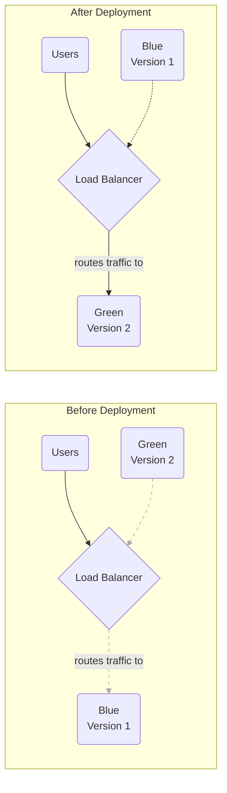
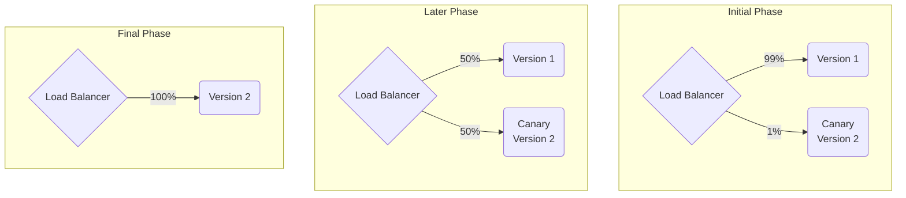

# Deployment Strategies

## Introduction

A deployment strategy is the method you use to release a new version of your application to production. The goal is to update your application with minimal downtime and risk. Choosing the right strategy depends on your application's architecture, your tolerance for risk, and your users' needs.

Modern CI/CD pipelines and container orchestrators like Kubernetes make it possible to automate sophisticated, safe deployment strategies that were once very difficult to implement.

## Common Deployment Strategies

### Rolling Update

This is the default strategy in many platforms, including Kubernetes. The update happens incrementally by replacing old instances with new ones, one by one or in batches.

*   **Pros**: Simple, low-resource overhead.
*   **Cons**: The rollout can be slow. If a problem is discovered midway, the system is in an inconsistent state with both old and new versions running. Rollback is also a slow, instance-by-instance process.

### Blue-Green Deployment

This strategy involves running two identical production environments, "Blue" and "Green." Only one environment is live at any time.



1.  **Deploy**: The new version (v2) is deployed to the inactive Green environment.
2.  **Test**: You can run automated tests against the Green environment without impacting users.
3.  **Switch**: The load balancer is reconfigured to switch all traffic from Blue to Green instantly.
4.  **Rollback**: If a problem occurs, you simply switch the load balancer back to Blue.

*   **Pros**: Instant rollout and rollback, no versioning issues.
*   **Cons**: Requires double the infrastructure, which can be expensive.

### Canary Release

A canary release involves gradually rolling out the new version to a small subset of users before making it available to everyone.



1.  **Deploy Canary**: The new version is deployed alongside the old version.
2.  **Shift Traffic**: A small percentage of traffic (e.g., 1%) is routed to the new version.
3.  **Monitor**: You closely monitor the canary for errors and performance issues. If it's healthy, you gradually increase the traffic percentage.
4.  **Promote or Rollback**: If the canary is stable, you roll it out to 100% of users. If not, you roll back by routing all traffic back to the old version.

*   **Pros**: The safest way to release. Reduces the blast radius of a bad deployment. Allows for real-world testing.
*   **Cons**: The most complex to set up and manage. Requires robust monitoring and observability.

## Feature Flags (Feature Toggles)

Feature flags are a related but distinct technique that allows you to deploy new code to production in a "dark" or inactive state. You can then remotely turn the feature on for specific users, groups, or a percentage of users.

*   **How it works**: You wrap new functionality in a conditional block in your code.
    ```javascript
    if (featureFlags.isEnabled('new-dashboard', user)) {
      // show the new dashboard
    } else {
      // show the old dashboard
    }
    ```
*   **Benefits**:
    *   **Decouples deployment from release**: You can merge and deploy code to production long before it's ready for users.
    *   **Testing in Production**: Safely test new features with internal users.
    *   **Instant Rollback**: If a feature has a bug, you can turn it off instantly without a redeployment.

<div class="further-reading">
<h3>Further Reading</h3>
<ul>
  <li><a href="https://martinfowler.com/bliki/BlueGreenDeployment.html" target="_blank" rel="noopener noreferrer">BlueGreen Deployment by Martin Fowler</a></li>
  <li><a href="https://martinfowler.com/bliki/CanaryRelease.html" target="_blank" rel="noopener noreferrer">Canary Release by Martin Fowler</a></li>
  <li><a href="https://martinfowler.com/articles/feature-toggles.html" target="_blank" rel="noopener noreferrer">Feature Toggles (Feature Flags) by Martin Fowler</a></li>
</ul>
</div>
