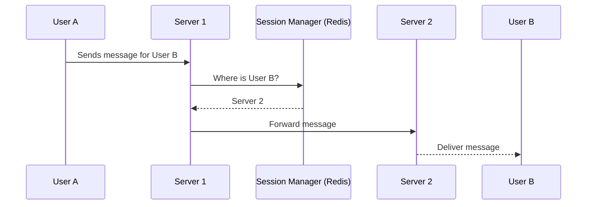

# Designing a Chat System

Designing a scalable chat application like WhatsApp or Facebook Messenger involves handling real-time messaging, user presence (online/offline status), and potentially group chats and message history.

## Step 1: Requirements

*   **Functional Requirements**:
    1.  Support for 1-on-1 private chat.
    2.  Support for group chats.
    3.  Users should receive messages in real-time.
    4.  Display user presence status (online, offline, typing...).
    5.  Message history/persistence.
*   **Non-Functional Requirements**:
    1.  **Low Latency**: Messages should be delivered with minimal delay.
    2.  **High Availability**: The chat service must be reliable.
    3.  **Scalability**: Must support millions of concurrent users.

## Step 2: High-Level Design

The core of a chat system is a persistent connection between the client and the server.

```mermaid
graph TD
    ClientA[User A's App] <=> CS{Chat Servers};
    ClientB[User B's App] <=> CS;

    CS <--> DBM[(Message Database)];
    CS <--> SM[Session/Presence Manager];
    
    subgraph "Chat Servers (WebSocket-based)"
      CS
    end
```
*   **Clients**: Mobile or web applications.
*   **Chat Servers**: A cluster of servers that manage persistent connections with clients. **WebSockets** are the ideal technology for this, providing a full-duplex, low-latency communication channel.
*   **Session/Presence Manager**: A stateful service that keeps track of which user is connected to which chat server. This is crucial for routing messages. An in-memory cache like **Redis** is perfect for this.
*   **Message Database**: A database to persist all chat messages.

## Step 3: Deep Dive

### 1. The Connection Layer

*   **Protocol Choice**: While long polling can work, **WebSockets** are far superior for real-time chat due to their lower overhead and bi-directional nature.
*   **Scalability**: A single server can only handle a limited number of persistent WebSocket connections (e.g., 50k-100k). Therefore, we need a fleet of chat servers behind a **Load Balancer**.
*   **The Routing Problem**: If User A is connected to Server 1, and User B is connected to Server 2, how does Server 1 route User A's message to User B? This is where the Session Manager comes in.

### 2. Session and Presence Management

*   **How it works**:
    1.  When a user's app connects to a chat server, the server records the mapping in a central store: `user_id -> server_id`.
    2.  This store (e.g., Redis) also manages the user's presence status (online/offline).
    3.  When a user disconnects (gracefully or due to a network issue), the chat server updates their status to offline. Heartbeats can be used to detect ungraceful disconnects.
*   **Message Routing Flow**:
    1.  User A (on Server 1) sends a message intended for User B.
    2.  Server 1 receives the message.
    3.  Server 1 queries the Session Manager: "Which server is User B connected to?"
    4.  The Session Manager replies: "Server 2".
    5.  Server 1 then forwards the message to Server 2, likely via a lightweight pub/sub mechanism or direct server-to-server call.
    6.  Server 2 receives the message and delivers it to User B over their WebSocket connection.



### 3. Database for Messages

*   **The Challenge**: Chat data can grow enormous. We need a database that can handle high write throughput and store massive amounts of data.
*   **Database Choice**: NoSQL databases are often a good fit here.
    *   **Wide-Column Stores (e.g., Cassandra, HBase)**: These are excellent for time-series data like messages. They scale horizontally and are optimized for writes. A common data model would use `(chat_id, timestamp)` as the primary key to store messages chronologically for each chat.
    *   **Document Stores (e.g., MongoDB)** can also work.

### 4. Handling Group Chats

Group chats add complexity to the fan-out.
*   Instead of looking up a single user's server, the chat server must look up all members of the group and route the message to the appropriate servers for each online member.
*   This can be optimized. A server can publish a message once to a group-specific topic/channel on a message broker (like Kafka), and all other chat servers handling members of that group can subscribe to that topic.

## Step 4: Final Touches

*   **Push Notifications**: For offline users, the server should send a push notification to their device. This involves integrating with services like APNS (Apple) and FCM (Google).
*   **Media Sharing**: Images and videos should be uploaded to an object store (like S3), and only the URL/metadata should be sent in the chat message.
*   **End-to-End Encryption**: For true privacy, systems like WhatsApp use end-to-end encryption, where messages are encrypted on the sender's device and can only be decrypted on the recipient's device. The server only sees encrypted blobs.
