# Designing a Ride-Sharing App

Designing a service like Uber or Lyft involves several interesting challenges, primarily around real-time location tracking, matching riders with drivers, and handling payments.

## Step 1: Requirements

*   **Functional Requirements**:
    1.  Riders can request a ride from their location to a destination.
    2.  Drivers can see nearby ride requests and accept them.
    3.  Riders and drivers can see each other's live location on a map.
    4.  The system should calculate the estimated price and route.
    5.  The system should handle payments after the ride is complete.
*   **Non-Functional Requirements**:
    1.  **High Availability**: The service must be reliable.
    2.  **Low Latency**: Location updates and ride requests must be processed in near real-time.
    3.  **Scalability**: The system must support millions of users in many different cities.

## Step 2: High-Level Design

The system can be broken down into several microservices, each handling a specific domain.

```mermaid
graph TD
    RiderApp[Rider App] --> GW{API Gateway};
    DriverApp[Driver App] --> GW;
    
    subgraph Backend Services
        GW --> AS[Auth Service];
        GW --> US[User Service];
        GW --> PS[Payments Service];
        GW --> DS[Driver Service];
        GW --> RS[Rider Service];
        GW --> MS[Matching Service];
    end

    DS -- Publishes location --> K((Kafka));
    RS -- Publishes ride request --> K;
    K --> MS;

    style MS fill:#1b263b,stroke:#00f5d4,stroke-width:2px;
```

*   **Rider/Driver Services**: Manage rider and driver-specific logic (e.g., profiles, trip history).
*   **Matching Service**: The core component responsible for connecting riders with drivers.
*   **Location Service (part of Driver Service)**: Ingests and processes location updates from drivers.

## Step 3: Deep Dive

### 1. Location Tracking

Drivers' apps will continuously send their GPS coordinates to the backend. This generates a massive amount of data.

*   **How often?**: Sending an update every 3-4 seconds is a reasonable balance between real-time accuracy and network/battery usage.
*   **Protocol**: A standard HTTP request for each update is too inefficient. A lightweight, persistent connection is better. **WebSocket** or **MQTT** are excellent choices for this.
*   **Data Ingestion**: The location updates should be pushed to a high-throughput **Message Queue** like **Kafka**. This decouples the ingestion from the processing. A separate service can then consume from Kafka to update driver locations.
*   **Storing Locations**: We need a database optimized for geospatial queries (e.g., "find all drivers within a 5km radius of this point").
    *   **Quadtrees/Geohashing**: These are techniques for indexing 2D spatial data.
    *   **Databases with Geospatial Support**: Databases like PostgreSQL (with PostGIS extension), MongoDB, and Elasticsearch have built-in support for efficient geospatial indexing and queries.

### 2. Matching Riders and Drivers

This is the most complex part of the system.

1.  **Rider Request**: A rider requests a trip. The Rider Service publishes a `RideRequested` event to Kafka.
2.  **Matching Service**: This service consumes `RideRequested` events.
3.  **Find Nearby Drivers**: The service queries the geospatial database to find all available drivers within a certain radius of the rider's location.
4.  **Filtering & Ranking**: The service then filters and ranks these drivers based on various factors:
    *   Distance / ETA to the rider.
    *   Driver rating.
    *   Vehicle type.
    *   Dynamic "surge" pricing models.
5.  **Dispatch**: The service sends the ride request to the top-ranked drivers (e.g., via push notification or WebSocket message). It might send to one driver at a time or broadcast to several.
6.  **Driver Acceptance**: The first driver to accept the ride is assigned the trip. The Matching Service updates the trip status and notifies the rider.

### 3. Communication

*   **Driver Location Updates**: Driver App to Server -> **WebSocket**/MQTT.
*   **Rider/Driver Communication**: Server to Apps (e.g., "Your driver is arriving") -> **WebSocket** or **Push Notifications**.
*   **Standard API Calls**: Rider/Driver Apps to Server (e.g., login, view trip history) -> **REST** or **gRPC** via an **API Gateway**.

## Step 4: Final Touches

*   **Database Choice**: A polyglot persistence approach works well here.
    *   **User/Trip Data**: A relational database like **PostgreSQL** or a document DB like **MongoDB**.
    *   **Driver Locations**: A database with strong geospatial capabilities like **PostgreSQL with PostGIS** or **Elasticsearch**.
*   **Fault Tolerance**: The Matching Service is critical. If it goes down, no rides can be booked. It must be designed for high availability with multiple replicas.
*   **City-based Partitioning**: The entire system can be partitioned or **sharded** by city. A driver in San Francisco does not need to be matched with a rider in New York. This greatly reduces the scope of the matching problem and allows the system to scale geographically.