# Designing a URL Shortener

This is a classic system design interview question. It's a great problem because it seems simple on the surface but can be expanded to cover many core concepts like database design, caching, and scaling.

## Step 1: Requirements and Goals

First, let's clarify the requirements.

*   **Functional Requirements**:
    1.  Given a long URL, generate a shorter, unique alias (e.g., `short.ly/xyz123`).
    2.  When a user accesses the short URL, they should be redirected to the original long URL.
    3.  (Optional) Users should be able to specify a custom short URL.
    4.  (Optional) Analytics: The service should track the number of clicks for each short URL.

*   **Non-Functional Requirements**:
    1.  **High Availability**: The service must be highly available. If the redirection service is down, the links won't work.
    2.  **Low Latency**: Redirects must be very fast.
    3.  **Scalability**: The system should be able to handle a high volume of requests. Shortened URLs should not expire.

*   **Back-of-the-Envelope Estimation**:
    *   Assume 100 million new URLs per month.
    *   Write QPS: `100M / (30 days * 86400s)` ≈ `40 writes/sec`.
    *   Assume a 10:1 read-to-write ratio (a URL is read more often than it's created).
    *   Read QPS: `40 * 10` = `400 reads/sec`.
    *   Storage: `100M URLs/month * 12 months * 5 years` = `6 Billion URLs`. If each URL entry takes ~500 bytes, `6B * 500B` = `3 TB` of storage.

## Step 2: High-Level Design

The core of the service is a key-value store. The short URL is the key, and the long URL is the value.

```mermaid
graph TD
    User --> Browser;
    
    subgraph "Write Path (Create Short URL)"
        direction LR
        Browser -- "POST /shorten (longURL)" --> API{API Server};
        API --> DB[(Database)];
    end
    
    subgraph "Read Path (Redirect)"
        direction LR
        Browser -- "GET /xyz123" --> API2{API Server};
        API2 --> Cache[Cache];
        Cache -- "Cache Miss" --> DB2[(Database)];
        DB2 --> Cache;
        Cache -- "Cache Hit" --> API2;
        API2 -- "301 Redirect" --> Browser;
    end

    style API fill:#1b263b,stroke:#00f5d4,stroke-width:2px;
    style API2 fill:#1b263b,stroke:#00f5d4,stroke-width:2px;
```

## Step 3: Deep Dive

### 1. Short Key Generation

How do we create the short key (e.g., `xyz123`)?

*   **Option 1: Hashing (e.g., MD5/SHA256)**
    *   Hash the long URL and take the first 6-7 characters.
    *   **Pros**: Simple, no state needed.
    *   **Cons**: Collisions are possible. Two different long URLs could hash to the same short key. We'd need a mechanism to handle this (e.g., append a character).

*   **Option 2: Base62 Encoding**
    *   This is the standard approach.
    *   Use a counter (e.g., from a database sequence) that increments for each new URL. Let's say the counter value is `1000`.
    *   Convert this decimal number to a base-62 representation. Base-62 uses characters `[0-9]`, `[a-z]`, `[A-Z]`.
    *   `1000` in base-62 is `g8`.
    *   **Pros**: Short keys are guaranteed to be unique and are non-guessable. The length of the key increases as the counter grows. With 7 characters, we can support `62^7` ≈ 3.5 trillion URLs.
    *   **Challenge**: The single counter can become a bottleneck. This can be solved by using a distributed unique ID generator like Twitter's Snowflake.

### 2. Database Design

*   **Schema**: A simple table would suffice:
    *   `short_key` (VARCHAR, Primary Key)
    *   `long_url` (TEXT)
    *   `user_id` (VARCHAR, optional)
    *   `created_at` (TIMESTAMP)
*   **Database Choice**:
    *   **SQL (e.g., PostgreSQL)**: A good choice. It's reliable, and our data is structured. We can easily scale reads using read replicas.
    *   **NoSQL (e.g., DynamoDB, Cassandra)**: Also an excellent choice. The key-value nature of the problem fits perfectly with NoSQL databases, which offer massive scalability for both reads and writes.

### 3. Caching

Since reads are more frequent than writes, a cache is essential for low-latency redirects. For a full overview of different strategies, see the topic on **Caching Strategies**.
*   **Strategy**: Use a Cache-Aside pattern.
    1.  When a redirect request comes in for `short.ly/xyz123`, first check the cache for the key `xyz123`.
    2.  If it's a **cache hit**, return the long URL immediately.
    3.  If it's a **cache miss**, query the database, store the result in the cache with a TTL (Time-To-Live), and then return it.
*   **Technology**: Use an in-memory cache like **Redis** or **Memcached**.

## Step 4: Scaling and Final Touches

*   **Application Servers**: The servers should be stateless, allowing us to add more of them behind a **Load Balancer** to scale horizontally.
*   **Database Scaling**:
    *   Start with a primary-replica setup to scale reads.
    *   As writes grow and data size exceeds a single server's capacity, we must introduce **Data Partitioning**. We could shard the database based on the `short_key`. For example, keys starting with 'a'-'m' go to Shard 1, and 'n'-'z' go to Shard 2.
*   **Analytics**: To count clicks without slowing down redirects, the redirect server can publish an event to a **Message Queue** (like Kafka or SQS) for each click. A separate analytics service can then consume these events asynchronously to update click counters.
*   **Rate Limiting**: To prevent abuse, we should implement rate limiting on the URL creation endpoint.