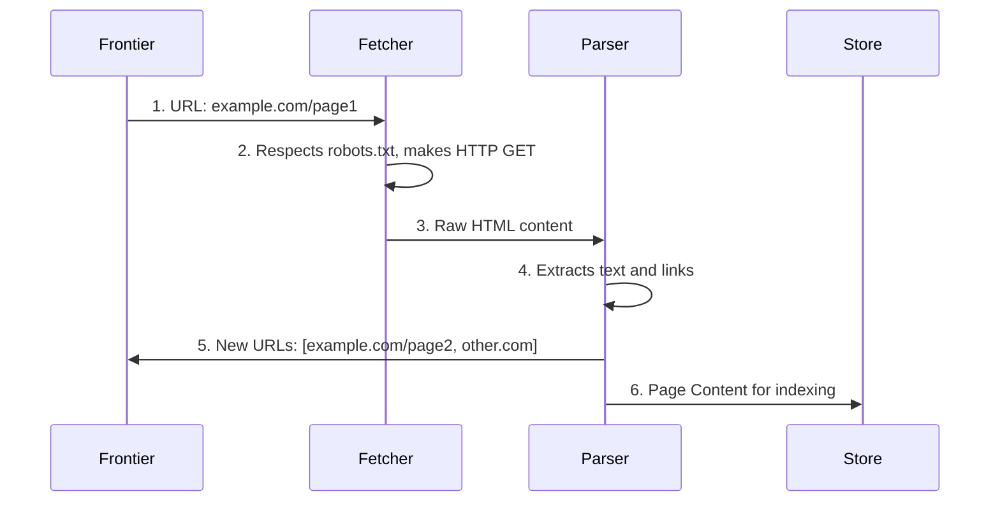

# Designing a Web Crawler

A web crawler (also known as a spider or bot) is a program that systematically browses the World Wide Web, typically for the purpose of web indexing for a search engine. Designing a scalable and considerate web crawler is a classic distributed systems problem.

## Step 1: Requirements

*   **Functional Requirements**:
    1.  Given a set of seed URLs, the crawler should fetch the pages.
    2.  It should parse the HTML to extract all links on the page.
    3.  It should add these new links to a list of URLs to be crawled.
    4.  It should store the content of the crawled pages.
    5.  The process should repeat continuously.
*   **Non-Functional Requirements**:
    1.  **Scalability**: The crawler must be able to crawl billions of web pages.
    2.  **Robustness**: It must handle bad HTML, network errors, and unresponsive servers gracefully.
    3.  **Politeness**: The crawler must not overwhelm any single web server with too many requests in a short period. This is a critical ethical and practical requirement.
    4.  **Extensibility**: The system should be extensible to support different types of content processing (e.g., image indexing, keyword extraction).

## Step 2: High-Level Architecture

A single-threaded crawler would be far too slow. We need a distributed, asynchronous architecture.

```mermaid
graph TD
    A[Seed URLs] --> B{URL Frontier};
    
    subgraph "Crawler Nodes (Many instances)"
        C[Fetcher] --> D{HTML Parser};
        D -- "Extracted Links" --> B;
        D -- "Page Content" --> E{Content Store};
    end

    B -- "URL to Fetch" --> C;

    style B fill:#1b263b,stroke:#00f5d4,stroke-width:2px;
```

*   **URL Frontier**: The heart of the crawler. It's a large-scale priority queue that stores all the URLs we intend to crawl.
*   **Fetcher**: A worker process that takes a URL from the frontier, makes an HTTP request, and retrieves the page content.
*   **HTML Parser**: A component that parses the raw HTML, extracts the content, and finds all new hyperlinks.
*   **Content Store**: A database or object store where the fetched page content is saved.

## Step 3: Deep Dive

### 1. The URL Frontier

This is the most complex component. It's not just a simple FIFO queue.
*   **Responsibilities**:
    1.  Store URLs to be downloaded.
    2.  Prioritize which URLs to crawl next (e.g., based on PageRank or update frequency).
    3.  Enforce politeness by ensuring we don't crawl the same domain too frequently.
*   **Implementation**:
    *   It typically consists of multiple queues, one for each domain/hostname.
    *   A scheduler process selects a domain queue that hasn't been accessed recently (respecting a politeness delay, e.g., 1 request per second per domain).
    *   It then pops a URL from that domain's queue and sends it to a fetcher.

### 2. Politeness and `robots.txt`

*   **`robots.txt`**: Before crawling any page on a domain, a well-behaved crawler must first fetch and parse the `http://domain.com/robots.txt` file. This file specifies which parts of the site the owner does not want to be crawled. Our crawler must respect these rules.
*   **Rate Limiting**: The crawler must limit the rate of requests to any single host. This is managed by the URL Frontier's scheduler.

### 3. Processing Pipeline

The entire workflow can be managed using a set of distributed queues.

### 4. Handling Duplicates

The web is full of duplicate content. We need to avoid storing the same page multiple times.
*   **Checksums**: Before storing a page, we can compute a checksum (hash) of its content.
*   **Duplicate Detection**: We can maintain a database of checksums of all pages we've already seen. If the new page's checksum already exists, we discard the page and just add a reference.

### 5. Data Storage

*   **URL Frontier**: Can be built using a message queue system like Kafka or a distributed database.
*   **Content Store**: Given the massive volume of data, an object store like **AWS S3** or a distributed file system like HDFS is suitable for storing the raw HTML. A search engine like **Elasticsearch** would then be used to index this content for querying.
*   **URL Metadata**: A database (SQL or NoSQL) is needed to store metadata about URLs, such as when they were last crawled, their content checksum, etc.

## Step 4: Final Touches

*   **Scalability**: The entire system is designed for horizontal scaling. If crawling is too slow, we can simply add more Fetcher and Parser nodes.
*   **Fault Tolerance**: Using persistent queues in the URL Frontier ensures that we don't lose URLs if a crawler node fails.
*   **URL Normalization**: URLs can have many forms that point to the same page (e.g., with/without `www`, `http` vs `https`). We need a canonicalization step to normalize all URLs to a standard format to avoid crawling the same page multiple times.
