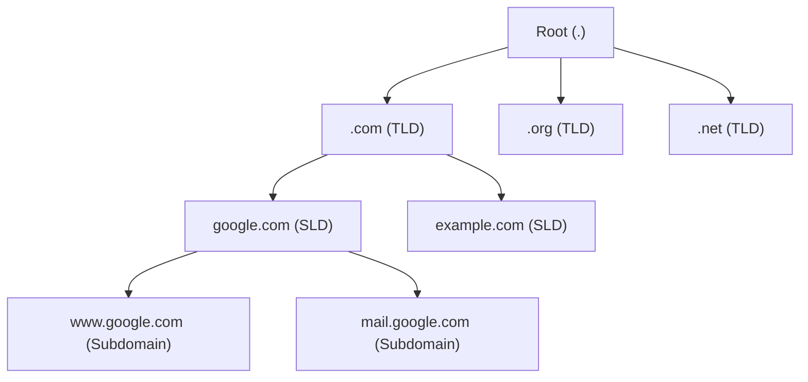
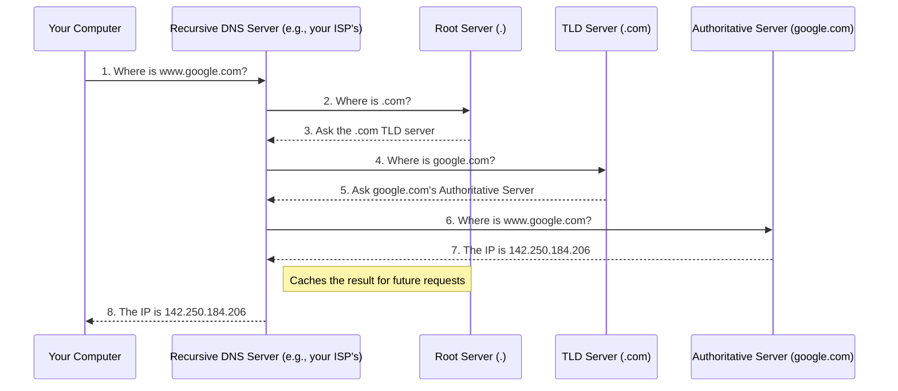

# Domain Name System (DNS)

## Introduction

Computers on the internet find each other using **IP addresses** (like `142.250.184.206`). However, humans find it much easier to remember names (like `www.google.com`). The Domain Name System (DNS) is the critical internet service that translates these human-readable domain names into computer-readable IP addresses. It's often called the "phone book of the internet."

When you type a URL into your browser, a DNS lookup is the very first thing that happens before your browser can even send an HTTP request.

## The DNS Hierarchy

DNS is a hierarchical system. A domain name like `www.google.com.` (note the trailing dot, which is often implicit) is read from right to left.

*   **Root Domain (.)**: The highest level of the hierarchy.
*   **Top-Level Domain (TLD)**: The segment that follows the final dot of a domain name (e.g., `.com`, `.org`, `.gov`).
*   **Second-Level Domain (SLD)**: The domain name itself (e.g., `google` in `google.com`).
*   **Subdomain**: Prefixes to the SLD (e.g., `www` or `mail`).

## The DNS Resolution Process

The DNS system is a distributed database. No single server holds all the translations. When you request a domain name, your computer queries a series of servers to find the IP address.

1.  **Recursive DNS Server**: Your computer first asks a "Recursive" DNS server (often provided by your ISP or a public one like Google's `8.8.8.8` or Cloudflare's `1.1.1.1`). This server's job is to do all the hard work of finding the answer.
2.  **Root Server**: If the recursive server doesn't have the answer cached, it asks one of the 13 root name servers in the world, "Who is responsible for the `.com` domain?" The root server responds with the address of the TLD server for `.com`.
3.  **TLD (Top-Level Domain) Server**: The recursive server then asks the `.com` TLD server, "Who is responsible for `google.com`?" The TLD server responds with the address of the authoritative name server for `google.com`.
4.  **Authoritative Name Server**: Finally, the recursive server asks the authoritative name server (which is controlled by the domain owner, Google), "What is the IP address for `www.google.com`?" This server knows the definitive answer and provides the IP address.
5.  **Caching is Crucial**: The recursive server caches this answer for a certain amount of time (defined by a TTL, or Time-To-Live value). The next time someone on the same ISP asks for `www.google.com`, the recursive server can answer immediately. Your own computer and browser also cache DNS records. Without caching, the DNS system would be overwhelmed.

## Common DNS Record Types

A DNS server doesn't just store IP addresses. It stores various types of records.

| Record Type | Name                     | Purpose                                                                | Example Value                       |
| :---------- | :----------------------- | :--------------------------------------------------------------------- | :---------------------------------- |
| **A**       | Address Record           | Maps a domain name to an IPv4 address.                                 | `142.250.184.206`                   |
| **AAAA**    | IPv6 Address Record      | Maps a domain name to an IPv6 address.                                 | `2001:0db8:85a3::8a2e:0370:7334`    |
| **CNAME**   | Canonical Name Record    | An alias that points one domain name to another.                       | `www.example.com` -> `example.com`  |
| **MX**      | Mail Exchange Record     | Specifies the mail server responsible for accepting email for a domain. | `10 mail.google.com`                |
| **NS**      | Name Server Record       | Delegates a DNS zone to use the given authoritative name servers.      | `ns1.godaddy.com`                   |
| **TXT**     | Text Record              | Stores arbitrary text. Used for things like email security (SPF, DKIM). | `"v=spf1 include:_spf.google.com ~all"` |

As a backend engineer, you will often need to configure these records for your services, for example, setting an `A` record to point your API's domain to your server's IP address, or an `MX` record to set up email.

<h3>Further Reading</h3>
<ul>
  <li><a href="https://howdns.works/" target="_blank" rel="noopener noreferrer">How DNS Works (Comic)</a></li>
  <li><a href="https://www.cloudflare.com/learning/dns/what-is-dns/" target="_blank" rel="noopener noreferrer">What is DNS? (Cloudflare)</a></li>
</ul>

