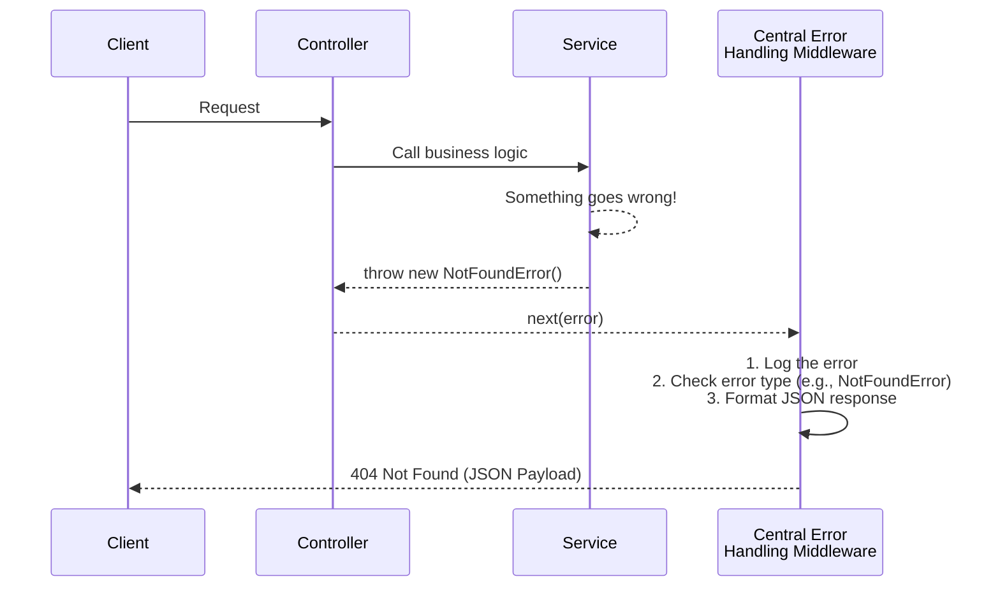

# Error Handling

## Introduction

Error handling is a critical aspect of building robust and reliable backend applications. It's the process of anticipating, detecting, and resolving errors that may occur during an application's execution. Proper error handling ensures that your application can recover gracefully from unexpected situations, provides clear feedback to users and developers, and prevents minor issues from cascading into major system failures.

A well-designed error handling strategy is not an afterthought; it's a fundamental part of the application's architecture.

## Error Propagation Flow

Instead of handling errors in every controller, it's best practice to use a centralized error handler. Your application logic throws an error, and a single piece of middleware at the end of the request chain is responsible for catching it and formatting the final response.

## Centralized Error Handling Examples

Most modern web frameworks support a special type of middleware for centralized error handling.

  

    <button class="tab-button active" data-lang="nodejs">Node.js (Express)</button>
    <button class="tab-button" data-lang="python">Python (Flask)</button>
    <button class="tab-button" data-lang="go">Go (net/http)</button>
  

  

<pre><code class="language-javascript">
class NotFoundError extends Error {
  constructor(message) {
    super(message);
    this.statusCode = 404;
  }
}

// Route handler throws an error
app.get('/users/:id', (req, res, next) => {
  try {
    const user = userService.findUserById(req.params.id);
    if (!user) {
      throw new NotFoundError('User not found');
    }
    res.json(user);
  } catch (err) {
    // Pass the error to the centralized handler
    next(err);
  }
});

// The centralized error handling middleware (must have 4 arguments)
app.use((err, req, res, next) => {
  console.error(err); // Log the error for debugging
  
  const statusCode = err.statusCode || 500;
  const message = err.message || 'An unexpected error occurred.';
  
  res.status(statusCode).json({ error: { message } });
});
</code></pre>
  

  

<pre><code class="language-python">
from flask import Flask, jsonify

class NotFoundError(Exception):
    status_code = 404

app = Flask(__name__)

# Route handler raises an error
@app.route('/users/<int:user_id>')
def get_user(user_id):
    user = user_service.find_user_by_id(user_id)
    if not user:
        raise NotFoundError("User not found")
    return jsonify(user)

# Centralized error handler for a specific exception type
@app.errorhandler(NotFoundError)
def handle_not_found(error):
    response = {'error': {'message': str(error)}}
    return jsonify(response), error.status_code

# Catch-all error handler for unexpected errors
@app.errorhandler(Exception)
def handle_generic_error(error):
    # Log the full error for debugging
    app.logger.error(f"Unexpected error: {error}", exc_info=True)
    response = {'error': {'message': 'An unexpected error occurred.'}}
    return jsonify(response), 500
</code></pre>
  

  

<pre><code class="language-go">
package main

import (
	"encoding/json"
	"log"
	"net/http"
)

// A custom handler type that can return an error
type appHandler func(http.ResponseWriter, *http.Request) *appError

type appError struct {
	Error   error
	Message string
	Code    int
}

// The centralized error handling middleware
func (fn appHandler) ServeHTTP(w http.ResponseWriter, r *http.Request) {
	if e := fn(w, r); e != nil { // e is *appError
		log.Printf("Error: %v", e.Error)
		w.Header().Set("Content-Type", "application/json")
		w.WriteHeader(e.Code)
		json.NewEncoder(w).Encode(map[string]string{"error": e.Message})
	}
}

// Route handler returns a custom error
func getUserHandler(w http.ResponseWriter, r *http.Request) *appError {
	user, err := findUserById(123)
	if err != nil {
		return &appError{err, "User not found", http.StatusNotFound}
	}
	json.NewEncoder(w).Encode(user)
	return nil
}

func main() {
    // Wrap the handler with the error-handling middleware
	http.Handle("/users/123", appHandler(getUserHandler))
	http.ListenAndServe(":8080", nil)
}
</code></pre>
  

## Best Practices
*   **Fail Fast**: Validate input at the beginning of a request handler.
*   **Use Custom Error Types**: Create specific error classes/types for business logic failures (e.g., `NotFoundError`, `ValidationError`).
*   **Be Specific with Throws, Generic with Catches**: Throw specific errors from your business logic, but have a generic, centralized handler to catch them.
*   **Log, Don't Swallow, Errors**: Never ignore a server error. Logging is crucial for debugging.
*   **Don't Leak Implementation Details**: Never expose raw error messages or stack traces from internal services to the client. This is a security risk.
*   **Use Consistent, Structured Error Formats**: Ensure all your API endpoints return errors in the same JSON format.