# Event-Driven Architecture (EDA)

## Introduction

Event-Driven Architecture is a software design pattern that promotes the production, detection, consumption of, and reaction to "events." An event is a significant change in state, such as a user placing an order or a payment being processed.

In an EDA, services communicate asynchronously by sending and receiving events through a message broker. This contrasts with a traditional request-response model where services make direct, synchronous calls to each other. EDA enables building highly scalable, resilient, and loosely coupled systems.

## The Publish-Subscribe (Pub/Sub) Pattern

Pub/Sub is the most common pattern in EDA. Producers publish events to a topic on a message broker, and the broker is responsible for delivering the event to all interested consumer services.

```mermaid
graph TD
    P[Order Service] -- "1. Publishes 'OrderCreated' Event" --> MB((Message Broker));
    
    subgraph Consumers
        C1[Notification Service];
        C2[Inventory Service];
        C3[Analytics Service];
    end

    MB -- "2. Delivers Event" --> C1;
    MB -- "2. Delivers Event" --> C2;
    MB -- "2. Delivers Event" --> C3;

    style P fill:#1b263b,stroke:#00f5d4,stroke-width:2px;
    style C1 fill:#1b263b,stroke:#ffc300,stroke-width:2px;
    style C2 fill:#1b263b,stroke:#ffc300,stroke-width:2px;
    style C3 fill:#1b263b,stroke:#ffc300,stroke-width:2px;
```

The key is that the **Order Service** does not know or care that the other services exist. This is **decoupling**.

## Code Examples: Redis Pub/Sub

Here's how to implement a simple producer/consumer system using Redis.

  

    <button class="tab-button active" data-lang="nodejs">Node.js (ioredis)</button>
    <button class="tab-button" data-lang="python">Python (redis-py)</button>
    <button class="tab-button" data-lang="go">Go (go-redis)</button>
  

  

<pre><code class="language-javascript">
// --- Producer (e.g., in your order service) ---
const Redis = require('ioredis');
const publisher = new Redis();

async function placeOrder(order) {
    console.log('Placing order:', order.id);
    // ... save order to database ...
    
    const event = { event: 'OrderCreated', data: order };
    // Publish the event to the 'orders' channel
    publisher.publish('orders', JSON.stringify(event));
    console.log('Published OrderCreated event.');
}

placeOrder({ id: 123, amount: 99.99 });

// --- Consumer (e.g., in your notification service) ---
const Redis = require('ioredis');
const subscriber = new Redis();

// Subscribe to the 'orders' channel
subscriber.subscribe('orders', (err, count) => {
    if (err) console.error(err);
    console.log(`Subscribed to ${count} channels.`);
});

subscriber.on('message', (channel, message) => {
    console.log(`Received message from channel '${channel}'`);
    const event = JSON.parse(message);
    
    if (event.event === 'OrderCreated') {
        console.log('Sending confirmation email for order:', event.data.id);
        // ... email sending logic ...
    }
});
</code></pre>
  

  

<pre><code class="language-python">
import redis
import json
import time

# --- Producer (e.g., in your order service) ---
r = redis.Redis(decode_responses=True)

def place_order(order):
    print(f"Placing order: {order['id']}")
    # ... save order to database ...
    
    event = {"event": "OrderCreated", "data": order}
    # Publish the event to the 'orders' channel
    r.publish('orders', json.dumps(event))
    print("Published OrderCreated event.")

place_order({"id": 123, "amount": 99.99})

# --- Consumer (e.g., in your notification service) ---
r = redis.Redis(decode_responses=True)
pubsub = r.pubsub()

# Subscribe to the 'orders' channel
pubsub.subscribe('orders')
print("Subscribed to 'orders' channel.")

for message in pubsub.listen():
    if message['type'] == 'message':
        print(f"Received message from channel '{message['channel']}'")
        event = json.loads(message['data'])
        
        if event['event'] == 'OrderCreated':
            print(f"Sending confirmation email for order: {event['data']['id']}")
            # ... email sending logic ...
</code></pre>
  

  

<pre><code class="language-go">
package main

import (
	"context"
	"encoding/json"
	"fmt"
	"github.com/go-redis/redis/v8"
)

var ctx = context.Background()

// --- Producer (e.g., in your order service) ---
func placeOrder(rdb *redis.Client, order map[string]interface{}) {
	fmt.Printf("Placing order: %.0f\n", order["id"])
	// ... save order to database ...

	event := map[string]interface{}{"event": "OrderCreated", "data": order}
	eventJSON, _ := json.Marshal(event)

	// Publish the event to the 'orders' channel
	err := rdb.Publish(ctx, "orders", eventJSON).Err()
	if err != nil { panic(err) }
	fmt.Println("Published OrderCreated event.")
}

// --- Consumer (e.g., in your notification service) ---
func listenForOrders(rdb *redis.Client) {
	pubsub := rdb.Subscribe(ctx, "orders")
	defer pubsub.Close()

	ch := pubsub.Channel()
	fmt.Println("Subscribed to 'orders' channel.")

	for msg := range ch {
		fmt.Printf("Received message from channel '%s'\n", msg.Channel)
		var event map[string]interface{}
		json.Unmarshal([]byte(msg.Payload), &event)

		if event["event"] == "OrderCreated" {
			data := event["data"].(map[string]interface{})
			fmt.Printf("Sending confirmation email for order: %.0f\n", data["id"])
			// ... email sending logic ...
		}
	}
}

func main() {
    rdb := redis.NewClient(&redis.Options{ Addr: "localhost:6379" })
    
    // Run consumer in a separate goroutine
    go listenForOrders(rdb)
    
    // Run producer
    placeOrder(rdb, map[string]interface{}{"id": 123, "amount": 99.99})

    // Keep main thread alive to see consumer output
    select{}
}
</code></pre>
  

## Benefits and Challenges

### Benefits
*   **Scalability**: Services can be scaled independently.
*   **Resilience**: If a consumer service fails, the rest of the system can continue to operate.
*   **Agility**: You can add new consumer services without changing any existing services.

### Challenges
*   **Complexity**: Asynchronous systems can be harder to debug. **Distributed Tracing** is essential.
*   **Eventual Consistency**: There is a delay before all parts of the system are consistent.
*   **Message Broker Management**: The broker is a critical piece of infrastructure that must be highly available and scalable.

<h3>Further Reading</h3>
<ul>
  <li><a href="https://martinfowler.com/articles/201701-event-driven.html" target="_blank" rel="noopener noreferrer">What do you mean by "Event-Driven"? by Martin Fowler</a></li>
  <li><a href="https://kafka.apache.org/documentation/#intro_concepts" target="_blank" rel="noopener noreferrer">Apache Kafka Concepts</a></li>
  <li><a href="https://microservices.io/patterns/communication-style/publish-subscribe.html" target="_blank" rel="noopener noreferrer">Pattern: Publish/Subscribe</a></li>
</ul>

