# Frontend Tooling

## Introduction

Modern frontend development involves more than just writing HTML, CSS, and JavaScript. To build scalable, maintainable, and performant applications, developers rely on a rich ecosystem of tools that automate common tasks, enable the use of modern language features, and optimize code for production.

This collection of tools is often referred to as the "build process" or "toolchain." Understanding the role of each tool is essential for any professional frontend developer.

## The Core Components of a Modern Toolchain

```mermaid
%% Modern front-end build pipeline
graph TD

    %% Nodes – use \n for line-breaks, quote complex labels
    A["Your Code\n(Modern JS, JSX, TS, SASS)"]
    B["Transpiler\n(Babel)"]
    C["Bundler\n(Vite / Webpack)"]
    D["Linter\n(ESLint)"]
    E["Formatter\n(Prettier)"]
    F["Optimized Production Code\n(Single JS/CSS files)"]

    %% Edges
    A --> B
    B --> C
    D --> A
    E --> A
    C --> F

    %% Styling
    style C fill:#1b263b,stroke:#00f5d4,stroke-width:2px
```

1.  **Transpiler (e.g., Babel)**: Translates modern JavaScript (and its variants like JSX or TypeScript) into older, more widely compatible JavaScript that can run in all browsers.
2.  **Bundler (e.g., Vite, Webpack)**: Takes your application code, which is often split into many modules, and "bundles" it into a small number of optimized files (usually one JavaScript file and one CSS file) for the browser to download.
3.  **Linter (e.g., ESLint)**: A static analysis tool that scans your code for potential errors, bugs, and stylistic issues without running it. It helps enforce code quality and consistency.
4.  **Formatter (e.g., Prettier)**: An opinionated tool that automatically reformats your code to ensure it adheres to a consistent style guide (e.g., indentation, line length, spacing).

## Deep Dive into Each Tool

### Transpilers: Babel

*   **Problem**: New JavaScript features (like `async/await` or optional chaining `?.`) are released every year, but older browsers may not support them. Similarly, languages like TypeScript and syntax extensions like JSX are not valid JavaScript.
*   **Solution**: **Babel** is a JavaScript compiler that takes modern JS code as input and outputs backwards-compatible versions that can run in older environments. It uses a set of "plugins" and "presets" to know which transformations to apply.

### Bundlers: Vite and Webpack

*   **Problem**: For maintainability, we write our code in small, reusable modules. However, making the browser download hundreds of small JavaScript files would be extremely slow.
*   **Solution**: A **bundler** traverses the dependency graph of your application starting from an entry point (e.g., `index.js`). It pulls in all the imported modules and merges them into a single file. During this process, it can also perform powerful optimizations:
    *   **Minification**: Removes all unnecessary characters (whitespace, comments) from the code to reduce file size.
    *   **Tree Shaking**: Removes "dead code" (code that is imported but never used).
    *   **Code Splitting**: Can intelligently split the bundle into smaller chunks that can be loaded on demand, improving initial page load time.
*   **Webpack** has been the industry standard for years, but it's known for being complex to configure. **Vite** is a newer, next-generation bundler that offers a much faster development experience and simpler configuration.

### Linters: ESLint

*   **Problem**: Code can be syntactically correct but still contain logical errors or not follow best practices.
*   **Solution**: **ESLint** is a highly configurable tool that enforces a set of rules on your codebase. It can catch common mistakes like:
    *   Using a variable before it's defined.
    *   Leaving `console.log` statements in production code.
    *   Not following the rules of React Hooks.
*   Linters are typically integrated directly into your code editor to provide real-time feedback as you type.

### Formatters: Prettier

*   **Problem**: In a team, developers might have different personal coding styles (e.g., tabs vs. spaces, single vs. double quotes). This leads to inconsistent code and noisy diffs in version control.
*   **Solution**: **Prettier** solves this by parsing your code and re-printing it according to its own strict, opinionated set of rules. It takes the argument out of styling. It's common to configure it to run automatically every time you save a file.

## Frameworks and Toolchains

Modern frontend frameworks like **Next.js** (for React), **Nuxt** (for Vue), and **SvelteKit** come with these tools pre-configured in an integrated, optimized toolchain. Using one of these frameworks is often the best way to get started, as they hide the complexity of the build process and let you focus on writing your application.

<h3>Further Reading</h3>
<ul>
  <li><a href="https://vitejs.dev/guide/" target="_blank" rel="noopener noreferrer">Vite Documentation</a></li>
  <li><a href="https://webpack.js.org/concepts/" target="_blank" rel="noopener noreferrer">Webpack Concepts</a></li>
  <li><a href="https://eslint.org/docs/latest/user-guide/getting-started" target="_blank" rel="noopener noreferrer">Getting Started with ESLint</a></li>
</ul>

