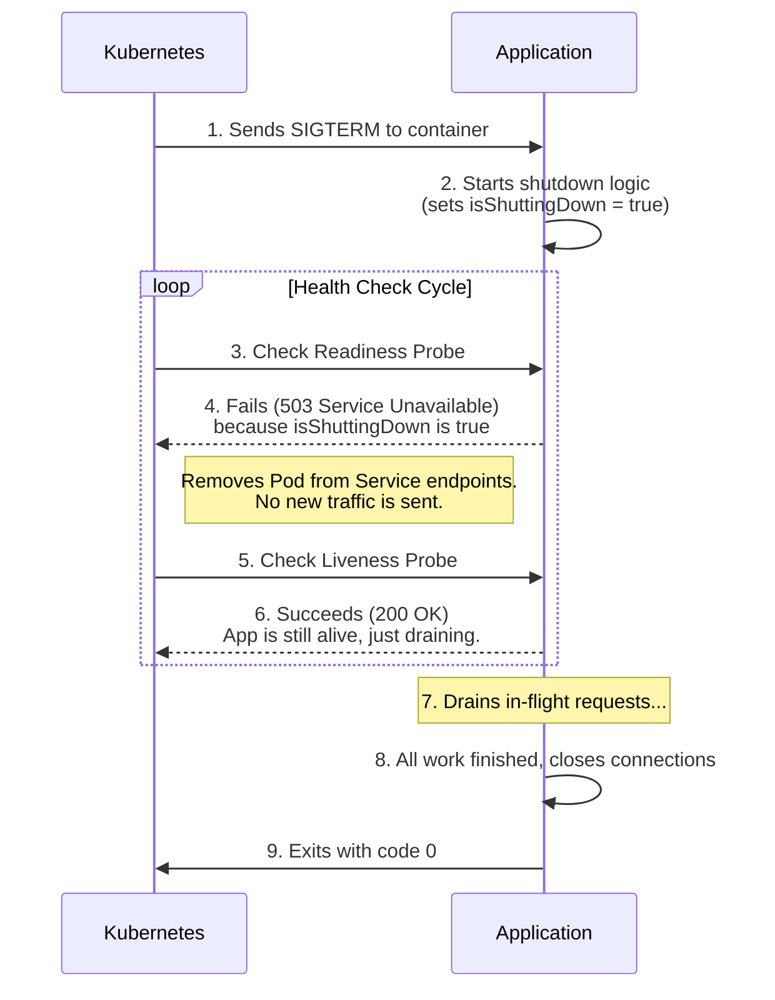

# Graceful Shutdown

## Introduction

Graceful shutdown is the process of safely and cleanly terminating an application process. In a modern, dynamically orchestrated environment (like Kubernetes), application instances are frequently stopped for deployments, scaling, or node maintenance.

A graceful shutdown ensures that the application doesn't terminate abruptly. Instead, it's given a period of time to finish its current work, release resources, and clean up before exiting. This is crucial for preventing data loss, avoiding corrupted state, and ensuring a seamless experience for users.

## Why is Graceful Shutdown Important?

Without a graceful shutdown, when a process receives a termination signal (`SIGTERM`), it might:
*   **Drop In-flight Requests**: Abruptly close network connections, causing currently processing requests to fail.
*   **Leave Incomplete Transactions**: Terminate mid-transaction, leaving the system in an inconsistent state.
*   **Lose Data**: Be killed while writing a file or before a background job finishes.
*   **Deregister Uncleanly**: Fail to notify a load balancer, causing traffic to be sent to a dead instance.

## The Graceful Shutdown Process in Kubernetes

The process is typically triggered when the host environment (like Kubernetes) sends a `SIGTERM` signal. The application should listen for this signal and initiate the following steps, coordinating with Kubernetes health probes.


This sequence ensures:
1.  The app stops receiving **new** traffic immediately.
2.  It's given time to finish its **current** work.
3.  Kubernetes knows the app is still alive during this draining period and doesn't kill it prematurely.

### Timeout Management

The orchestrator provides a "grace period" (in Kubernetes, `terminationGracePeriodSeconds`, defaulting to 30s). If the application doesn't exit within this period, the orchestrator sends a `SIGKILL` signal, which is a forceful termination that cannot be ignored. Your shutdown logic *must* complete within this window.

## Implementation Example (Node.js with Express)

```javascript
import express from 'express';
import http from 'http';

const app = express();
const server = http.createServer(app);

let isShuttingDown = false;

// Readiness probe endpoint
app.get('/ready', (req, res) => {
  if (isShuttingDown) {
    return res.status(503).send('Service Unavailable');
  }
  res.status(200).send('OK');
});

// Liveness probe endpoint
app.get('/live', (req, res) => res.status(200).send('OK'));


// ... your app routes and logic ...
app.get('/', (req, res) => {
  setTimeout(() => res.send('Hello, world!'), 5000);
});

server.listen(3000, () => console.log(`Server listening on port 3000`));

// Function to handle graceful shutdown
function gracefulShutdown() {
  if (isShuttingDown) return;
  isShuttingDown = true;
  console.log('Received shutdown signal. Shutting down gracefully...');

  // 1. Stop the server from accepting new connections
  server.close(() => {
    console.log('HTTP server closed.');
    // 2. Close database connections, etc.
    console.log('All resources cleaned up. Exiting.');
    process.exit(0);
  });

  // Force exit after a timeout
  setTimeout(() => {
    console.error('Could not close connections in time, forcefully shutting down');
    process.exit(1);
  }, 10000); // 10 second timeout
}

process.on('SIGTERM', gracefulShutdown);
process.on('SIGINT', gracefulShutdown);
```

## Best Practices
*   **Listen for `SIGTERM`**: This is the standard signal your application must handle.
*   **Coordinate with Health Probes**: Ensure your readiness probe fails immediately upon receiving `SIGTERM`, while your liveness probe continues to pass until the process is ready to exit.
*   **Handle Long-Running Jobs**: For background jobs that may take longer than the grace period, your shutdown logic should ideally signal the job to stop, save its state, and allow it to be resumed later by another worker.
*   **Test Your Shutdown Logic**: It's important to test that your graceful shutdown procedure actually works as expected.

<div class="further-reading">
<h3>Further Reading</h3>
<ul>
  <li><a href="https://kubernetes.io/docs/concepts/workloads/pods/pod-lifecycle/" target="_blank" rel="noopener noreferrer">Kubernetes Pod Lifecycle Documentation</a></li>
  <li><a href="https://learnk8s.io/graceful-shutdown" target="_blank" rel="noopener noreferrer">Graceful shutdown and zero downtime deployments in Kubernetes</a></li>
   <li><a href="https://blog.risingstack.com/graceful-shutdown-node-js-app/" target="_blank" rel="noopener noreferrer">Graceful Shutdown in Node.js</a></li>
</ul>
</div>