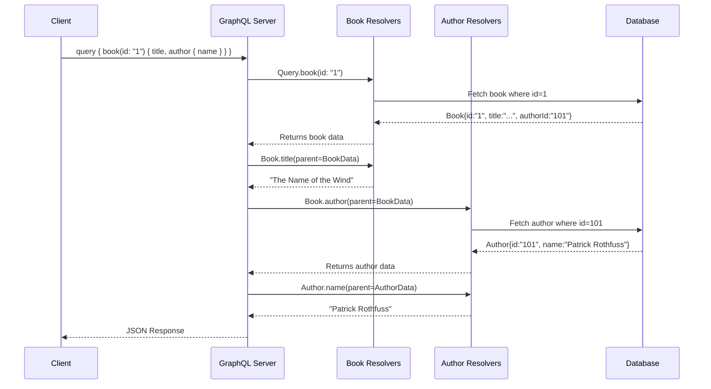

# GraphQL

## Introduction

GraphQL is a query language for your API and a server-side runtime for executing those queries using a type system you define for your data. Developed by Facebook, GraphQL provides an alternative to REST for building APIs.

Unlike REST, which exposes multiple endpoints for different resources, a GraphQL API typically exposes a single endpoint. The client specifies exactly what data it needs in a query, and the server responds with a JSON object containing precisely that data, nothing more and nothing less. This solves the common problems of over-fetching and under-fetching in REST APIs.

## The Query Resolution Flow

The heart of a GraphQL server is its **schema** and the corresponding **resolver** functions. When a query arrives, the server walks the query tree, executing the resolver for each field.

## Code Examples: Schema and Resolvers

Here is a simple "Hello World" schema and its implementation in popular libraries.

  

    <button class="tab-button active" data-lang="nodejs">Node.js (Apollo Server)</button>
    <button class="tab-button" data-lang="python">Python (Ariadne)</button>
    <button class="tab-button" data-lang="go">Go (gqlgen)</button>
  

  

<pre><code class="language-javascript">
const { ApolloServer } = require('@apollo/server');
const { startStandaloneServer } = require('@apollo/server/standalone');

// 1. The Schema (Schema Definition Language)
const typeDefs = `#graphql
  type Query {
    hello: String
  }
`;

// 2. The Resolvers (functions that return data for the schema)
const resolvers = {
  Query: {
    hello: () => 'Hello from Apollo Server!',
  },
};

// 3. The Server
const server = new ApolloServer({ typeDefs, resolvers });

startStandaloneServer(server, { listen: { port: 4000 } }).then(({ url }) => {
  console.log(`🚀 Server ready at ${url}`);
});
</code></pre>
  

  

<pre><code class="language-python">
from ariadne import QueryType, make_executable_schema, gql
from ariadne.asgi import GraphQL

# 1. The Schema (Schema Definition Language)
type_defs = gql("""
    type Query {
        hello: String
    }
""")

# 2. The Resolvers
query = QueryType()

@query.field("hello")
def resolve_hello(*_):
    return "Hello from Ariadne!"

schema = make_executable_schema(type_defs, query)

# 3. The Server (e.g., using Starlette/Uvicorn)
app = GraphQL(schema, debug=True)

# To run: uvicorn server:app
</code></pre>
  

  

<pre><code class="language-go">
// This example uses gqlgen, which is a schema-first library.
// You would first define your schema in a .graphqls file.

// --- schema.graphqls ---
/*
type Query {
  hello: String!
}
*/

// --- resolver.go (generated by gqlgen, you fill in the logic) ---
package graph

import "context"

// Hello is the resolver for the hello field.
func (r *queryResolver) Hello(ctx context.Context) (string, error) {
	return "Hello from gqlgen!", nil
}

// Query returns QueryResolver implementation.
func (r *Resolver) Query() QueryResolver { return &queryResolver{r} }

type queryResolver struct{ *Resolver }

// To run, `gqlgen` generates a server stub that you can start.
</code></pre>
  

## GraphQL vs. REST

| Feature              | REST                                                                       | GraphQL                                                                    |
| :------------------- | :------------------------------------------------------------------------- | :------------------------------------------------------------------------- |
| **Data Fetching**    | Often leads to over-fetching (getting more data than needed) or under-fetching (requiring multiple requests). | Client gets exactly the data it asks for in a single request.              |
| **Endpoints**        | Multiple endpoints for different resources (e.g., `/users`, `/users/1/posts`). | Typically a single endpoint (e.g., `/graphql`).                            |
| **Schema/Typing**    | No built-in schema. Often documented with external tools like OpenAPI/Swagger. | Strongly typed with a schema that serves as a contract.                    |
| **Versioning**       | Versioning is often done in the URL (e.g., `/api/v2`).                     | Versionless. New fields can be added to the schema without breaking clients. |

## Best Practices
*   **Use a Service Layer**: Don't put business logic directly in resolvers. Resolvers should be a thin layer that calls your business logic services.
*   **Prevent N+1 Problems**: Use a data loading pattern to batch and cache database calls within a single request. Facebook's `DataLoader` is a popular utility for this.
*   **Schema Design is Key**: Design your schema from the perspective of the client, not your database structure.
*   **Use Tooling**: The GraphQL ecosystem has excellent tooling. Use libraries like Apollo, Relay, and tools like GraphiQL or Apollo Studio to build and explore your API.

<h3>Further Reading</h3>
<ul>
  <li><a href="https://graphql.org/learn/" target="_blank" rel="noopener noreferrer">Official GraphQL Documentation</a></li>
  <li><a href="https://www.apollographql.com/docs/" target="_blank" rel="noopener noreferrer">Apollo GraphQL Platform Docs</a></li>
  <li><a href="https://principledgraphql.com/" target="_blank" rel="noopener noreferrer">Principled GraphQL</a></li>
</ul>

