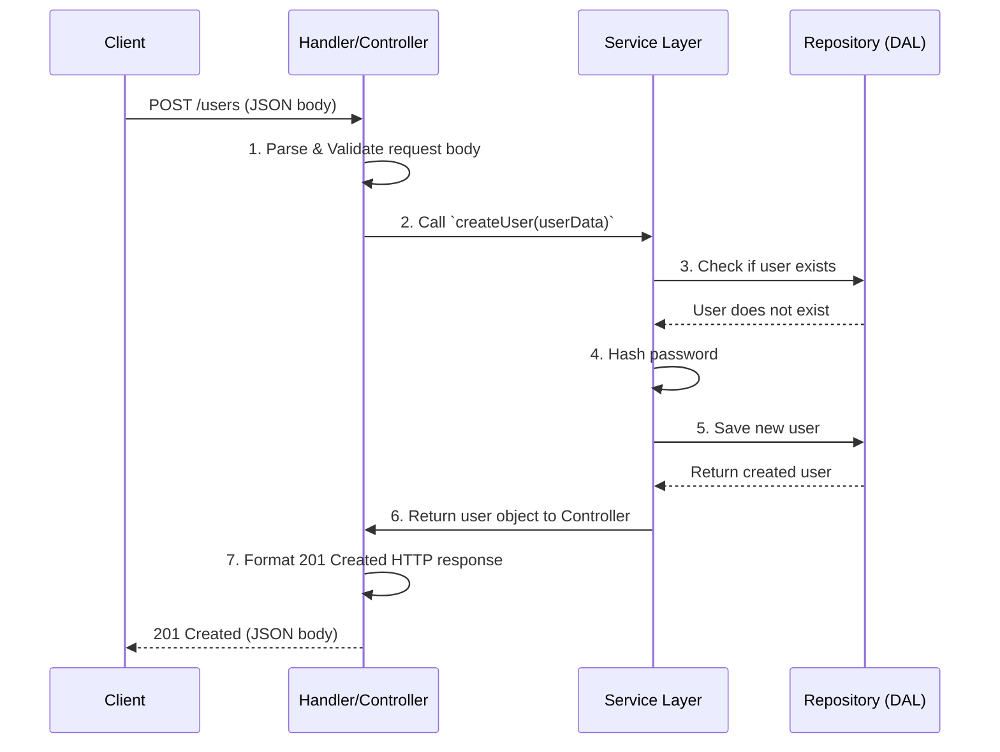

# Handlers, Controllers, and Services

## Introduction

In backend architecture, organizing code into logical layers is crucial for maintainability, testability, and scalability. The pattern of using Handlers, Controllers, and Services is a common and effective way to structure an application, particularly for APIs. This pattern helps to enforce the "Separation of Concerns" principle, ensuring that each part of your code has a clear and distinct responsibility.

-   **Handler/Controller**: The entry point for a request. Its job is to handle the specifics of the transport layer (e.g., HTTP).
-   **Service**: The core of the application. It contains the business logic and orchestrates different tasks.

## Request Flow and Separation of Concerns

This diagram shows how a request to create a user flows through the different layers, each with its own distinct responsibility.

## Code Examples: Creating a User

These examples show how the controller and service for a "create user" feature are cleanly separated.

  

    <button class="tab-button active" data-lang="nodejs">Node.js (Express)</button>
    <button class="tab-button" data-lang="python">Python (Flask)</button>
    <button class="tab-button" data-lang="go">Go (net/http)</button>
  

  

<pre><code class="language-javascript">
// --- user.controller.js ---
// RESPONSIBILITY: Handle HTTP, validation, and calling the service.
class UserController {
    constructor(userService) { this.userService = userService; }
    
    async createUser(req, res, next) {
        try {
            // Joi or another library would be used for real validation
            if (!req.body.email) throw new Error("Validation Error");

            const newUser = await this.userService.createUser(req.body);
            res.status(201).json(newUser);
        } catch (error) {
            // Map service errors to HTTP status codes
            if (error.message === 'UserExists') {
                return res.status(409).send("User already exists.");
            }
            next(error); // Pass to global error handler
        }
    }
}

// --- user.service.js ---
// RESPONSIBILITY: Core business logic. Knows nothing about HTTP.
class UserService {
    constructor(userRepository) { this.userRepository = userRepository; }

    async createUser(userData) {
        const existing = await this.userRepository.findByEmail(userData.email);
        if (existing) {
            throw new Error('UserExists');
        }
        
        const hashedPassword = await hash(userData.password);
        // ... more business logic ...
        
        const userToSave = { ...userData, password: hashedPassword };
        return this.userRepository.save(userToSave);
    }
}
</code></pre>
  

  

<pre><code class="language-python">
# --- user_controller.py ---
# RESPONSIBILITY: Handle HTTP, validation, and calling the service.
from flask import request, jsonify

class UserController:
    def __init__(self, user_service):
        self.user_service = user_service
        
    def create_user(self):
        try:
            user_data = request.get_json()
            if 'email' not in user_data:
                return jsonify({"error": "Validation Error"}), 400

            new_user = self.user_service.create_user(user_data)
            return jsonify(new_user), 201
        except ValueError as e: # Custom exception for business logic errors
            return jsonify({"error": str(e)}), 409
        except Exception as e:
            return jsonify({"error": "Server Error"}), 500

# --- user_service.py ---
# RESPONSIBILITY: Core business logic. Knows nothing about HTTP.
class UserService:
    def __init__(self, user_repository):
        self.user_repository = user_repository
        
    def create_user(self, user_data):
        if self.user_repository.find_by_email(user_data['email']):
            raise ValueError('User already exists')
        
        hashed_password = hash(user_data['password'])
        # ... more business logic ...
        
        user_to_save = {**user_data, "password": hashed_password}
        return self.user_repository.save(user_to_save)
</code></pre>
  

  

<pre><code class="language-go">
// --- user_handler.go ---
// RESPONSIBILITY: Handle HTTP, validation, and calling the service.
package handlers
import ("net/http"; "encoding/json")

type UserHandler struct {
    UserService services.UserService
}
func (h *UserHandler) CreateUser(w http.ResponseWriter, r *http.Request) {
    var userData models.User
    if err := json.NewDecoder(r.Body).Decode(&userData); err != nil {
        http.Error(w, "Bad Request", http.StatusBadRequest)
        return
    }
    
    newUser, err := h.UserService.CreateUser(r.Context(), &userData)
    if err != nil {
        if err == services.ErrUserExists {
            http.Error(w, "User already exists", http.StatusConflict)
            return
        }
        http.Error(w, "Server Error", http.StatusInternalServerError)
        return
    }
    
    w.WriteHeader(http.StatusCreated)
    json.NewEncoder(w).Encode(newUser)
}

// --- user_service.go ---
// RESPONSIBILITY: Core business logic. Knows nothing about HTTP.
package services
import "context"

type UserService struct {
    UserRepo repositories.UserRepository
}
func (s *UserService) CreateUser(ctx context.Context, user *models.User) (*models.User, error) {
    existing, _ := s.UserRepo.FindByEmail(ctx, user.Email)
    if existing != nil {
        return nil, ErrUserExists
    }
    
    user.Password = hash(user.Password)
    // ... more business logic ...
    
    return s.UserRepo.Save(ctx, user)
}
</code></pre>
  

## Benefits of this Separation

*   **Testability**: You can test your core business logic (in the services) without having to simulate HTTP requests.
*   **Reusability**: The same service logic can be exposed through different controllers (e.g., a REST API and a GraphQL API can both use `UserService`).
*   **Maintainability**: Code is easier to find and understand. If there's a bug in how users are created, you look in the `UserService`. If the response format is wrong, you look in the `UserController`.