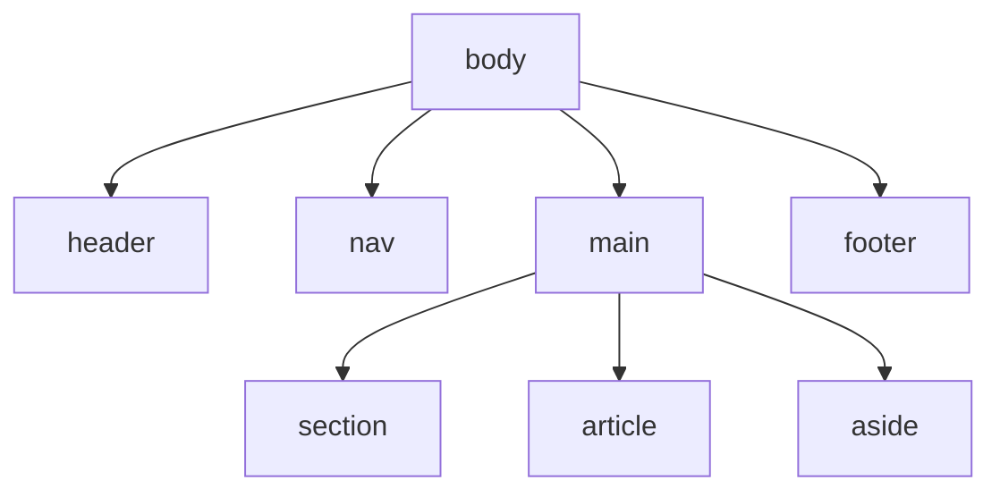

# HTML & Semantics

## Introduction

HTML (HyperText Markup Language) is the standard markup language for documents designed to be displayed in a web browser. It forms the skeleton of all web pages. While it's possible to build a website using generic `<div>` and `<span>` tags, **Semantic HTML** involves using HTML elements that accurately describe their content and meaning.

Using semantic tags is crucial for **accessibility**, **SEO (Search Engine Optimization)**, and **maintainability**. It provides a clear structure that both browsers and developers can understand.

## The Basic Structure of an HTML Document

Every HTML page has a fundamental structure.

```html
<!DOCTYPE html>
<html lang="en">
<head>
    <meta charset="UTF-8">
    <meta name="viewport" content="width=device-width, initial-scale=1.0">
    <title>Page Title</title>
</head>
<body>
    <!-- All visible content goes here -->
</body>
</html>
```
*   `<!DOCTYPE html>`: Declares the document type.
*   `<html>`: The root element of the page. The `lang` attribute is important for accessibility.
*   `<head>`: Contains meta-information about the page (title, character set, styles, scripts) that is not displayed directly.
*   `<body>`: Contains all the content that will be visible to the user.

## Key Semantic Layout Elements

These elements are used to define the major sections of a web page, creating a meaningful document outline.


*   `<header>`: Represents introductory content, typically a group of introductory or navigational aids. It can contain a logo, a search form, the author's name, etc.
*   `<nav>`: Represents a section of a page whose purpose is to provide navigation links, either within the current document or to other documents.
*   `<main>`: Represents the dominant content of the `<body>` of a document. There should only be one `<main>` element per page.
*   `<section>`: Represents a standalone section of a document, which doesn't have a more specific semantic element to represent it. Typically, sections should have a heading.
*   `<article>`: Represents a self-contained composition in a document, page, application, or site, which is intended to be independently distributable or reusable (e.g., a forum post, a magazine or newspaper article, or a blog entry).
*   `<aside>`: Represents a portion of a document whose content is only indirectly related to the document's main content. Often presented as sidebars.
*   `<footer>`: Represents a footer for its nearest sectioning content or the `<body>` element. A footer typically contains information about the author, copyright information, or links to related documents.

## Common Text and Content Elements

*   `<h1>`, `<h2>`, ..., `<h6>`: Headings are crucial for document structure. There should only be one `<h1>` per page, and headings should not skip levels (e.g., an `<h2>` should not be followed by an `<h4>`).
*   `<p>`: A paragraph.
*   `<a>`: A hyperlink, defined by its `href` attribute.
*   `<ul>`, `<ol>`, `<li>`: Unordered lists, ordered lists, and list items.
*   `<strong>` vs. `<b>`: `<strong>` indicates that its contents have strong importance, seriousness, or urgency. `<b>` is for drawing attention without the added importance (like a product name).
*   `<em>` vs. `<i>`: `<em>` indicates stress emphasis on its contents. `<i>` represents text in an alternate voice or mood, like a technical term or a thought.
*   `<blockquote>` and `<q>`: For long quotations and short inline quotations, respectively.
*   `<figure>` and `<figcaption>`: Used to group a media element (like an ``) with its caption.

## Forms and Interactive Elements

Semantic form elements improve accessibility and user experience.
*   `<form>`: The container for form controls.
*   `<label>`: Crucially, the `for` attribute of a `<label>` should match the `id` of an `<input>`, `<select>`, or `<textarea>`. This links them together, allowing screen readers to announce the label when the input is focused, and letting users click the label to focus the input.
*   `<input>`: The most versatile form element. Its `type` attribute is key (e.g., `text`, `email`, `password`, `checkbox`, `radio`, `submit`).
*   `<button>`: A clickable button.
*   `<select>` and `<option>`: For dropdown lists.
*   `<textarea>`: For multi-line text input.

### Example of a Semantic Form

```html
<form action="/subscribe" method="post">
    <label for="email-input">Email:</label>
    <input type="email" id="email-input" name="user_email" required>
    <button type="submit">Subscribe</button>
</form>
```

<div class="further-reading">
<h3>Further Reading</h3>
<ul>
  <li><a href="https://developer.mozilla.org/en-US/docs/Glossary/Semantics#semantics_in_html" target="_blank" rel="noopener noreferrer">HTML Semantics (MDN)</a></li>
  <li><a href="https://www.w3.org/TR/html52/sections.html" target="_blank" rel="noopener noreferrer">The Sections of the HTML standard (W3C)</a></li>
</ul>
</div>