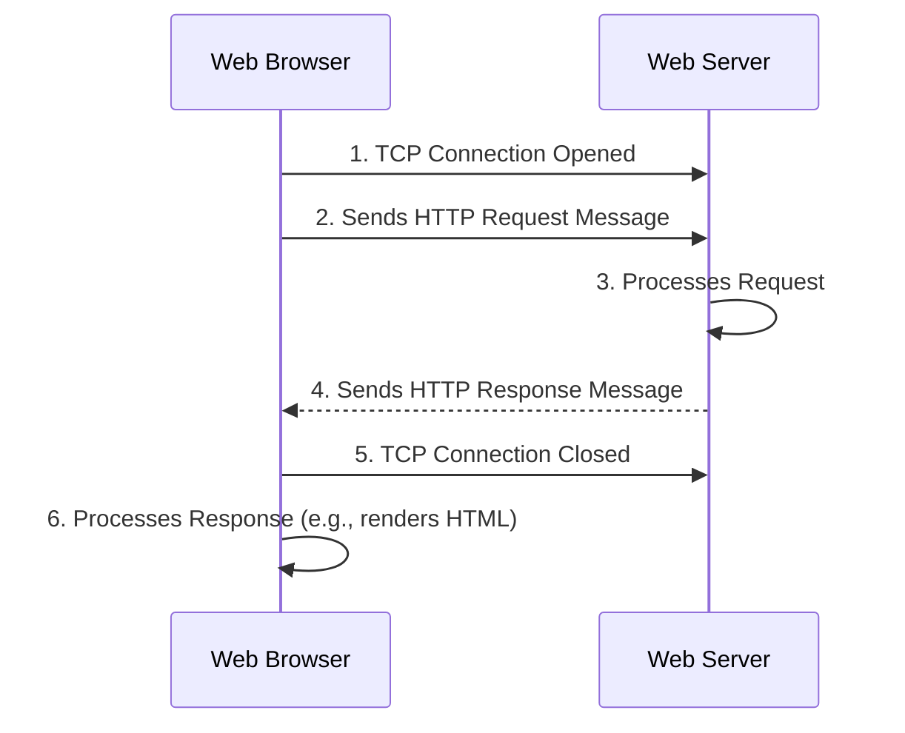

# HTTP Protocol

## Introduction

The Hypertext Transfer Protocol (HTTP) is the foundation of data communication for the World Wide Web. It's a client-server protocol, meaning requests are initiated by the recipient, usually a web browser. A complete document is reconstructed from the different sub-documents fetched, such as text, layout description, images, videos, scripts, and more.

As a backend engineer, a deep understanding of HTTP is non-negotiable. It's the language your server will speak with clients, whether they are web browsers, mobile apps, or other services.

## Request/Response Lifecycle

The core of HTTP is a simple, stateless cycle. The server retains no knowledge of the client between requests.



### A Practical Example: GET Request

Let's look at the raw text of a simple HTTP exchange to retrieve data.

**The Request:**
```http
GET /products/123 HTTP/1.1         <-- Request Line: [Method] [Path] [HTTP Version]
Host: api.example.com              <-- Header: The domain the request is for
User-Agent: curl/7.64.1            <-- Header: Identifies the client software
Accept: application/json           <-- Header: Tells the server what content types the client can accept
Authorization: Bearer <jwt_token>  <-- Header: Carries authentication credentials

                                   <-- An empty line separates headers from the body (no body in this GET request)
```

**The Response:**
```http
HTTP/1.1 200 OK                    <-- Status Line: [HTTP Version] [Status Code] [Status Message]
Content-Type: application/json     <-- Header: The media type of the response body
Content-Length: 87                 <-- Header: The size of the response body in bytes
Cache-Control: no-cache            <-- Header: Instructs clients not to cache this response
Date: Mon, 23 May 2023 22:38:34 GMT <-- Header: The date and time the response was sent

{                                  <-- An empty line separates headers from the body
  "id": 123,
  "name": "Laptop",
  "price": 1299.99
}
```

### Another Example: POST Request

Here is an example of creating a new resource, which includes a request body.

**The Request:**
```http
POST /products HTTP/1.1
Host: api.example.com
Content-Type: application/json
Content-Length: 38

{
  "name": "Mouse",
  "price": 25.50
}
```

**The Response:**
```http
HTTP/1.1 201 Created
Content-Type: application/json
Location: /products/124

{
  "id": 124,
  "name": "Mouse",
  "price": 25.50
}
```

## HTTP Methods (Verbs)

HTTP methods indicate the desired action to be performed on a resource. Understanding their properties is key to building correct RESTful APIs.

| Method  | Description                   | Idempotent? | Safe? |
| :------ | :---------------------------- | :---------- | :---- |
| **GET**     | Retrieve data.                | Yes         | Yes   |
| **POST**    | Create a new resource.        | No          | No    |
| **PUT**     | Replace a resource entirely.  | Yes         | No    |
| **PATCH**   | Partially update a resource.  | No          | No    |
| **DELETE**  | Delete a resource.            | Yes         | No    |
| **OPTIONS** | Describe communication options. | Yes         | Yes   |

- **Idempotent**: An operation is idempotent if making it multiple times has the same effect as making it once. This is critical for designing reliable APIs, as clients might automatically retry failed requests.
- **Safe**: A method is safe if it doesn't alter the state of the server. `GET` and `OPTIONS` should never have side effects.

## Status Codes

HTTP status codes indicate the result of the request. They are grouped into five classes:

| Range         | Class             | Meaning                                                              |
| :------------ | :---------------- | :------------------------------------------------------------------- |
| **`1xx`**     | Informational     | Request received, continuing process.                                |
| **`2xx`**     | Success           | The action was successfully received, understood, and accepted.      |
| **`3xx`**     | Redirection       | Further action must be taken to complete the request.                |
| **`4xx`**     | Client Error      | The request contains bad syntax or cannot be fulfilled.              |
| **`5xx`**     | Server Error      | The server failed to fulfill an apparently valid request.            |

### Common Status Codes
- `200 OK`: Standard success response.
- `201 Created`: A new resource was successfully created. The `Location` header should point to the new resource.
- `204 No Content`: The server successfully processed the request but has no content to return (e.g., for a `DELETE` request).
- `400 Bad Request`: The server cannot process the request due to a client error (e.g., malformed JSON).
- `401 Unauthorized`: The client must authenticate to get the requested response.
- `403 Forbidden`: The client does not have access rights to the content.
- `404 Not Found`: The server cannot find the requested resource.
- `500 Internal Server Error`: A generic error message for an unexpected server condition.

## Headers

HTTP headers are key-value pairs that pass additional information.

### Common Request Headers
- **`Authorization`**: Credentials to authenticate a client.
- **`Content-Type`**: The media type of the request body (e.g., `application/json`).
- **`Accept`**: Media types that are acceptable for the response.
- **`User-Agent`**: Information about the client making the request.

### Common Response Headers
- **`Content-Type`**: The media type of the response body.
- **`Location`**: Used in redirection or to specify the URL of a newly created resource.
- **`Cache-Control`**: Directives for caching mechanisms.
- **`Set-Cookie`**: Sends a cookie from the server to the client.

## Cookies, Sessions, and Tokens

These mechanisms are used to maintain state across stateless HTTP requests.
*   **Cookies**: Data stored by the server on the client's browser. Prone to CSRF attacks if not secured properly.
*   **Sessions**: Server-side storage of user data, identified by a Session ID (usually in a cookie). This is a stateful approach.
*   **Tokens (e.g., JWT)**: A stateless, self-contained credential that the client sends with each request to prove its identity. This is the modern standard for APIs.

<div class="further-reading">
<h3>Further Reading</h3>
<ul>
  <li><a href="https://developer.mozilla.org/en-US/docs/Web/HTTP/Overview" target="_blank" rel="noopener noreferrer">An overview of HTTP (MDN)</a></li>
  <li><a href="https://www.rfc-editor.org/rfc/rfc9110" target="_blank" rel="noopener noreferrer">RFC 9110 - HTTP Semantics (The Official Spec)</a></li>
  <li><a href="https://restfulapi.net/" target="_blank" rel="noopener noreferrer">RESTful API Tutorial</a></li>
</ul>
</div>