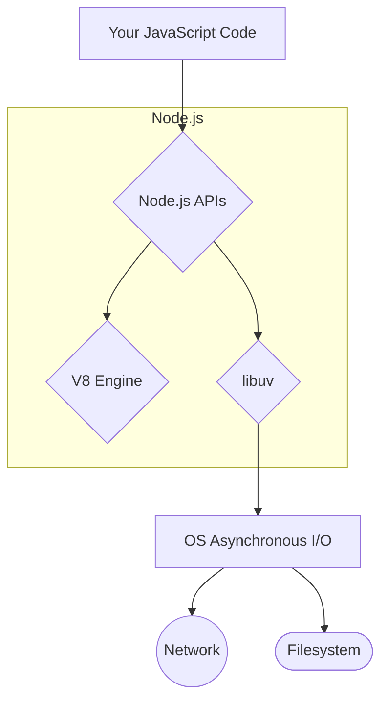

# Introduction to Node.js

## What is Node.js?

Node.js is **not** a programming language. It is **not** a framework. Node.js is a **JavaScript runtime environment** built on Chrome's V8 JavaScript engine. It allows you to run JavaScript code on the server, outside of a web browser.

Created by Ryan Dahl in 2009, Node.js was designed to build scalable network applications. Its key innovation was an **event-driven, non-blocking I/O model**.

## The Architecture of Node.js

Node.js is a combination of several powerful technologies:
*   **V8 Engine**: Google's open-source, high-performance JavaScript and WebAssembly engine, written in C++. This is the same engine that runs in the Chrome browser. V8 compiles JavaScript directly to native machine code before executing it, making it very fast.
*   **libuv**: A C++ library that provides the asynchronous, event-driven, non-blocking I/O capabilities. It's libuv that handles interactions with the operating system for things like networking and file system access, and it manages the famous **event loop**.



## The Key Idea: Event-Driven, Non-Blocking I/O

Traditional server-side languages like PHP or Java often use a multi-threaded model to handle concurrency. When a request comes in, a new thread is spawned to handle it. If that request involves waiting for a database or a file to be read (I/O), that thread is "blocked," sitting idle until the operation completes. This can be inefficient and consume a lot of memory.

Node.js takes a different approach. It runs on a **single main thread**.

```mermaid
graph TD
    subgraph "Traditional Blocking Model (e.g., PHP)"
        direction LR
        R1[Request 1] --> T1[Thread 1];
        T1 -- "Reads file (blocks)" --> T1;
        R2[Request 2] --> T2[Thread 2];
        T2 -- "DB Query (blocks)" --> T2;
    end
    
    subgraph "Node.js Non-Blocking Model"
        direction TD
        Req1[Request 1] --> EL{Event Loop};
        Req2[Request 2] --> EL;
        
        EL -- "Initiates file read" --> IO(OS/libuv);
        EL -- "Initiates DB query" --> IO;
        
        note right of EL "The main thread is NOT blocked.<br>It's free to handle more requests."
        
        IO -- "File read complete (callback)" --> EL;
        IO -- "DB query complete (callback)" --> EL;
    end
```
When Node.js needs to perform an I/O operation, it doesn't wait. It sends the task to the operating system (via libuv), along with a callback function, and then immediately moves on to handle the next event. When the I/O operation is finished, the OS notifies Node.js, which then places the corresponding callback function into the event queue to be executed by the main thread.

This model makes Node.js extremely efficient and scalable for I/O-heavy applications, such as web servers, APIs, and real-time services. It can handle tens of thousands of concurrent connections with minimal memory overhead.

## Common Use Cases

*   **Backend APIs**: Building fast and scalable RESTful or GraphQL APIs. This is the most common use case.
*   **Real-Time Applications**: Chat servers, online gaming services, and collaborative tools benefit from Node.js's ability to handle many persistent connections (e.g., via WebSockets).
*   **Microservices**: Its small footprint and fast startup time make it a great choice for building individual microservices.
*   **Build Tools**: The vast majority of frontend tooling (like Vite, Webpack, ESLint, Prettier) is built with Node.js.

## What Node.js is NOT Good For

Because it runs on a single main thread, Node.js is **not well-suited for CPU-bound tasks**. If you have a task that involves heavy computation (like image processing or complex calculations) that runs for a long time, it will block the event loop and make your entire application unresponsive. For such tasks, it's better to use a language with true multi-threading or to offload the work to a background worker process.

<div class="further-reading">
<h3>Further Reading</h3>
<ul>
  <li><a href="https://nodejs.org/en/about/" target="_blank" rel="noopener noreferrer">Node.js Official "About" Page</a></li>
  <li><a href="https://www.youtube.com/watch?v=TlB_eWDSMt4" target="_blank" rel="noopener noreferrer">Node.js Explained in 100 Seconds (Video)</a></li>
</ul>
</div>