# Introduction to React

## What is React?

React is a free and open-source front-end JavaScript library for building user interfaces based on components. It was created by Facebook and is now maintained by a community of developers and companies. React is not a full-fledged framework; it's a library focused specifically on the "View" layer of an application. This means it's primarily concerned with what the user sees and interacts with.

The core philosophy of React is built on two main ideas:

1.  **Declarative UI**: You tell React *what* you want the UI to look like for a given state, and React will figure out the most efficient way to update the actual browser DOM to match that state. This is in contrast to an *imperative* approach, where you would have to write step-by-step instructions to manipulate the DOM.
2.  **Component-Based Architecture**: You build your UI by composing small, reusable, and independent pieces called "components."

## The Virtual DOM

Directly manipulating the browser's DOM is slow. Every time you change an element, the browser may have to recalculate the layout and repaint the screen, which can be computationally expensive.

React solves this performance bottleneck with the **Virtual DOM (VDOM)**. The VDOM is a lightweight, in-memory representation of the real DOM.

```mermaid
graph TD
    A[State Change Occurs] --> B{1. React creates a new VDOM tree};
    B --> C{2. React 'diffs' the new VDOM against the old VDOM};
    C --> D{3. Identifies the minimal changes needed};
    D --> E[4. Batches these changes and updates the real DOM];
    
    style E fill:#1b263b,stroke:#00f5d4,stroke-width:2px;
```


This "diffing" process is extremely fast because it happens in memory. By batching updates and only changing the parts of the real DOM that absolutely need to be changed, React minimizes expensive DOM operations and makes the application feel much faster.

## JSX: JavaScript XML

JSX is a syntax extension for JavaScript that allows you to write HTML-like code directly within your JavaScript files. It is not valid JavaScript and must be compiled (transpiled) into regular JavaScript by a tool like Babel.

```jsx
// This is JSX
const element = <h1>Hello, world!</h1>;

// After transpilation, it becomes a regular JavaScript function call
const element = React.createElement('h1', null, 'Hello, world!');
```

JSX combines the expressiveness of HTML with the power of JavaScript.

```jsx
import React from 'react';

function Greeting({ name }) {
  // We can use JavaScript expressions inside curly braces {}
  const greetingText = `Hello, ${name || 'Guest'}!`;
  const styles = {
    color: 'blue',
    fontSize: '20px'
  };

  return (
    <div style={styles}>
      <h1>{greetingText}</h1>
      <p>Welcome to our React application.</p>
    </div>
  );
}
```

This component, `Greeting`, is a simple function that takes an object of properties (`props`) and returns a description of the UI. This is the fundamental building block of a React application.

<div class="further-reading">
<h3>Further Reading</h3>
<ul>
  <li><a href="https://react.dev/learn" target="_blank" rel="noopener noreferrer">React Official Tutorial</a></li>
  <li><a href="https://react.dev/learn/understanding-your-ui-as-a-tree" target="_blank" rel="noopener noreferrer">Thinking in React</a></li>
</ul>
</div>