# JavaScript Core Concepts

## Introduction

JavaScript is the programming language of the web. While its syntax may seem straightforward, its runtime model, particularly its handling of asynchronous operations, is unique and essential to understand for building responsive applications. The key to this is the **Event Loop**, **Promises**, and the `async/await` syntax.

## Single-Threaded Nature

JavaScript is a single-threaded language. This means it has only one "call stack" and can only do one thing at a time. If it were to run a long-running task (like a network request or a timer) synchronously, the entire user interface would freeze until the task was complete.

To solve this, JavaScript uses a non-blocking, asynchronous model powered by the event loop.

## The Event Loop

The JavaScript runtime environment (in the browser or Node.js) consists of more than just the JS engine.

```mermaid
graph TD
    A[Call Stack] -- "setTimeout(cb, 1000)" --> B[Web APIs];
    B -- "After 1000ms" --> C{Callback Queue};
    
    subgraph "Event Loop"
        D{Event Loop}
    end
    
    D -- "Is Call Stack empty?" --> A;
    A -- "Yes" --> D;
    D -- "Pushes callback to stack" --> C;
    C --> A;

    style D fill:#1b263b,stroke:#00f5d4,stroke-width:2px;
```


1.  **Call Stack**: Where JavaScript keeps track of function calls. When a function is called, it's pushed onto the stack. When it returns, it's popped off.
2.  **Web APIs / Node.js APIs**: These are APIs provided by the environment, not the JavaScript engine itself. They handle asynchronous operations like `setTimeout`, DOM events, and `fetch`.
3.  **Callback Queue (or Task Queue)**: When an asynchronous operation is complete, its callback function is placed in this queue.
4.  **Event Loop**: This is a constantly running process with one simple job: if the **Call Stack** is empty, it takes the first item from the **Callback Queue** and pushes it onto the Call Stack for execution.

This model allows JavaScript to "start" a long-running operation, move on to other things, and then run a callback function when the operation is finished, all without blocking the main thread.

## Promises

Callbacks can lead to "callback hell" (deeply nested, hard-to-read code). **Promises** are objects that represent the eventual completion (or failure) of an asynchronous operation.

A promise can be in one of three states:
*   **Pending**: The initial state; not yet fulfilled or rejected.
*   **Fulfilled**: The operation completed successfully.
*   **Rejected**: The operation failed.

You can attach callbacks to a promise using the `.then()` (for fulfillment) and `.catch()` (for rejection) methods.

```javascript
const myPromise = new Promise((resolve, reject) => {
    // Simulate an async operation
    setTimeout(() => {
        if (Math.random() > 0.5) {
            resolve("Operation successful!");
        } else {
            reject("Operation failed!");
        }
    }, 1000);
});

myPromise
    .then((successMessage) => {
        // This runs if the promise is resolved
        console.log(successMessage);
    })
    .catch((errorMessage) => {
        // This runs if the promise is rejected
        console.error(errorMessage);
    });
```
Promises are chainable, which makes handling a sequence of asynchronous operations much cleaner than nested callbacks.

## Async/Await

`async/await` is modern syntactic sugar built on top of Promises. It allows you to write asynchronous code that looks and behaves more like synchronous code, making it much easier to read and reason about.

*   `async`: When placed before a function declaration, it turns the function into an "async function." Async functions always implicitly return a Promise.
*   `await`: Can only be used inside an `async` function. It pauses the execution of the async function and waits for the Promise to resolve. While it's paused, the JavaScript engine can continue running other code.

```javascript
// A function that returns a promise
function fetchData() {
    return new Promise(resolve => {
        setTimeout(() => {
            resolve({ data: "Some data from the server" });
        }, 1500);
    });
}

// An async function that uses await
async function displayData() {
    try {
        console.log("Fetching data...");
        
        // The function pauses here until fetchData's promise resolves
        const result = await fetchData(); 
        
        console.log("Data received:", result.data);
    } catch (error) {
        // If the promise rejects, the error is caught here
        console.error("Failed to fetch data:", error);
    }
}

displayData();
console.log("This will log before 'Data received'");
```
This code is much more readable than the equivalent `.then()`/`.catch()` chain. `async/await` is the standard way to handle asynchronous operations in modern JavaScript.

<div class="further-reading">
<h3>Further Reading</h3>
<ul>
  <li><a href="https://developer.mozilla.org/en-US/docs/Web/JavaScript/EventLoop" target="_blank" rel="noopener noreferrer">The Event Loop (MDN)</a></li>
  <li><a href="https://www.youtube.com/watch?v=8aGhZQkoFbQ" target="_blank" rel="noopener noreferrer">What the heck is the event loop anyway? (Video)</a></li>
  <li><a href="https://developer.mozilla.org/en-US/docs/Web/JavaScript/Reference/Global_Objects/Promise" target="_blank" rel="noopener noreferrer">Using Promises (MDN)</a></li>
</ul>
</div>