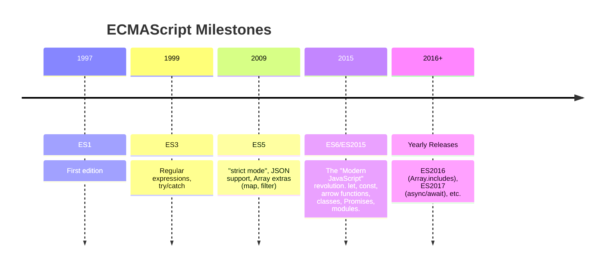

# JavaScript History and Evolution (ECMAScript)

JavaScript is one of the three core technologies of the World Wide Web, alongside HTML and CSS. While it began as a simple scripting language for browsers, it has evolved into a powerful, multi-paradigm language that runs everywhere, from servers to mobile devices.

## The Beginning: Mocha, LiveScript, and Netscape

In 1995, Netscape Communications hired a programmer named **Brendan Eich** with the goal of embedding a scripting language into their Netscape Navigator browser. The initial idea was to have a simple language, something like Scheme, to appeal to non-professional programmers.

Eich developed the first version of the language in just 10 days. It was originally codenamed **Mocha**, later renamed to **LiveScript**, and finally, in a marketing move to capitalize on the popularity of Java, it was renamed to **JavaScript**. This naming has caused confusion ever since, but **JavaScript and Java are completely different languages**.

## The Browser Wars and Standardization

Microsoft soon reverse-engineered JavaScript to create their own implementation, called **JScript**, for Internet Explorer. This led to the "first browser war," where Netscape and Microsoft implemented different, incompatible features, making it a nightmare for web developers to build sites that worked in both browsers.

To solve this problem, Netscape submitted JavaScript to **Ecma International**, a standards organization, for standardization. This led to the creation of the **ECMAScript** standard in 1997.

**ECMAScript** is the name of the official standard, while **JavaScript** is the most well-known implementation of that standard. Other implementations include JScript (Microsoft) and ActionScript (Adobe). The standards body responsible for evolving ECMAScript is **TC39 (Technical Committee 39)**.

## Key ECMAScript Versions

### ES1, ES2, ES3 (1997-1999)
These initial versions laid the foundation of the language, adding core features like regular expressions and `try/catch` error handling.

### The "Lost Decade" and ES4
The development of ES4 was ambitious but became too complex and politically contentious, and was eventually abandoned. This led to a long period of stagnation in the language's evolution.

### ES5 (2009): A Major Step Forward
ES5 was a significant update that brought much-needed improvements.
*   `"use strict";` mode to opt into a more restricted and safer variant of JavaScript.
*   Native `JSON` support.
*   New `Array` methods like `map()`, `filter()`, `reduce()`, and `forEach()`.

### ES6 / ES2015: The Revolution
This was the biggest update to JavaScript ever, completely modernizing the language. It's the foundation of what we consider "modern JavaScript." Key features include:
*   `let` and `const` for block-scoped variables.
*   **Arrow functions** (`=>`).
*   **Classes** (syntactic sugar over prototypal inheritance).
*   **Promises** for asynchronous programming.
*   **Modules** (`import`/`export`).
*   Destructuring, default parameters, template literals, and much more.

### ES2016 and Beyond: The Yearly Release Cycle
After the massive release of ES6, TC39 moved to a yearly release schedule. New features go through a formal proposal process with several stages. Once a feature is "finished," it is included in the next yearly release.

This has led to a steady, incremental improvement of the language. Some notable additions since ES2015 include:
*   **ES2016**: `Array.prototype.includes()`.
*   **ES2017**: `async/await` syntax for Promises.
*   **ES2018**: Rest/Spread properties for objects.
*   **ES2020**: Optional Chaining (`?.`) and Nullish Coalescing (`??`).
*   **ES2022**: Top-level `await`.

## JavaScript Today
Thanks to this continuous evolution and the power of tools like Babel (which transpile modern JS to older, compatible versions), developers can use the latest language features to write cleaner, more powerful, and more maintainable code, while still supporting a wide range of browsers and environments.

<h3>Further Reading</h3>
<ul>
  <li><a href="https://developer.mozilla.org/en-US/docs/Web/JavaScript/Language_Resources" target="_blank" rel="noopener noreferrer">JavaScript resources on MDN</a></li>
  <li><a href="https://github.com/tc39/proposals" target="_blank" rel="noopener noreferrer">The TC39 Proposals Process</a></li>
</ul>

