# Microservices Architecture

## Introduction

Microservices is an architectural style that structures an application as a collection of small, autonomous services, modeled around a business domain. This approach is a contrast to the traditional **monolithic architecture**, where the entire application is built as a single, unified unit.

## Monolith vs. Microservices Visualization

```mermaid
graph TD
    subgraph Monolithic Architecture
        A[Client] --> B{Monolith Application};
        B --> C[Database];
        style B fill:#1b263b,stroke:#00f5d4,stroke-width:2px;
    end

    subgraph Microservices Architecture
        D[Client] --> E{API Gateway};
        E --> F[Users Service];
        E --> G[Orders Service];
        E --> H[Products Service];
        F --> I[Users DB];
        G --> J[Orders DB];
        H --> K[Products DB];
        style F fill:#1b263b,stroke:#ffc300,stroke-width:2px;
        style G fill:#1b263b,stroke:#ffc300,stroke-width:2px;
        style H fill:#1b263b,stroke:#ffc300,stroke-width:2px;
    end
```



### Characteristics of Microservices

*   **Single Responsibility**: Each service is designed around a specific business capability.
*   **Independently Deployable**: A change in one service doesn't require deploying the whole application.
*   **Technology Heterogeneity**: Each service can use the best tech stack for its job.
*   **Decentralized Data Management**: Each service owns its own data.
*   **Resilience**: The failure of one service should not, ideally, cause the entire application to fail.

## The API Gateway Pattern
In a microservices architecture, the client should not call dozens of different services directly. An **API Gateway** is a server that acts as a single entry point into the system.

**Responsibilities of an API Gateway:**
*   **Routing**: Routes incoming requests to the appropriate microservice.
*   **Authentication & Authorization**: Centralizes user authentication, offloading it from individual services.
*   **Rate Limiting & Security**: Provides a single place to implement rate limiting and other security policies.
*   **Request Aggregation**: Can combine results from multiple services into a single response.

## Challenges in Microservices (And Their Solutions)

While powerful, a microservices architecture introduces significant complexity.

1.  **Inter-service Communication**:
    *   **Challenge**: Services need to communicate over a potentially unreliable network. Synchronous calls (e.g., REST) can lead to cascading failures.
    *   **Solution**: Use a mix of communication styles. Asynchronous communication (e.g., message queues like RabbitMQ or Kafka) is great for commands that don't need an immediate response. For high-performance synchronous calls, consider using **gRPC** instead of REST. In all cases, implement resilience patterns like **retries with exponential backoff** and the **circuit breaker pattern**.

2.  **Service Discovery**:
    *   **Challenge**: In a dynamic environment, how does Service A know the IP address of Service B?
    *   **Solution**: A **Service Registry** (like Consul or etcd). Orchestrators like Kubernetes provide this out of the box. Services register themselves with the registry upon startup, and query the registry to find other services.

3.  **Distributed Transactions**:
    *   **Challenge**: An operation spanning multiple services cannot use a simple ACID transaction. For example, placing an order might require updating the Order service, the Payment service, and the Inventory service. What if the payment succeeds but the inventory update fails?
    *   **Solution**: The **Saga pattern**. A saga is a sequence of local transactions. Each service performs its own transaction and then publishes an event. The next service in the sequence listens for this event and performs its transaction. If a step fails, the saga executes a series of **compensating transactions** to roll back the changes made by the preceding services.
    
    ```mermaid
    sequenceDiagram
        participant Client
        participant OrderService as Order Service
        participant PaymentService as Payment Service
        participant InventoryService as Inventory Service

        Client->>OrderService: Create Order
        OrderService->>OrderService: 1. Create Order (status: PENDING)
        OrderService->>PaymentService: 2. Execute Payment
        
        alt Payment Fails
            PaymentService-->>OrderService: Payment Failed
            OrderService->>OrderService: 3a. Compensating Tx:<br>Update Order (status: FAILED)
        else Payment Succeeds
            PaymentService-->>OrderService: Payment Succeeded
            OrderService->>InventoryService: 3b. Reserve Inventory
            
            alt Inventory Fails
                InventoryService-->>OrderService: Inventory Failed
                OrderService->>OrderService: 4a. Compensating Tx:<br>Update Order (status: FAILED)
                OrderService->>PaymentService: 4b. Compensating Tx:<br>Refund Payment
            else Inventory Succeeds
                InventoryService-->>OrderService: Inventory Succeeded
                OrderService->>OrderService: 4c. Update Order (status: CONFIRMED)
            end
        end
    end
    ```

4.  **Observability**:
    *   **Challenge**: Debugging a request that flows through multiple services is extremely difficult.
    *   **Solution**: **Distributed Tracing** is essential. A unique trace ID is generated at the start of a request and propagated through all subsequent service calls. This allows you to visualize the entire request journey. Centralized logging and metrics are also non-negotiable.

## When to Use Microservices (And When Not To)

Microservices are not a silver bullet. The operational overhead is significant.

**Start with a well-structured monolith first.** This is often the more pragmatic and faster approach for new projects, small teams, or applications with low-to-medium complexity. A "modular monolith" where code is well-organized by business domain can be a very effective architecture.

**Consider migrating to microservices when:**
*   **Your monolith has become too large**: It's a "big ball of mud," development has slowed down, and onboarding new engineers is difficult.
*   **You have independent scaling needs**: One part of your application (e.g., real-time processing) needs massive scaling, while other parts (e.g., user profiles) do not.
*   **You need to enable team autonomy**: You want multiple teams to be able to develop, deploy, and scale their parts of the application independently.
*   **You have a clear business domain**: You can clearly define the boundaries and responsibilities of each service.

Don't use microservices just because it's the trendy thing to do. The complexity can overwhelm a project if the justification isn't strong.

<div class="further-reading">
<h3>Further Reading</h3>
<ul>
  <li><a href="https://martinfowler.com/articles/microservices.html" target="_blank" rel="noopener noreferrer">Microservices by Martin Fowler</a></li>
  <li><a href="https://microservices.io/patterns/sagas.html" target="_blank" rel="noopener noreferrer">Pattern: Saga</a></li>
  <li><a href="https://samnewman.io/books/building_microservices_2nd_edition/" target="_blank" rel="noopener noreferrer">Building Microservices, 2nd Edition by Sam Newman</a></li>
</ul>
</div>