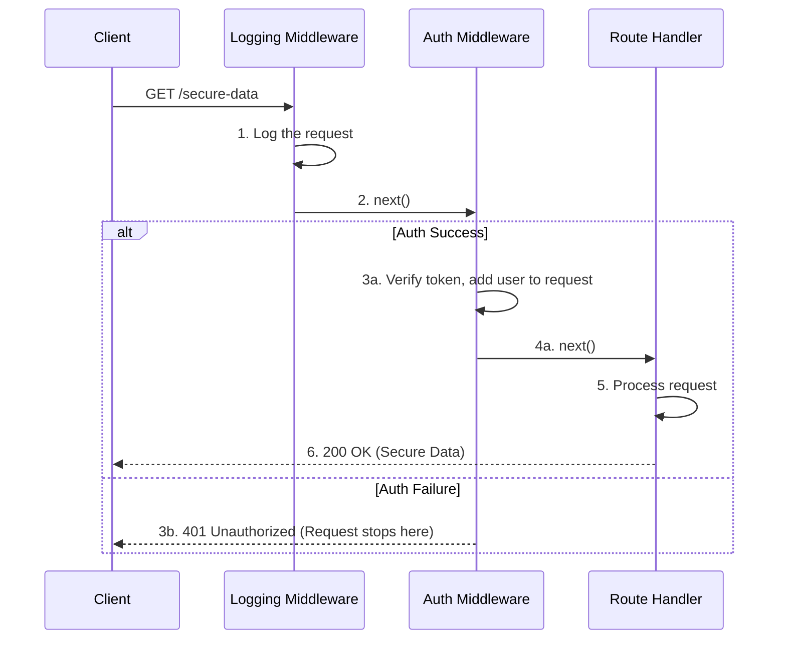

# Middleware

## Introduction

In backend web frameworks, middleware refers to functions that are executed in the middle of the request-response cycle. When a request hits your server, it can be configured to pass through a chain of middleware functions before it reaches the final route handler. Each middleware in the chain has the power to process the request, modify it, and pass control to the next middleware, or to terminate the request-response cycle by sending a response itself.

Middleware provides a powerful and elegant way to handle **cross-cutting concerns**—functionality that is needed across many different routes, such as logging, authentication, and error handling. It allows you to write small, focused, and reusable pieces of code that can be composed together.

## The Middleware Chain

A request flows through middleware sequentially. The order in which you apply your middleware matters.

## Code Examples

Here are examples of a logging middleware, a simple authentication middleware, and a centralized error handler.

  

    <button class="tab-button active" data-lang="nodejs">Node.js (Express)</button>
    <button class="tab-button" data-lang="python">Python (Flask)</button>
    <button class="tab-button" data-lang="go">Go (net/http)</button>
  

  

<pre><code class="language-javascript">
const express = require('express');
const app = express();

// 1. Logging middleware
const loggingMiddleware = (req, res, next) => {
  console.log(`[${new Date().toISOString()}] ${req.method} ${req.url}`);
  next(); // Pass control to the next middleware
};

// 2. Auth middleware
const authMiddleware = (req, res, next) => {
  if (req.headers['authorization'] === 'Bearer my-secret-token') {
    req.user = { id: 1, name: 'Admin' };
    next();
  } else {
    res.status(401).send('Unauthorized'); // End the request
  }
};

// 3. Centralized error handling middleware (must be last and have 4 arguments)
const errorHandlingMiddleware = (err, req, res, next) => {
  console.error(err.stack);
  res.status(500).send('Something broke!');
};

// --- Applying Middleware ---
// Apply logging middleware globally to all requests
app.use(loggingMiddleware);

// A route that might throw an error
app.get('/error', (req, res, next) => {
  next(new Error('This is a test error!'));
});

// Apply auth middleware only to specific routes
app.get('/secure', authMiddleware, (req, res) => {
  res.send(`Hello, ${req.user.name}! This is secure data.`);
});

app.get('/public', (req, res) => {
  res.send('This is public data.');
});

// Apply error handling middleware at the very end
app.use(errorHandlingMiddleware);

app.listen(3000);
</code></pre>
  

  

<pre><code class="language-python">
from flask import Flask, request, g, jsonify, Response
import time

app = Flask(__name__)

# 1. Logging middleware (runs before each request)
@app.before_request
def logging_middleware():
    print(f"[{time.time()}] {request.method} {request.path}")

# 2. Auth middleware (decorator to apply to specific routes)
from functools import wraps
def auth_required(f):
    @wraps(f)
    def decorated_function(*args, **kwargs):
        if request.headers.get('Authorization') == 'Bearer my-secret-token':
            g.user = {'id': 1, 'name': 'Admin'}
            return f(*args, **kwargs)
        return Response('Unauthorized', status=401)
    return decorated_function

# 3. Centralized error handling
@app.errorhandler(Exception)
def handle_exception(e):
    # Log the error and return a generic server error
    app.logger.error(e)
    return jsonify(error="Something broke!"), 500

@app.route('/secure')
@auth_required
def secure_data():
    return jsonify(message=f"Hello, {g.user['name']}! This is secure data.")

@app.route('/public')
def public_data():
    return jsonify(message="This is public data.")

if __name__ == '__main__':
    app.run(port=5000)
</code></pre>
  

  

<pre><code class="language-go">
package main

import (
	"context"
	"log"
	"net/http"
	"time"
)

// Middleware is a function that takes a handler and returns a new handler
type Middleware func(http.Handler) http.Handler

// 1. Logging middleware
func LoggingMiddleware(next http.Handler) http.Handler {
	return http.HandlerFunc(func(w http.ResponseWriter, r *http.Request) {
		start := time.Now()
		log.Printf("Started %s %s", r.Method, r.URL.Path)
		next.ServeHTTP(w, r)
		log.Printf("Completed in %v", time.Since(start))
	})
}

// 2. Auth middleware
func AuthMiddleware(next http.Handler) http.Handler {
	return http.HandlerFunc(func(w http.ResponseWriter, r *http.Request) {
		if r.Header.Get("Authorization") == "Bearer my-secret-token" {
            // Add user to the request context
			ctx := context.WithValue(r.Context(), "user", "Admin")
			next.ServeHTTP(w, r.WithContext(ctx))
		} else {
			http.Error(w, "Unauthorized", http.StatusUnauthorized)
		}
	})
}

// 3. Panic recovery middleware (Go's version of error handling)
func PanicRecoveryMiddleware(next http.Handler) http.Handler {
    return http.HandlerFunc(func(w http.ResponseWriter, r *http.Request) {
        defer func() {
            if err := recover(); err != nil {
                log.Printf("Recovered from panic: %v", err)
                http.Error(w, "Something broke!", http.StatusInternalServerError)
            }
        }()
        next.ServeHTTP(w, r)
    })
}

func secureHandler(w http.ResponseWriter, r *http.Request) {
    user := r.Context().Value("user").(string)
	w.Write([]byte("Hello, " + user + "! This is secure data."))
}

func publicHandler(w http.ResponseWriter, r *http.Request) {
	w.Write([]byte("This is public data."))
}

func main() {
	mux := http.NewServeMux()
	mux.HandleFunc("/public", publicHandler)
	mux.Handle("/secure", AuthMiddleware(http.HandlerFunc(secureHandler)))
	
    // Apply middleware globally in reverse order of execution (chaining)
    var handler http.Handler = mux
    handler = PanicRecoveryMiddleware(handler)
    handler = LoggingMiddleware(handler)

	log.Println("Listening on :8080")
	http.ListenAndServe(":8080", handler)
}
</code></pre>
  

## Common Use Cases for Middleware
*   **Authentication & Authorization**: Checking credentials and permissions.
*   **Logging**: Recording details about every request.
*   **Error Handling**: A special middleware at the end of the chain to catch errors and format a consistent response.
*   **Data Parsing**: Parsing request bodies (e.g., JSON). This is often the first middleware in the chain.
*   **CORS**: Setting headers for Cross-Origin Resource Sharing.
*   **Compression**: Compressing response bodies to save bandwidth.
*   **Rate Limiting**: Throttling requests to prevent abuse.
*   **Request Context**: Creating and populating a request-scoped context.