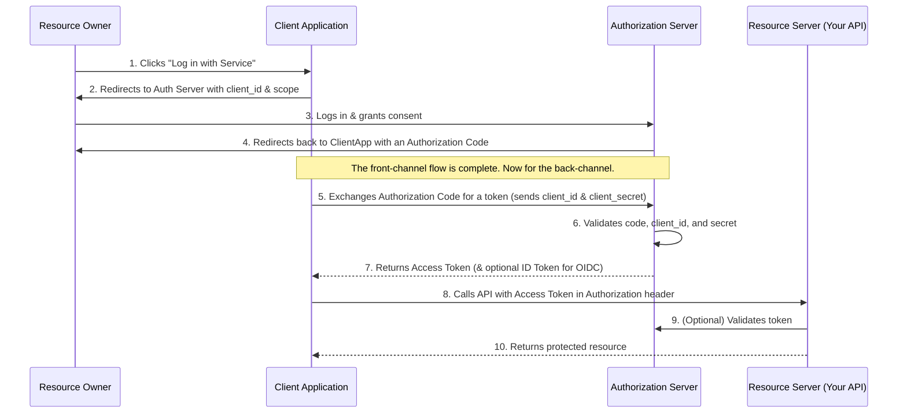

# OAuth2 and OpenID Connect

## Introduction

While JWTs and API keys are great for first-party clients (your own web or mobile app), you need a more robust and secure mechanism when you want to allow third-party applications to access your users' data on their behalf. This is the problem that **OAuth2** solves.

-   **OAuth2 (Open Authorization)**: An open standard for **access delegation**. It is an authorization framework that enables applications to obtain limited access to user accounts on an HTTP service. It is *not* an authentication protocol. It's about granting permissions.
-   **OpenID Connect (OIDC)**: A simple identity layer built on top of the OAuth 2.0 protocol. It allows clients to verify the identity of the end-user and to obtain basic profile information. OIDC introduces the concept of an **ID Token** and is what enables "Log in with Google/GitHub" functionality. It's about proving identity.

## Core Concepts and Roles

The OAuth2 flow involves four distinct roles:

1.  **Resource Owner**: The user who owns the data and grants permission.
2.  **Client**: The third-party application requesting access to the user's data.
3.  **Authorization Server**: The server that authenticates the Resource Owner and issues access tokens after getting consent.
4.  **Resource Server**: The server that hosts the user's data (your API). It accepts and validates the access token.

## The Authorization Code Grant Flow

This is the most common and secure OAuth2 flow, typically used by web and mobile apps.

### Grant Types

OAuth2 defines several "grant types" for different use cases:

*   **Authorization Code**: The flow described above. Best for confidential clients (web servers) and native/mobile apps.
*   **Client Credentials**: Used for machine-to-machine communication where there is no user. The client authenticates with its `client_id` and `client_secret` to get a token.
*   **Implicit (Legacy)**: A simplified flow where the access token is returned directly to the client. It's less secure and generally not recommended for new applications.
*   **Resource Owner Password Credentials (Legacy)**: The client asks the user for their username and password directly. This should only be used for highly trusted, first-party applications.

### Access Tokens vs. ID Tokens

*   **Access Token**: An opaque string or JWT that the Resource Server (your API) uses to verify that the client has permission to access certain resources. It's meant for the API. Its contents are irrelevant to the client.
*   **ID Token (OIDC only)**: Always a JWT. It contains identity information about the user (like their user ID, email, name). It's meant for the client application to use, allowing it to know who the logged-in user is without needing to call another endpoint.

## Best Practices
*   **Use the Authorization Code Flow with PKCE**: For mobile and Single-Page Apps (SPAs), the Proof Key for Code Exchange (PKCE) extension is a modern standard that adds an extra layer of security.
*   **Use Short-Lived Access Tokens**: Access tokens should have a short lifespan (minutes). Use long-lived **Refresh Tokens** to obtain new access tokens without user interaction.
*   **Store Tokens Securely**: On the backend, store client secrets and refresh tokens securely. On the frontend, token storage requires careful consideration to prevent XSS.
*   **Validate Scopes**: The API (Resource Server) must always check that the scopes included in the access token are sufficient for the requested operation.

<h3>Further Reading</h3>
<ul>
  <li><a href="https://oauth.net/2/" target="_blank" rel="noopener noreferrer">OAuth 2.0 Official Website</a></li>
  <li><a href="https://openid.net/connect/" target="_blank" rel="noopener noreferrer">OpenID Connect Official Website</a></li>
  <li><a href="https://auth0.com/docs/get-started/authentication-and-authorization-flow" target="_blank" rel="noopener noreferrer">Auth0: Authentication and Authorization Flow</a></li>
</ul>

