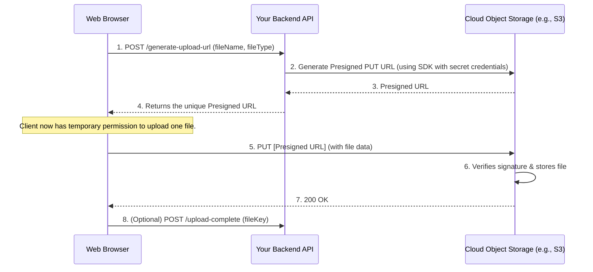

# Object Storage and Large Files

## Introduction

Many applications need to handle user-generated content like images, videos, and documents. Storing these files directly in a database or on the local file system of your application server is generally a bad practice, as it's not durable, scalable, or efficient.

The modern solution is **object storage**. This is a data storage architecture that manages data as objects in a flat structure within "buckets." Cloud providers like AWS, Google Cloud, and Azure offer highly scalable, durable, and cost-effective object storage services.

*   **Leading Services**: Amazon S3, Google Cloud Storage (GCS), Azure Blob Storage.
*   **Key Benefits**: Virtually limitless scale, extreme durability (e.g., S3 is designed for 99.999999999% durability), and security.

## Secure Uploads with Presigned URLs

A common and secure pattern for handling file uploads is to use **presigned URLs**. This offloads the heavy lifting of the file transfer from your server to the cloud provider's infrastructure.

**Benefits of this pattern:**
*   **Security**: Your cloud credentials are never exposed to the client.
*   **Scalability**: Offloads the bandwidth and processing of the upload from your servers.

## Code Examples: Generating a Presigned S3 URL

Here's how your backend can generate a presigned URL that allows a client to upload a file directly to an AWS S3 bucket.

  

    <button class="tab-button active" data-lang="nodejs">Node.js (AWS SDK v3)</button>
    <button class="tab-button" data-lang="python">Python (Boto3)</button>
    <button class="tab-button" data-lang="go">Go (AWS SDK v2)</button>
  

  

<pre><code class="language-javascript">
const { S3Client, PutObjectCommand } = require("@aws-sdk/client-s3");
const { getSignedUrl } = require("@aws-sdk/s3-request-presigner");

const s3Client = new S3Client({ region: "us-east-1" });
const BUCKET_NAME = "my-upload-bucket";

async function generateUploadUrl(fileName) {
  const command = new PutObjectCommand({
    Bucket: BUCKET_NAME,
    Key: `uploads/${fileName}`, // The key (path) where the file will be stored
  });

  // The URL expires in 15 minutes
  const signedUrl = await getSignedUrl(s3Client, command, { expiresIn: 900 });
  
  return signedUrl;
}

// In an Express controller:
// app.post('/generate-upload-url', async (req, res) => {
//     const { fileName } = req.body;
//     const url = await generateUploadUrl(fileName);
//     res.json({ url });
// });
</code></pre>
  

  

<pre><code class="language-python">
import boto3
from botocore.exceptions import ClientError
import logging

s3_client = boto3.client('s3', region_name='us-east-1')
BUCKET_NAME = "my-upload-bucket"

def generate_upload_url(file_name, expiration=900):
    """Generate a presigned URL to share an S3 object
    :param file_name: string
    :param expiration: Time in seconds for the presigned URL to remain valid
    :return: Presigned URL as string. If error, returns None.
    """
    key = f"uploads/{file_name}"

    try:
        response = s3_client.generate_presigned_url(
            'put_object',
            Params={'Bucket': BUCKET_NAME, 'Key': key},
            ExpiresIn=expiration
        )
    except ClientError as e:
        logging.error(e)
        return None
    
    return response

# In a Flask controller:
# @app.route('/generate-upload-url', methods=['POST'])
# def presign_url():
#     file_name = request.json.get('fileName')
#     url = generate_upload_url(file_name)
#     return jsonify({'url': url})
</code></pre>
  

  

<pre><code class="language-go">
package main

import (
	"context"
	"log"
	"time"

	"github.com/aws/aws-sdk-go-v2/config"
	"github.com/aws/aws-sdk-go-v2/service/s3"
)

const BUCKET_NAME = "my-upload-bucket"

func generateUploadUrl(fileName string) (string, error) {
	cfg, err := config.LoadDefaultConfig(context.TODO(), config.WithRegion("us-east-1"))
	if err != nil {
		return "", err
	}

	s3Client := s3.NewFromConfig(cfg)
	presignClient := s3.NewPresignClient(s3Client)
	
	key := "uploads/" + fileName

	presignedUrl, err := presignClient.PresignPutObject(context.TODO(),
		&s.PutObjectInput{
			Bucket: &BUCKET_NAME,
			Key:    &key,
		},
		s3.WithPresignExpires(15*time.Minute))

	if err != nil {
		return "", err
	}

	return presignedUrl.URL, nil
}

// In a net/http handler:
// func generateUrlHandler(w http.ResponseWriter, r *http.Request) {
//     fileName := r.URL.Query().Get("fileName")
//     url, err := generateUploadUrl(fileName)
//     // ... handle error and write JSON response
// }
</code></pre>
  

## Serving Files and Using a CDN

*   **Public Content**: For public files, you can serve them directly from a public bucket URL.
*   **Private Content**: For private files, you can use the same presigned URL mechanism for `GET` requests, granting temporary read access.
*   **Content Delivery Network (CDN)**: For better performance, use a CDN (like Amazon CloudFront or Google Cloud CDN) in front of your object storage bucket. The CDN caches your files at "edge locations" closer to your users, dramatically reducing download latency.