# OpenAPI Standards

## Introduction

The OpenAPI Specification (OAS), formerly known as the Swagger Specification, is a standard, language-agnostic interface description for HTTP APIs. It allows both humans and computers to discover and understand the capabilities of a service without requiring access to source code, documentation, or network traffic inspection.

An OpenAPI document, written in YAML or JSON, is the source of truth for your API's design, describing its endpoints, operations, parameters, schemas, and authentication methods.

## The OpenAPI-Driven Workflow

Adopting a "Design-First" approach with OpenAPI enables powerful automation and collaboration. The specification becomes the central contract that drives the entire development lifecycle.

```mermaid
graph TD
    A[1. Design & Collaborate on OpenAPI Spec] --> B(2. Generate Mock Server);
    A --> C(3. Generate Client SDKs);
    A --> D(4. Generate Server Stubs);

    subgraph Frontend Development
        C --> E[Develop Frontend against SDK];
    end
    
    subgraph Backend Development
        D --> F[Implement Business Logic];
    end

    B --> E;
    E -- "Consumes" --> F;
    
    A --> G(5. Generate Interactive Docs);
    F -- "Validated by" --> H(6. Contract Testing);
    A -- "Defines" --> H;

    style A fill:#1b263b,stroke:#00f5d4,stroke-width:2px;
```



## Using a Generated Client SDK

One of the biggest benefits of OpenAPI is code generation. Let's assume we used the example OpenAPI spec from below to generate client SDKs. Here's how easy it becomes to interact with the API.

<div class="code-tabs">
  <div class="tab-buttons">
    <button class="tab-button active" data-lang="nodejs">Node.js (Generated Client)</button>
    <button class="tab-button" data-lang="python">Python (Generated Client)</button>
    <button class="tab-button" data-lang="go">Go (Generated Client)</button>
  </div>
  <div class="tab-content active" data-lang="nodejs">
<pre><code class="language-javascript">
// Assuming 'openapi-generator-cli' was used to generate a client
import { UserApi, Configuration } from 'my-backend-api-client';

const config = new Configuration({ basePath: "https://api.example.com/v1" });
const userApi = new UserApi(config);

async function main() {
    try {
        // The generated client provides strongly-typed methods
        // that match the 'operationId' in the spec.
        const users = await userApi.listUsers();
        console.log('All Users:', users);
        
        const user = await userApi.getUserById('user-123');
        console.log('Single User:', user);
    } catch (error) {
        console.error('API Error:', error);
    }
}
main();
</code></pre>
  </div>
  <div class="tab-content" data-lang="python">
<pre><code class="language-python">
# Assuming 'openapi-generator-cli' was used to generate a client
import my_backend_api_client
from my_backend_api_client.api import user_api
from pprint import pprint

configuration = my_backend_api_client.Configuration(
    host="https://api.example.com/v1"
)

with my_backend_api_client.ApiClient(configuration) as api_client:
    api_instance = user_api.UserApi(api_client)
    try:
        # The generated client provides methods that match the 'operationId'
        api_response = api_instance.list_users()
        pprint(api_response)
    except my_backend_api_client.ApiException as e:
        print("Exception when calling UserApi->list_users: %s\n" % e)
</code></pre>
  </div>
  <div class="tab-content" data-lang="go">
<pre><code class="language-go">
// Assuming 'oapi-codegen' or similar was used to generate a client
package main

import (
	"context"
	"fmt"
	"my-backend-api-client/client"
)

func main() {
	c, err := client.NewClient("https://api.example.com/v1")
	if err != nil {
		panic(err)
	}

	// The generated client provides strongly-typed methods
	// that match the 'operationId' in the spec.
	users, err := c.ListUsers(context.Background())
	if err != nil {
		panic(err)
	}
	fmt.Printf("Users: %+v\n", *users.JSON200)

	user, err := c.GetUserById(context.Background(), "user-123")
	if err != nil {
		panic(err)
	}
	fmt.Printf("Single User: %+v\n", *user.JSON200)
}
</code></pre>
  </div>
</div>

## Simplified OpenAPI Document Example
This YAML file is the source for the code generation and documentation.
```yaml
openapi: 3.0.0
info:
  title: Simple User API
  version: 1.0.0
servers:
  - url: https://api.example.com/v1
paths:
  /users:
    get:
      summary: List all users
      operationId: listUsers # This becomes the method name
      responses:
        '200':
          description: A list of users.
          content:
            application/json:
              schema:
                type: array
                items:
                  $ref: '#/components/schemas/User'
  /users/{userId}:
    get:
      summary: Get a user by ID
      operationId: getUserById # Method name
      parameters:
        - name: userId
          in: path
          required: true
          schema: { type: string }
      responses:
        '200':
          description: A single user.
          content:
            application/json:
              schema:
                $ref: '#/components/schemas/User'
components:
  schemas:
    User:
      type: object
      properties:
        id: { type: string }
        name: { type: string }
        email: { type: string, format: email }
```

<div class="further-reading">
<h3>Further Reading</h3>
<ul>
  <li><a href="https://swagger.io/specification/" target="_blank" rel="noopener noreferrer">OpenAPI Specification (v3)</a></li>
  <li><a href="https://openapi-generator.tech/" target="_blank" rel="noopener noreferrer">OpenAPI Generator Tool</a></li>
  <li><a href="https://stoplight.io/open-source/elements" target="_blank" rel="noopener noreferrer">Stoplight Elements (for interactive docs)</a></li>
</ul>
</div>