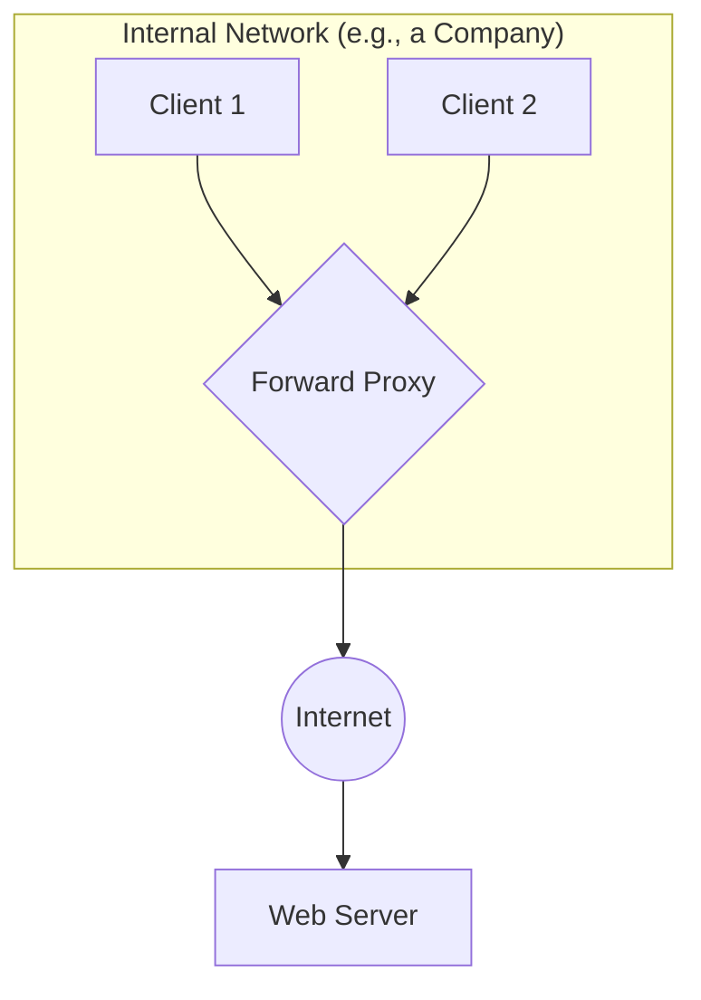
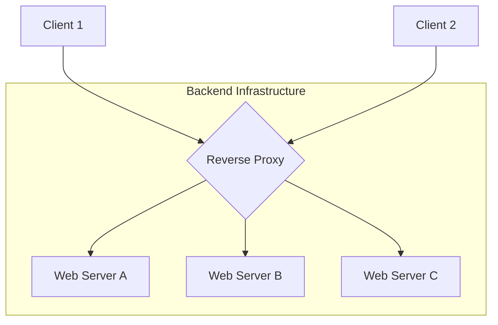

# Proxies

## Introduction

In networking, a proxy is an intermediary server that sits between a client and a destination server, forwarding requests on their behalf. The word "proxy" means "to act on behalf of another," and that's exactly what these servers do.

There are two main types of proxies, and the distinction depends on whose behalf they are acting: the client's or the server's. Understanding this difference is key to understanding their different roles in system architecture.

## Forward Proxy

A forward proxy sits in front of a client or a group of clients and forwards their requests to the internet. From the perspective of the destination server, the request appears to come from the proxy server, not the original client.

**Common Use Cases for Forward Proxies:**
*   **Bypassing Firewalls and Censorship**: A user inside a restricted network can use a proxy in an unrestricted network to access blocked content.
*   **Anonymity**: Can hide the client's real IP address.
*   **Filtering Content**: A school or company might use a forward proxy to block access to certain websites.

For most backend engineers building web services, forward proxies are something their clients might use, but not something they typically build or manage.

## Reverse Proxy

A reverse proxy is the opposite. It sits in front of a server or a group of servers and forwards client requests to them. From the perspective of the client, it appears they are communicating directly with the reverse proxy; they have no knowledge of the backend servers behind it.

**This is an extremely common and important pattern in backend system design.**

**Common Use Cases for Reverse Proxies:**

1.  **Load Balancing**: This is a primary use case. A reverse proxy can distribute incoming traffic across multiple backend servers, which is essential for scalability and high availability.
2.  **SSL/TLS Termination**: The reverse proxy can handle incoming HTTPS connections, decrypting the requests and passing unencrypted requests to the internal backend servers. This offloads the computational overhead of encryption from the application servers and simplifies certificate management.
3.  **Caching**: A reverse proxy can cache responses from the backend servers and serve them directly to clients for subsequent requests, reducing the load on the backend.
4.  **Security and DDoS Protection**: It can act as a single point of entry to your infrastructure, allowing you to implement security measures like a Web Application Firewall (WAF) to filter out malicious traffic.
5.  **API Gateway**: A more advanced reverse proxy that provides features like request routing, authentication, rate limiting, and request transformation.

**Popular Reverse Proxy Technologies**:
*   NGINX
*   Apache HTTP Server
*   HAProxy
*   Cloud-provided load balancers (like AWS ELB/ALB, Google Cloud Load Balancer) often function as managed reverse proxies.

<h3>Further Reading</h3>
<ul>
  <li><a href="https://www.cloudflare.com/learning/cdn/glossary/reverse-proxy/" target="_blank" rel="noopener noreferrer">What is a Reverse Proxy? by Cloudflare</a></li>
  <li><a href="https://www.nginx.com/resources/glossary/reverse-proxy-server/" target="_blank" rel="noopener noreferrer">What is a Reverse Proxy Server? by NGINX</a></li>
</ul>

