# RESTful Architecture

## Introduction

REST (Representational State Transfer) is an architectural style for designing networked applications. It's not a standard or a protocol, but a set of constraints that result in a system that is scalable, performant, and easy to work with. APIs that adhere to these principles are called "RESTful" APIs.

REST has become the de-facto standard for building web APIs, as it leverages the existing, proven technologies of the web, primarily HTTP.

## Resource-Oriented Design

A key principle of REST is its focus on **resources** (the "nouns" of your API), and using standard HTTP methods (the "verbs") to operate on them.

```mermaid
graph TD
    subgraph "Good: RESTful URIs (Nouns)"
        A1("`GET /users`") --> L1(List all users);
        A2("`POST /users`") --> C1(Create a new user);
        A3("`GET /users/123`") --> R1(Retrieve user 123);
        A4("`DELETE /users/123`") --> D1(Delete user 123);
        A5("`GET /users/123/orders`") --> O1(List orders for user 123);
    end

    subgraph "Bad: RPC-Style URIs (Verbs)"
        B1("`GET /getAllUsers`");
        B2("`POST /createNewUser`");
        B3("`GET /getUserById?id=123`");
        B4("`POST /deleteUser`");
        B5("`GET /getOrdersForUser?userId=123`");
    end

    style A1 fill:#1b263b,stroke:#00f5d4,stroke-width:2px;
    style A2 fill:#1b263b,stroke:#00f5d4,stroke-width:2px;
    style A3 fill:#1b263b,stroke:#00f5d4,stroke-width:2px;
    style A4 fill:#1b263b,stroke:#00f5d4,stroke-width:2px;
    style A5 fill:#1b263b,stroke:#00f5d4,stroke-width:2px;

    style B1 fill:#1b263b,stroke:#e76f51,stroke-width:2px;
    style B2 fill:#1b263b,stroke:#e76f51,stroke-width:2px;
    style B3 fill:#1b263b,stroke:#e76f51,stroke-width:2px;
    style B4 fill:#1b263b,stroke:#e76f51,stroke-width:2px;
    style B5 fill:#1b263b,stroke:#e76f51,stroke-width:2px;
```



## The Six Constraints of REST

1.  **Client-Server Architecture**: The client (UI) and server (data) are separate, allowing them to evolve independently.
2.  **Statelessness**: Each request from a client must contain all information needed to complete it. The server stores no client session state. This improves scalability and reliability.
3.  **Cacheability**: Responses must define whether they are cacheable. This allows clients or intermediaries to reuse prior data, improving performance.
4.  **Layered System**: A client cannot ordinarily tell whether it is connected directly to the end server or to an intermediary (like a load balancer or API gateway).
5.  **Uniform Interface**: This is the core constraint that distinguishes REST.
    *   **Resource-Based**: Use URIs to identify resources (e.g., `/users/123`).
    *   **Manipulation of Resources Through Representations**: Clients modify resources by sending representations (e.g., JSON) to the server.
    *   **Self-Descriptive Messages**: Use headers like `Content-Type` and `Accept` to specify the format of data.
    *   **HATEOAS (Hypermedia as the Engine of Application State)**: Responses should include links to related actions.
6.  **Code on Demand (Optional)**: Servers can temporarily extend client functionality by transferring executable code (e.g., JavaScript).

## Example: A RESTful Controller

This pseudo-code shows how a `UsersController` would map HTTP methods and URIs to CRUD operations.

```javascript
class UsersController {
    // Maps to: GET /users
    list(request, response) {
        // ... logic to get all users ...
        // Apply filtering, sorting, pagination from query params
    }

    // Maps to: POST /users
    create(request, response) {
        // ... logic to create a new user from request body ...
        // Returns 201 Created
    }

    // Maps to: GET /users/:id
    getById(request, response) {
        const userId = request.params.id;
        // ... logic to get a single user ...
        // Returns 404 Not Found if user doesn't exist
    }

    // Maps to: PATCH /users/:id
    update(request, response) {
        const userId = request.params.id;
        const updates = request.body;
        // ... logic to partially update a user ...
    }
    
    // Maps to: DELETE /users/:id
    delete(request, response) {
        const userId = request.params.id;
        // ... logic to delete a user ...
        // Returns 204 No Content
    }
}
```

## Best Practices
*   **Use Nouns for URIs**: `/users`, `/products`.
*   **Use HTTP Methods for Actions**: `GET`, `POST`, `PATCH`, `DELETE`.
*   **Use HTTP Status Codes**: `200 OK`, `201 Created`, `400 Bad Request`, `404 Not Found`.
*   **Support Filtering, Sorting, and Pagination**: Use query parameters for collections (e.g., `GET /users?status=active&sort=-created_at&page=2`).
*   **Version Your API**: Use a version number in the URL (e.g., `/api/v1/users`) to handle breaking changes.

<div class="further-reading">
<h3>Further Reading</h3>
<ul>
  <li><a href="https://restfulapi.net/" target="_blank" rel="noopener noreferrer">RESTful API Tutorial</a></li>
  <li><a href="https://martinfowler.com/articles/richardsonMaturityModel.html" target="_blank" rel="noopener noreferrer">Richardson Maturity Model (a way to grade how "RESTful" an API is)</a></li>
  <li><a href="https://www.rfc-editor.org/rfc/rfc9110" target="_blank" rel="noopener noreferrer">RFC 9110 - HTTP Semantics</a></li>
</ul>
</div>