# Routing

## Introduction

In backend development, routing is the mechanism that maps incoming client requests to the specific code that handles them. When a request hits your server at a specific URL path (e.g., `/users/123`) and with a particular HTTP method (e.g., `GET`), the router is responsible for determining which function or controller should be executed.

Effective routing is fundamental to building a well-structured and maintainable API.

## How Routing Works

The router acts as a dispatcher. It inspects the method and path of an incoming request and matches it against a list of predefined "routes." Once a match is found, the associated handler function is executed.

```mermaid
graph TD
    A[GET /users/123] --> R{Router};
    B[POST /users] --> R;
    C[GET /products] --> R;

    R -- "Matches GET /users/:id" --> H1[getUserById Handler];
    R -- "Matches POST /users" --> H2[createUser Handler];
    R -- "Matches GET /products" --> H3[getProducts Handler];

    style R fill:#1b263b,stroke:#00f5d4,stroke-width:2px;
```



A route is typically defined by:
1.  **The HTTP Method**: `GET`, `POST`, `PUT`, etc.
2.  **The URL Pattern (or Path)**: A string that defines the URL structure, often including placeholders for dynamic values.
3.  **The Handler**: The function that gets executed upon a match.

## Code Examples

Here's how to define routes, including path parameters and query parameters, in different frameworks.

<div class="code-tabs">
  <div class="tab-buttons">
    <button class="tab-button active" data-lang="nodejs">Node.js (Express)</button>
    <button class="tab-button" data-lang="python">Python (Flask)</button>
    <button class="tab-button" data-lang="go">Go (net/http)</button>
  </div>
  <div class="tab-content active" data-lang="nodejs">
<pre><code class="language-javascript">
const express = require('express');
const app = express();

// Basic route
app.get('/hello', (req, res) => {
  res.send('Hello, World!');
});

// Route with a path parameter
// The ':' denotes a dynamic segment
app.get('/users/:userId/posts/:postId', (req, res) => {
  const { userId, postId } = req.params;
  res.send(`Fetching post ${postId} for user ${userId}.`);
});

// Route with query parameters (e.g., /search?q=books&sort=newest)
app.get('/search', (req, res) => {
  const { q, sort } = req.query;
  res.send(`Searching for '${q}' sorted by '${sort}'.`);
});

app.listen(3000);
</code></pre>
  </div>
  <div class="tab-content" data-lang="python">
<pre><code class="language-python">
from flask import Flask, request, jsonify

app = Flask(__name__)

# Basic route
@app.route('/hello')
def hello_world():
    return 'Hello, World!'

# Route with path parameters
# Type converters like <int:> can be used
@app.route('/users/<int:user_id>/posts/<int:post_id>')
def get_user_post(user_id, post_id):
    return f'Fetching post {post_id} for user {user_id}.'

# Route with query parameters (e.g., /search?q=books&sort=newest)
@app.route('/search')
def search():
    query = request.args.get('q')
    sort_by = request.args.get('sort')
    return f"Searching for '{query}' sorted by '{sort_by}'."

if __name__ == '__main__':
    app.run(port=5000)
</code></pre>
  </div>
  <div class="tab-content" data-lang="go">
<pre><code class="language-go">
package main

import (
	"fmt"
	"net/http"
	"strings"
)

func main() {
	// Basic route
	http.HandleFunc("/hello", func(w http.ResponseWriter, r *http.Request) {
		fmt.Fprint(w, "Hello, World!")
	})

	// Route with path parameters (manual parsing)
	http.HandleFunc("/users/", func(w http.ResponseWriter, r *http.Request) {
		parts := strings.Split(r.URL.Path, "/")
		// Expects /users/{userId}/posts/{postId}
		if len(parts) == 5 && parts[3] == "posts" {
			userId := parts[2]
			postId := parts[4]
			fmt.Fprintf(w, "Fetching post %s for user %s.", postId, userId)
		} else {
			http.NotFound(w, r)
		}
	})

	// Route with query parameters (e.g., /search?q=books&sort=newest)
	http.HandleFunc("/search", func(w http.ResponseWriter, r *http.Request) {
		query := r.URL.Query().Get("q")
		sortBy := r.URL.Query().Get("sort")
		fmt.Fprintf(w, "Searching for '%s' sorted by '%s'.", query, sortBy)
	})

	http.ListenAndServe(":8080", nil)
	// Note: For complex routing in Go, libraries like 'gorilla/mux' or 'chi' are commonly used.
}
</code></pre>
  </div>
</div>

### Route Middleware

Middleware functions are functions that execute before the main handler. They are incredibly powerful for handling cross-cutting concerns.
*   **Authentication/Authorization**: Checking if a user can access a route.
*   **Logging**: Recording details about every incoming request.
*   **Validation**: Validating the request body.

This example shows a middleware chain that first validates the request, then checks for authentication.
```javascript
// Example of an authentication middleware in Express.js
const validateRequest = (schema) => (req, res, next) => {
    // ... validation logic using a library like Joi ...
    console.log('1. Validating request body...');
    next();
};

const requireAuth = (req, res, next) => {
  console.log('2. Checking authentication...');
  if (!req.user) {
    return res.status(401).send('You must be logged in.');
  }
  // If user is authenticated, pass control to the next handler
  next();
};

// Applying the middleware to a specific route
app.post('/profile', validateRequest(profileSchema), requireAuth, (req, res) => {
  console.log('3. Executing main handler.');
  res.send('This is your private profile.');
});
```

### Route Grouping and Namespacing
As an API grows, it's useful to group related routes. Most frameworks provide a way to apply a common prefix or middleware to a group of routes.

```javascript
// Express.js example of route grouping
const apiRouter = express.Router();
const v1Router = express.Router();

// All routes in v1Router will be prefixed with /api/v1
app.use('/api/v1', apiRouter);
apiRouter.use(v1Router);

// This route is now accessible at /api/v1/users
v1Router.get('/users', (req, res) => { /* ... */ });
// This route is now accessible at /api/v1/products
v1Router.get('/products', (req, res) => { /* ... */ });
```

## Best Practices
*   **Keep URLs Simple and Intuitive**: Your API's URLs should be easy to understand.
*   **Use Nouns for Resources, Verbs for Actions (HTTP Methods)**:
    *   **Good**: `DELETE /users/123`
    *   **Bad**: `POST /deleteUser/123`
*   **Use Plural Nouns**: It's conventional to use plural nouns for resource collections (e.g., `/users` instead of `/user`).
*   **Organize Routes Logically**: Group related routes into separate files or modules (e.g., `userRoutes.js`, `productRoutes.js`).
*   **Version Your API**: If you anticipate making breaking changes, include a version number in your URL (e.g., `/api/v1/users`).

<div class="further-reading">
<h3>Further Reading</h3>
<ul>
  <li><a href="https://expressjs.com/en/guide/routing.html" target="_blank" rel="noopener noreferrer">Express.js Routing Guide</a></li>
  <li><a href="https://flask.palletsprojects.com/en/2.3.x/quickstart/#routing" target="_blank" rel="noopener noreferrer">Flask Routing Quickstart</a></li>
  <li><a href="https://github.com/gorilla/mux" target="_blank" rel="noopener noreferrer">gorilla/mux (a popular Go router)</a></li>
</ul>
</div>