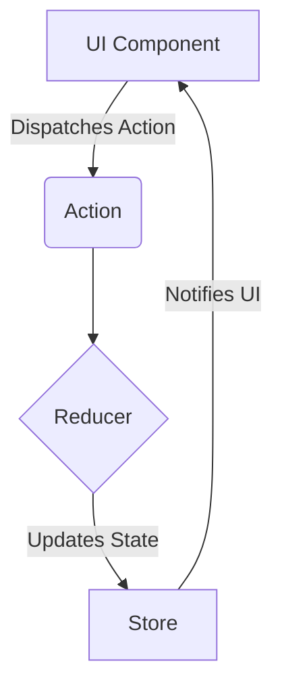

# State Management

## Introduction

In a modern frontend application, "state" refers to any data that can change over time and that should be reflected in the UI. This can be anything from the value of an input field, to whether a modal is open, to the user's authentication status, or the data fetched from an API.

**State management** is the practice of managing this data in a structured and predictable way. As applications grow, managing state becomes one of the most significant challenges in frontend development.

## The Problem: Sharing State

Components often need to share and communicate state. For example, a `ShoppingCart` component needs to know how many items have been added from various `Product` components.

### Prop Drilling

The simplest way to share state between components is to "lift state up" to the nearest common ancestor and pass it down via props.

```mermaid
graph TD
    A[App (manages cart state)] -- "cartItems" --> B[ProductPage];
    B -- "cartItems, onAddToCart" --> C[ProductList];
    C -- "onAddToCart" --> D[ProductItem];
    
    A --> E[Navbar];
    E --> F[CartIcon (needs cartItems.length)];
```

In this diagram, if `ProductItem` needs to add an item to the cart, the state and the function to update it (`onAddToCart`) might live in the top-level `App` component. This data has to be "drilled" down through `ProductPage` and `ProductList` just to get to `ProductItem`. The `CartIcon` also needs the cart data, which is passed down through `Navbar`.

This works for small applications, but it quickly becomes cumbersome and hard to maintain. This is known as **"prop drilling."**

## Solutions for Global State

To solve prop drilling, we use global state management solutions. These create a centralized store for state that any component in the application can access directly, without needing props.

### 1. Context API (React)

The Context API is React's built-in solution for sharing state. You create a `Provider` at a high level in your component tree, and any child component can become a `Consumer` to access the state.

```javascript
// 1. Create a Context
const CartContext = React.createContext();

// 2. Create a Provider component
function CartProvider({ children }) {
  const [cartItems, setCartItems] = useState([]);
  
  const addToCart = (item) => {
    setCartItems(prevItems => [...prevItems, item]);
  };
  
  // The value prop is what consumers will receive
  const value = { cartItems, addToCart };
  
  return <CartContext.Provider value={value}>{children}</CartContext.Provider>;
}

// 3. Wrap your app with the Provider
// <CartProvider><App /></CartProvider>

// 4. Use the context in any child component
function CartIcon() {
  // The useContext hook subscribes the component to the context
  const { cartItems } = React.useContext(CartContext);
  
  return <div>Cart: {cartItems.length}</div>;
}
```
**Pros**: Built into React, great for medium-sized applications and for state that doesn't change extremely frequently.
**Cons**: Can cause performance issues if the context value changes often, as all consuming components will re-render.

### 2. External Libraries (Redux, Zustand, etc.)

For large-scale applications, dedicated state management libraries provide more powerful tools and better performance optimizations.

**Redux** is one of the most established. It enforces a strict, predictable pattern for state updates:
1.  **Store**: A single object holds the entire application's state.
2.  **Actions**: Plain JavaScript objects that describe an event that happened (e.g., `{ type: 'ADD_TO_CART', payload: item }`).
3.  **Reducers**: Pure functions that take the current state and an action, and return the new state.


This one-way data flow makes state changes predictable and easy to debug.

**Zustand** is a more modern, simpler alternative that is gaining popularity. It uses a "store" concept but with much less boilerplate than Redux.

## Types of State

It's helpful to categorize the state in your application:
*   **Local State**: State that is only needed by a single component (e.g., the value of a form input). `useState` is perfect for this.
*   **Shared/Global State**: State that is needed by multiple components across the app (e.g., user info, shopping cart). This is where Context or libraries like Redux shine.
*   **Server Cache State**: Data that is fetched from your backend and cached on the client. Tools like **React Query** or **SWR** are specifically designed to manage this type of state, handling caching, re-fetching, and synchronization for you.

Choosing the right tool for the right type of state is key to building a maintainable and performant frontend application.

<div class="further-reading">
<h3>Further Reading</h3>
<ul>
  <li><a href="https://react.dev/learn/sharing-state-between-components" target="_blank" rel="noopener noreferrer">React Docs: Sharing State Between Components</a></li>
  <li><a href="https://redux.js.org/introduction/getting-started" target="_blank" rel="noopener noreferrer">Redux Official Docs</a></li>
  <li><a href="https://tanstack.com/query/latest" target="_blank" rel="noopener noreferrer">TanStack Query (formerly React Query)</a></li>
</ul>
</div>