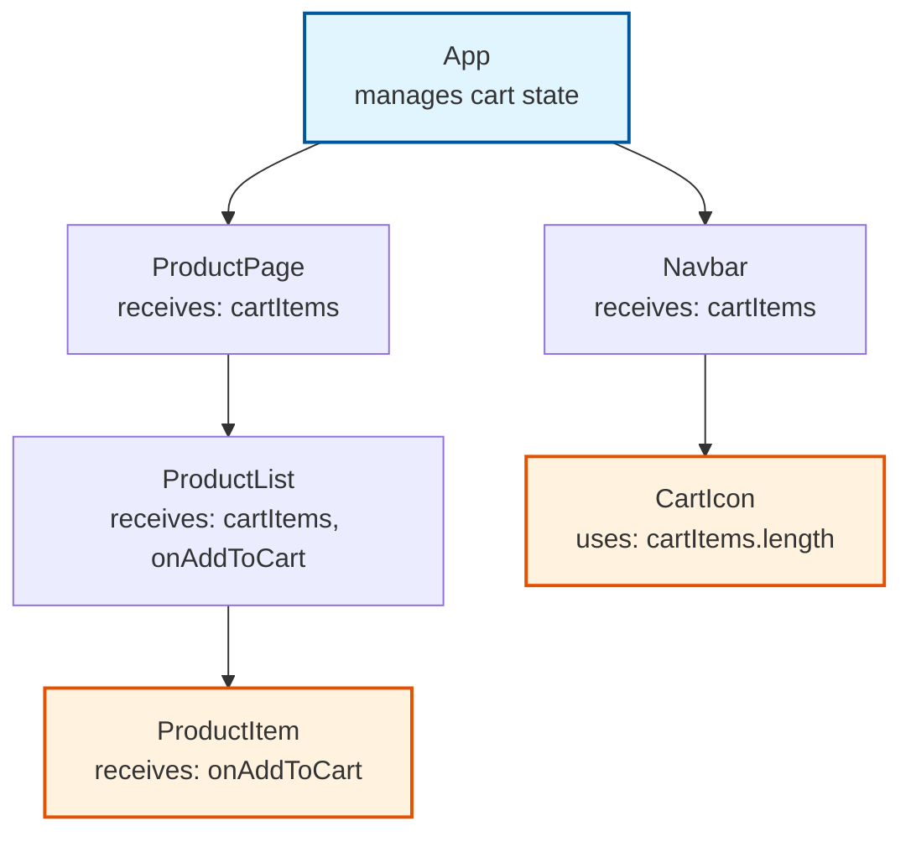

# State Management

## Introduction

In modern frontend applications, particularly those built with frameworks like React, Vue, or Angular, **state** refers to any data that can change over time and directly influences the user interface (UI). This includes simple values like the text in an input field, toggles for UI elements (e.g., a modal's visibility), user authentication details, or complex data structures like lists fetched from an API.

**State management** involves organizing, updating, and sharing this data in a predictable, scalable manner. As applications scale—from a simple landing page to a full e-commerce platform—poor state management leads to bugs, performance bottlenecks, and code that's hard to maintain. Effective state management ensures that UI updates are efficient, debugging is straightforward, and teams can collaborate without constant refactoring.

Key principles of good state management:
- **Predictability**: Changes follow a clear, one-way flow.
- **Immutability**: State is never mutated in place; new copies are created.
- **Selectivity**: Only affected components re-render on changes.

## The Problem: Sharing State

Components in a frontend app are often hierarchical and modular, but they frequently need to share or react to the same data. For instance, in a shopping app, multiple `Product` components might need to update a shared `ShoppingCart`, while a `Navbar` displays the cart's item count.

### Prop Drilling

The most basic approach to sharing state is to "lift" it to the nearest common ancestor component and pass it down through props. This works well for shallow hierarchies but leads to **prop drilling** in deeper trees—where irrelevant intermediate components must forward props they don't use.

Here's a visual representation of prop drilling in a shopping app:



In this flow:
- The `App` holds `cartItems` (an array) and `onAddToCart` (a function).
- `cartItems` drills down to `ProductPage` → `ProductList` → `ProductItem` (even if `ProductPage` doesn't use it).
- `onAddToCart` only needs to reach `ProductItem`, but the path is still cluttered.
- `CartIcon` requires `cartItems.length` via `Navbar`.

**Pros**: No external dependencies; uses built-in features.
**Cons**: Violates separation of concerns, increases cognitive load, and can cause unnecessary re-renders.

Prop drilling is fine for small apps (e.g., <10 components) but becomes a nightmare in larger ones, often signaling the need for global state solutions.

## Solutions for Global State

Global state management centralizes data in a single source of truth (e.g., a "store"), allowing any component to read or subscribe to it without prop chains. This decouples components, improves testability, and scales better.

### 1. Context API (React)

React's built-in Context API is ideal for avoiding prop drilling in medium-sized apps. It provides a way to pass data through the component tree without manual forwarding.

#### How It Works
1. **Create a Context**: A container for the shared value.
2. **Provider**: Wraps the app (or subtree) and supplies the value.
3. **Consumer**: Any descendant uses `useContext` to access it.

Example: Managing a shopping cart.

```javascript
import React, { createContext, useContext, useState } from 'react';

// 1. Create the context
const CartContext = createContext();

// 2. Provider with state logic
export function CartProvider({ children }) {
  const [cartItems, setCartItems] = useState([]);

  const addToCart = (item) => {
    setCartItems(prevItems => [...prevItems, { ...item, id: Date.now() }]);
  };

  const removeFromCart = (id) => {
    setCartItems(prevItems => prevItems.filter(item => item.id !== id));
  };

  const value = { cartItems, addToCart, removeFromCart };

  return (
    <CartContext.Provider value={value}>
      {children}
    </CartContext.Provider>
  );
}

// 3. Custom hook for easy consumption
export const useCart = () => {
  const context = useContext(CartContext);
  if (!context) {
    throw new Error('useCart must be used within CartProvider');
  }
  return context;
};

// Usage in components
function ProductItem({ product }) {
  const { addToCart } = useCart();
  return (
    <button onClick={() => addToCart(product)}>
      Add to Cart
    </button>
  );
}

function CartIcon() {
  const { cartItems } = useCart();
  return <div>🛒 {cartItems.length}</div>;
}

// In App.js
function App() {
  return (
    <CartProvider>
      <Navbar />
      <ProductPage />
    </CartProvider>
  );
}
```

**Pros**:
- Zero setup; native to React.
- Lightweight for simple shared state (e.g., theme, auth).

**Cons**:
- Re-renders all consumers on value changes (use memoization to mitigate).
- Not ideal for frequent updates or complex logic.

**When to Use**: Apps with 1-3 shared state slices (e.g., user session, theme).

### 2. Redux (and Redux Toolkit)

Redux is a predictable state container for JavaScript apps, emphasizing a unidirectional data flow. It's battle-tested in enterprise apps but has boilerplate—mitigated by **Redux Toolkit** (RTK), which simplifies setup.

#### Core Concepts
- **Store**: Single global object holding all state.
- **Actions**: Events describing "what happened" (e.g., `{ type: 'cart/addItem', payload: item }`).
- **Reducers**: Functions that compute new state from old state + action.
- **Selectors**: Memoized queries for derived state.

Flow diagram:

```mermaid
graph LR
    A[UI Component<br/>e.g., ProductItem] -->|Dispatches Action| B[Action Creator<br/>{ type: 'ADD_ITEM', payload }] 
    B --> C[Store<br/>Applies Reducer]
    C --> D[Reducer<br/>Pure Function<br/>Returns New State]
    D --> C
    C -->|Subscribes & Updates| E[UI Component<br/>Re-renders Selectively]
    
    style A fill:#f3e5f5,stroke:#4a148c
    style E fill:#f3e5f5,stroke:#4a148c
    style C fill:#e8f5e8,stroke:#2e7d32
```

Quick RTK Example:

```javascript
// store/cartSlice.js
import { createSlice, createEntityAdapter } from '@reduxjs/toolkit';

const cartAdapter = createEntityAdapter();

const cartSlice = createSlice({
  name: 'cart',
  initialState: cartAdapter.getInitialState(),
  reducers: {
    addItem: cartAdapter.addOne,
    removeItem: cartAdapter.removeOne,
  },
});

export const { addItem, removeItem } = cartSlice.actions;
export default cartSlice.reducer;

// store/index.js
import { configureStore } from '@reduxjs/toolkit';
import cartReducer from './cartSlice';

export const store = configureStore({
  reducer: { cart: cartReducer },
});

// Usage with Hooks
import { useDispatch, useSelector } from 'react-redux';
import { addItem } from './store/cartSlice';

function ProductItem({ product }) {
  const dispatch = useDispatch();
  const cartItems = useSelector(state => state.cart.ids.length); // Selector

  return (
    <button onClick={() => dispatch(addItem(product))}>
      Add ({cartItems} items)
    </button>
  );
}
```

**Pros**:
- Time-travel debugging (via Redux DevTools).
- Strict patterns prevent mutations.
- Great for large teams.

**Cons**:
- Learning curve and boilerplate (less with RTK).
- Overkill for small apps.

**When to Use**: Complex apps with many interdependent state updates (e.g., dashboards).

### 3. Zustand: Minimalist Store

Zustand is a small (~1KB), hook-based library that's simpler than Redux. It uses a single store function and supports middleware for persistence/devtools.

Example:

```javascript
import { create } from 'zustand';
import { devtools, persist } from 'zustand/middleware';

const useCartStore = create(
  devtools(
    persist(
      (set) => ({
        items: [],
        addItem: (item) => set((state) => ({ items: [...state.items, item] })),
        removeItem: (id) => set((state) => ({ items: state.items.filter(i => i.id !== id) })),
        getCount: (state) => state.items.length,
      }),
      { name: 'cart-storage' } // Persists to localStorage
    )
  )
);

// Usage
function ProductItem({ product }) {
  const addItem = useCartStore((state) => state.addItem);
  const count = useCartStore((state) => state.getCount());

  return <button onClick={() => addItem(product)}>Add ({count})</button>;
}
```

**Pros**:
- No providers or context; direct hook usage.
- Built-in persistence and devtools.
- Performant with fine-grained subscriptions.

**Cons**:
- Less enforced structure (can lead to spaghetti in huge apps).

**When to Use**: Most modern React apps—balances simplicity and power.

### 4. Other Popular Options
- **Recoil**: Facebook's atomic state management; great for granular updates.
- **MobX**: Reactive, observable-based; less boilerplate, more "magic."
- **Jotai**: Bottom-up atoms for fine control, inspired by Recoil.

Choose based on app size: Context for small, Zustand/Recoil for medium, Redux/MobX for large.

## Types of State

Categorizing state helps select the right tool:
- **Local State**: Component-specific (e.g., form inputs). Use `useState` or `useReducer`.
- **Shared/Global State**: App-wide (e.g., cart, theme). Context, Zustand, or Redux.
- **Server State/Cache**: Async data from APIs (e.g., user profiles). Use **TanStack Query** (formerly React Query) or **SWR** for fetching, caching, mutations, and optimistic updates.

Example with TanStack Query:

```javascript
import { useQuery, useMutation, QueryClient, QueryClientProvider } from '@tanstack/react-query';

const queryClient = new QueryClient();

function Products() {
  const { data: products, isLoading } = useQuery({
    queryKey: ['products'],
    queryFn: () => fetch('/api/products').then(res => res.json()),
  });

  const mutation = useMutation({
    mutationFn: (newProduct) => fetch('/api/products', { method: 'POST', body: JSON.stringify(newProduct) }),
    onSuccess: () => queryClient.invalidateQueries({ queryKey: ['products'] }), // Refetch
  });

  if (isLoading) return <div>Loading...</div>;
  return (
    <ul>
      {products.map(product => (
        <li key={product.id}>{product.name}</li>
      ))}
    </ul>
  );
}

// Wrap app
<QueryClientProvider client={queryClient}>
  <Products />
</QueryClientProvider>
```

This handles loading states, errors, and caching automatically.

## Best Practices

1. **Start Simple**: Use local state first; promote to global only when needed.
2. **Normalize Data**: Store flat structures (e.g., entities by ID) for efficiency.
3. **Immutable Updates**: Always create new objects/arrays.
4. **Selectors & Memoization**: Avoid recomputing derived state.
5. **DevTools**: Integrate Redux DevTools or Zustand's middleware.
6. **Testing**: Mock stores for unit tests; integration tests for flows.
7. **Performance**: Split stores by domain (e.g., `userStore`, `cartStore`) to minimize re-renders.

## Common Pitfalls

- Over-globalizing: Not everything needs a store—keep local where possible.
- Ignoring Re-renders: Profile with React DevTools.
- Async Handling: Always pair with query libraries for server state.

<div class="further-reading">
<h3>Further Reading</h3>
<ul>
  <li><a href="https://react.dev/learn/sharing-state-between-components" target="_blank" rel="noopener noreferrer">React Docs: Sharing State Between Components</a></li>
  <li><a href="https://redux.js.org/introduction/getting-started" target="_blank" rel="noopener noreferrer">Redux Official Docs</a></li>
  <li><a href="https://tanstack.com/query/latest" target="_blank" rel="noopener noreferrer">TanStack Query (Server State)</a></li>
  <li><a href="https://zustand-demo.pmnd.rs/" target="_blank" rel="noopener noreferrer">Zustand Interactive Demo</a></li>
  <li><a href="https://kentcdodds.com/blog/how-to-use-react-context-effectively" target="_blank" rel="noopener noreferrer">Kent C. Dodds: Using React Context Effectively</a></li>
  <li><a href="https://www.epicweb.dev/state-management" target="_blank" rel="noopener noreferrer">Epic React: State Management Workshop</a></li>
</ul>
</div>
