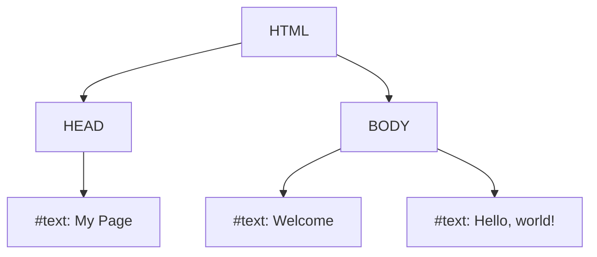

# The DOM and Browser APIs

## Introduction

When a web browser loads an HTML document, it creates a model of that document in memory. This model is called the **Document Object Model (DOM)**. The DOM represents the page as a tree-like structure of nodes and objects, where each node represents a part of the document (like an element, an attribute, or a piece of text).

JavaScript can interact with this DOM to dynamically change the content, structure, and style of a web page. This is the foundation of all modern, interactive websites.

## The DOM Tree

The browser parses the HTML and builds a tree structure.

```html
<html>
  <head>
    <title>My Page</title>
  </head>
  <body>
    <h1>Welcome</h1>
    <p>Hello, world!</p>
  </body>
</html>
```

This HTML would be represented by a DOM tree like this:



## Interacting with the DOM using JavaScript

JavaScript has access to a global `document` object, which is the entry point to the entire DOM.

### Selecting Elements

To modify an element, you first need to select it.
```javascript
// Select by ID (fastest)
const mainHeading = document.getElementById('main-title');

// Select the first element that matches a CSS selector
const firstParagraph = document.querySelector('p.intro');

// Select all elements that match a CSS selector
const allListItems = document.querySelectorAll('ul li');
```

### Modifying Elements

Once you have an element, you can change its properties.
```javascript
// Get a reference to an element
const heading = document.getElementById('main-title');

// Change its text content
heading.textContent = 'Welcome to the new page!';

// Change its style
heading.style.color = 'blue';
heading.style.fontSize = '24px';

// Add or remove CSS classes
heading.classList.add('highlight');
heading.classList.remove('old-class');

// Change its attributes
const link = document.querySelector('a');
link.setAttribute('href', 'https://www.new-url.com');
```

### Creating and Appending Elements

You can also create new elements from scratch and add them to the page.
```javascript
// 1. Create a new element
const newListItem = document.createElement('li');

// 2. Add content to it
newListItem.textContent = 'This is a new item.';

// 3. Find the parent element you want to add it to
const list = document.querySelector('ul');

// 4. Append the new element as a child
list.appendChild(newListItem);
```

### Handling Events

Interactivity is achieved by listening for events that happen on DOM elements.
```javascript
const myButton = document.getElementById('my-button');

// The addEventListener method is the standard way to handle events
myButton.addEventListener('click', () => {
    alert('Button was clicked!');
});

// You can listen for any kind of event
const input = document.querySelector('input');
input.addEventListener('keydown', (event) => {
    console.log(`Key pressed: ${event.key}`);
});
```

## Other Key Browser APIs

The browser provides many other powerful APIs beyond just the DOM.

*   **`window` Object**: The global object in browser JavaScript. It represents the browser window and provides access to things like `document`, `console`, `setTimeout`, and `localStorage`.
*   **Fetch API**: The modern standard for making network requests (e.g., to your backend API). It's a promise-based API.
    ```javascript
    fetch('https://api.example.com/data')
      .then(response => response.json())
      .then(data => console.log(data))
      .catch(error => console.error('Fetch failed:', error));
    ```
*   **Geolocation API**: Allows you to get the user's geographical position (with their permission).
    ```javascript
    navigator.geolocation.getCurrentPosition((position) => {
      console.log('Latitude:', position.coords.latitude);
    });
    ```
*   **Local Storage & Session Storage**: Web Storage APIs that allow you to store key-value pairs in the browser.
    *   `localStorage` persists data even after the browser is closed.
    *   `sessionStorage` clears the data when the browser tab is closed.

<div class="further-reading">
<h3>Further Reading</h3>
<ul>
  <li><a href="https://developer.mozilla.org/en-US/docs/Web/API/Document_Object_Model/Introduction" target="_blank" rel="noopener noreferrer">Introduction to the DOM (MDN)</a></li>
  <li><a href="https://javascript.info/document" target="_blank" rel="noopener noreferrer">The Document (javascript.info)</a></li>
  <li><a href="https://developer.mozilla.org/en-US/docs/Web/API" target="_blank" rel="noopener noreferrer">Web APIs (MDN)</a></li>
</ul>
</div>