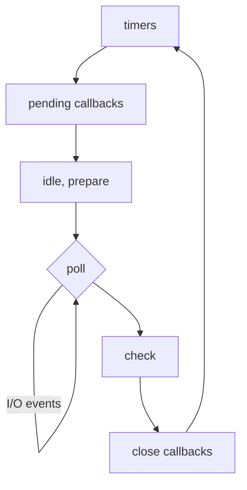

# The Node.js Event Loop (In-Depth)

While JavaScript itself is single-threaded, the Node.js runtime is not. It uses the **libuv** library to handle asynchronous I/O operations, which in turn can use a pool of threads. The **event loop** is the mechanism that allows Node.js to perform non-blocking I/O operations despite being single-threaded in its main execution.

The event loop's job is to orchestrate the execution of your code, collect and process I/O events, and execute queued callbacks. It's what makes Node.js so efficient for I/O-heavy applications.

## A High-Level View

The simplified model is often presented as:
1.  Code on the call stack is executed.
2.  When an async operation is encountered, it's handed off to Node.js APIs (libuv).
3.  When the operation completes, its callback is placed in a queue.
4.  The event loop takes callbacks from the queue and pushes them to the call stack when the stack is empty.

While this is a good starting point, the reality is more complex. The event loop is a loop that proceeds through several distinct **phases**, and there are different queues for different types of callbacks.

## The Phases of the Event Loop

Each turn of the event loop goes through the following phases in order:



1.  **`timers` Phase**:
    *   **What it does**: Executes callbacks scheduled by `setTimeout()` and `setInterval()`.
    *   The event loop enters this phase and checks if any timer has expired. If so, it runs the corresponding callback.

2.  **`pending callbacks` Phase**:
    *   **What it does**: Executes I/O callbacks that were deferred to the next loop iteration. For example, some system-level errors from TCP sockets are reported here.

3.  **`idle, prepare` Phase**:
    *   Used internally by Node.js.

4.  **`poll` Phase**: This is the most important phase.
    *   **What it does**:
        1.  Calculates how long it should block and wait for new I/O events.
        2.  Processes events in the poll queue.
    *   When the event loop enters the poll phase, if the poll queue is **not empty**, it will iterate through its queue of callbacks executing them synchronously until either the queue is exhausted, or the system-dependent hard limit is reached.
    *   If the poll queue is **empty**:
        *   If there are scripts that have been scheduled by `setImmediate()`, the event loop will end the poll phase and continue to the `check` phase to execute those scripts.
        *   If there are no scripts scheduled by `setImmediate()`, the event loop will wait for callbacks to be added to the queue, then execute them immediately.

5.  **`check` Phase**:
    *   **What it does**: Executes callbacks scheduled by `setImmediate()`. These callbacks are run immediately after the `poll` phase has completed.

6.  **`close callbacks` Phase**:
    *   **What it does**: Executes close event callbacks, such as `socket.on('close', ...)`.

## `process.nextTick()` and Microtasks

There are two special queues that are **not** part of the event loop's phases but are processed *within* them.

*   **`nextTick` Queue**: Callbacks scheduled with `process.nextTick()` are not part of the event loop proper. They are processed **after the current operation completes**, regardless of the current phase of the event loop. This means `nextTick` callbacks will always run before any other I/O callbacks or timers.

*   **Microtask Queue**: This queue is used for Promise callbacks (`.then()`, `.catch()`, `.finally()`). The microtask queue is also processed after the current operation, and importantly, **after the `nextTick` queue is empty**.

### Order of Operations

The order of execution for async operations is a common source of confusion.
1.  Synchronous code runs first.
2.  All `process.nextTick()` callbacks are executed.
3.  All Promise microtasks are executed.
4.  The event loop continues to its next phase.

```javascript
console.log('1. start');

setTimeout(() => { console.log('5. timeout'); }, 0);

setImmediate(() => { console.log('6. immediate'); });

Promise.resolve().then(() => { console.log('4. promise'); });

process.nextTick(() => { console.log('3. nextTick'); });

console.log('2. end');

// OUTPUT:
// 1. start
// 2. end
// 3. nextTick
// 4. promise
// 5. timeout
// 6. immediate
```
This output demonstrates that `nextTick` and Promise callbacks run before any of the event loop's phases (like timers or check) get a chance to execute.

Understanding these phases and queues is key to debugging complex asynchronous behavior in Node.js.

<div class="further-reading">
<h3>Further Reading</h3>
<ul>
  <li><a href="https://nodejs.org/en/docs/guides/event-loop-timers-and-nexttick/" target="_blank" rel="noopener noreferrer">The Node.js Event Loop, Timers, and `process.nextTick()`</a></li>
  <li><a href="https://www.youtube.com/watch?v=PNa9OMajw9w" target="_blank" rel="noopener noreferrer">What the heck is the event loop anyway? (A great talk, browser-focused but core concepts apply)</a></li>
</ul>
</div>