# Validation and Transformation

## Introduction

Before your application's business logic processes any data from an external source (like a user's API request), that data must be considered untrusted. Validation and transformation are the crucial first steps in handling this data safely and effectively.

-   **Validation**: The process of ensuring incoming data conforms to a set of predefined rules. This includes checking data types, formats, lengths, and ranges.
-   **Transformation** (or Sanitization): The process of cleaning, modifying, or converting data into a standardized and safe format. This can include trimming whitespace, converting a string to lowercase, or stripping malicious code.

These steps are a critical part of an application's security and data integrity.

## The Validation Flow

Validation should happen at the "edge" of your application, in the controller or middleware layer, before any business logic is executed. This "fail-fast" approach keeps your service layer clean and simple, as it can assume it's always receiving valid data.

```mermaid
graph TD
    A[Request with User Input] --> B{Controller};
    B --> C{Validation Schema};
    C -- "Rules: email is required, password min 8 chars" --> B;

    subgraph B
        direction LR
        B1(Validate Input) -- "Invalid" --> B2(Reject with 400 Error);
        B1 -- "Valid" --> B3(Pass Clean Data to Service);
    end

    B2 --> D[Response to Client];
    B3 --> E[Service Layer];

    style B1 fill:#1b263b,stroke:#00f5d4,stroke-width:2px;
    style B2 fill:#e76f5120,stroke:#e76f51;
```



## Code Examples: Schema-based Validation

Manually writing `if` statements to check every field is tedious and error-prone. It's best practice to use a dedicated library to define a declarative "schema" for your data.

<div class="code-tabs">
  <div class="tab-buttons">
    <button class="tab-button active" data-lang="nodejs">Node.js (Joi)</button>
    <button class="tab-button" data-lang="python">Python (Pydantic)</button>
    <button class="tab-button" data-lang="go">Go (validator)</button>
  </div>
  <div class="tab-content active" data-lang="nodejs">
<pre><code class="language-javascript">
const Joi = require('joi');

// 1. Define the schema
const registerSchema = Joi.object({
  email: Joi.string().email().lowercase().required(),
  password: Joi.string().min(8).required(),
  fullName: Joi.string().trim().optional(),
});

// 2. In an Express.js middleware or controller
async function validateRegistration(req, res, next) {
  try {
    // validateAsync both validates and transforms (e.g., lowercase, trim)
    const validatedData = await registerSchema.validateAsync(req.body);
    req.body = validatedData; // Replace raw body with cleaned data
    next();
  } catch (error) {
    // If validation fails, Joi throws an error
    res.status(400).json({ message: error.details[0].message });
  }
}
</code></pre>
  </div>
  <div class="tab-content" data-lang="python">
<pre><code class="language-python">
from pydantic import BaseModel, EmailStr, ValidationError, constr

# 1. Define the schema using Pydantic's BaseModel
class RegisterSchema(BaseModel):
    email: EmailStr # Pydantic handles email format validation
    password: constr(min_length=8) # Constrained string
    full_name: str | None = None # Optional field

# 2. In a Flask controller
@app.route('/register', methods=['POST'])
def register():
    try:
        # Pydantic automatically parses, validates, and transforms the request JSON
        validated_data = RegisterSchema(**request.get_json())
        
        # Access the validated and typed data
        print(f"Validated email: {validated_data.email}")
        
        # ... pass validated_data.dict() to service layer ...
        return jsonify({"status": "success"}), 201

    except ValidationError as e:
        # If validation fails, Pydantic raises an error
        return jsonify({"errors": e.errors()}), 400
</code></pre>
  </div>
  <div class="tab-content" data-lang="go">
<pre><code class="language-go">
package main

import (
	"encoding/json"
	"net/http"
	"github.com/go-playground/validator/v10"
)

var validate = validator.New()

// 1. Define the schema using a struct and validation tags
type RegisterSchema struct {
	Email    string `json:"email" validate:"required,email"`
	Password string `json:"password" validate:"required,min=8"`
	FullName string `json:"fullName" validate:"omitempty"` // omitempty means optional
}

// 2. In a net/http handler
func registerHandler(w http.ResponseWriter, r *http.Request) {
	var data RegisterSchema
	if err := json.NewDecoder(r.Body).Decode(&data); err != nil {
		http.Error(w, "Invalid JSON", http.StatusBadRequest)
		return
	}

	// 3. Validate the struct against the tags
	err := validate.Struct(data)
	if err != nil {
		// If validation fails, validator returns an error
		http.Error(w, "Validation failed: "+err.Error(), http.StatusBadRequest)
		return
	}

	// ... pass validated 'data' to service layer ...
	w.WriteHeader(http.StatusCreated)
}
</code></pre>
  </div>
</div>

### Custom Validation and Sanitization
Sometimes you need more complex validation that involves business logic (e.g., checking if a username is already taken). This often happens in the service layer.

For sanitization, especially to prevent Cross-Site Scripting (XSS), you might need to strip HTML tags from certain fields.

```javascript
// Example of a custom validation rule and sanitization in a Node.js service
const sanitizeHtml = require('sanitize-html');

class UserService {
    async createUser(data) {
        // 1. Custom Validation
        const existingUser = await db.users.findByUsername(data.username);
        if (existingUser) {
            throw new Error('Username is already taken.');
        }

        // 2. Sanitization to prevent Stored XSS
        // Allows some basic formatting but removes dangerous tags like <script>
        const cleanBio = sanitizeHtml(data.bio, {
            allowedTags: [ 'b', 'i', 'em', 'strong' ],
            allowedAttributes: {}
        });
        
        const userToSave = { ...data, bio: cleanBio };
        // ... save user to database ...
    }
}
```

## Best Practices
*   **Use a Schema-based Library**: Don't write validation logic by hand. It's repetitive and error-prone.
*   **Return Clear Error Messages**: When validation fails, the API response should clearly indicate which fields were invalid and why. A `400 Bad Request` is the appropriate HTTP status code.
*   **Validate at the Boundary**: Perform schema validation as soon as data enters your system. Perform business logic validation (like uniqueness checks) in your service layer.
*   **Sanitize for the Context**: How you sanitize data depends on how you will use it. Data for an HTML page needs HTML escaping/stripping, data for a SQL query needs parameterization.
*   **Fail Fast**: Reject invalid requests as early as possible.

<div class="further-reading">
<h3>Further Reading</h3>
<ul>
  <li><a href="https://joi.dev/" target="_blank" rel="noopener noreferrer">Joi Documentation (Node.js)</a></li>
  <li><a href="https://docs.pydantic.dev/" target="_blank" rel="noopener noreferrer">Pydantic Documentation (Python)</a></li>
  <li><a href="https://github.com/go-playground/validator" target="_blank" rel="noopener noreferrer">go-playground/validator (Go)</a></li>
  <li><a href="https://cheatsheetseries.owasp.org/cheatsheets/Input_Validation_Cheat_Sheet.html" target="_blank" rel="noopener noreferrer">OWASP Input Validation Cheat Sheet</a></li>
</ul>
</div>