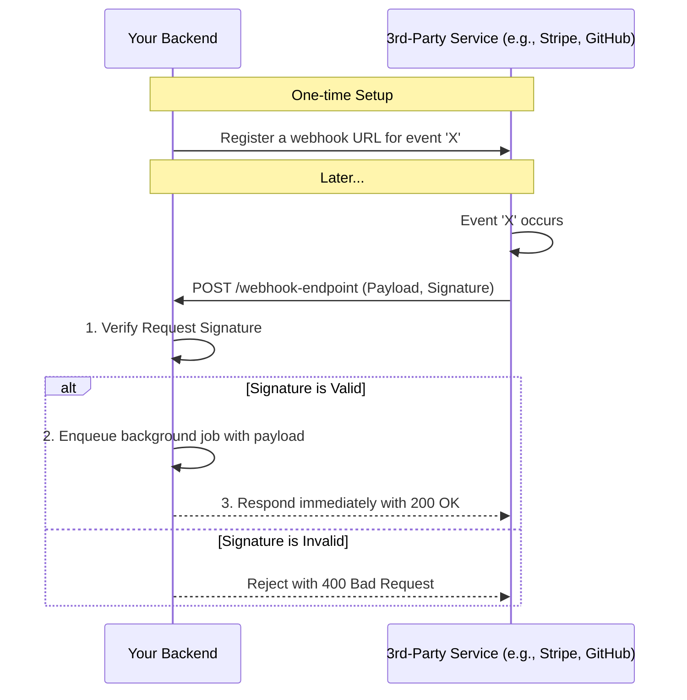

# Webhooks

## Introduction

Webhooks are a mechanism for enabling real-time, event-driven communication between different web applications. They are essentially user-defined HTTP callbacks. Instead of you repeatedly asking an application for new information (a process known as "polling"), the application tells you about new information as soon as it happens.

This "push" model is far more efficient than a "pull" model (polling). Polling can be wasteful, as many requests might return no new data, and it introduces delays, as you only find out about new events when you next ask. Webhooks provide immediate notifications.

## Core Concepts

### How Webhooks Work

1.  **You Register a URL**: In the user interface or API of a third-party service (the "provider"), you register a URL that you control. This URL is the "webhook endpoint" on your backend application. You also subscribe to specific events (e.g., `payment.succeeded`, `repo.push`).
2.  **An Event Occurs**: Something happens in the provider's system that you subscribed to.
3.  **The Provider Sends an HTTP Request**: The provider's server automatically makes an HTTP `POST` request to the URL you registered. The body of this request contains a payload (usually JSON) with details about the event.
4.  **Your Backend Receives the Request**: Your webhook endpoint receives this `POST` request, verifies it, and triggers business logic.
5.  **Your Backend Responds Immediately**: Your endpoint should respond quickly with a `2xx` status code (e.g., `200 OK`) to acknowledge receipt.

### Webhook Flow Diagram

## Security: Verifying Signatures

Since your webhook endpoint is a publicly accessible URL, you must secure it. Anyone could potentially send a fake request to your endpoint, pretending to be the provider. The standard way to secure webhooks is by **verifying the request signature**.

1.  When you set up the webhook, the provider gives you a secret key. You store this securely on your backend.
2.  With every webhook it sends, the provider creates a "signature" by hashing the request payload using the secret key (typically with an HMAC-SHA256 algorithm).
3.  This signature is included in an HTTP header (e.g., `Stripe-Signature` or `X-Hub-Signature-256`).
4.  When your endpoint receives the request, you must perform the *exact same* hashing computation on the raw request body.
5.  If the signature you calculate matches the one in the header, the request is authentic. If not, you must reject it.

**It is absolutely critical to perform this signature verification for every incoming webhook request.**

## Code Examples: Building a Webhook Listener

Here are practical examples of a secure webhook endpoint that verifies a GitHub webhook signature.

  
