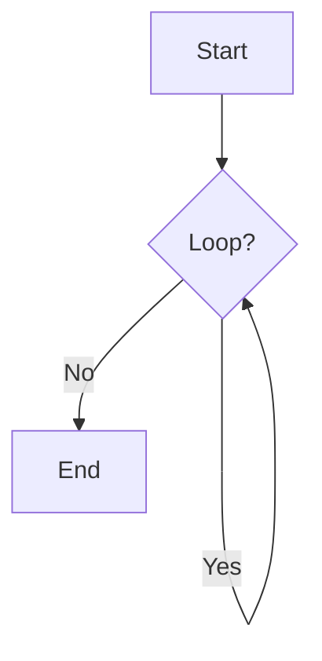
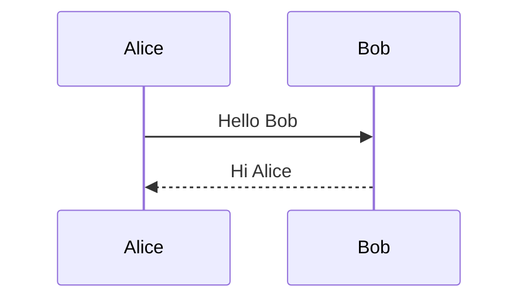
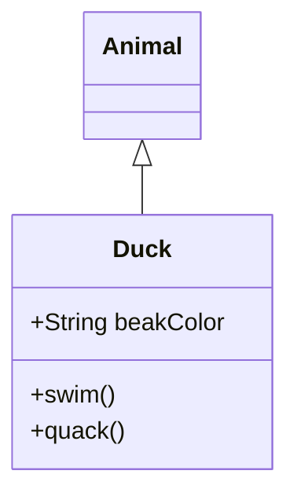
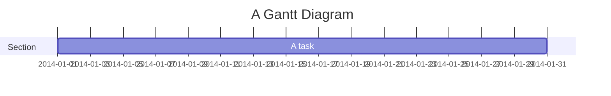
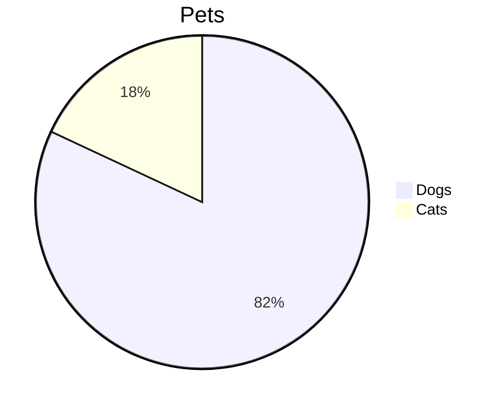

# Diagrams & Visuals

While not native Markdown, many platforms support diagram syntax via libraries like Mermaid.js.

## Mermaid Code Blocks
Mark a code block with `mermaid`.

### Flowchart


### Sequence Diagram


### Class Diagram


### Gantt Chart


### Pie Chart


## ASCII Art
The "old school" way. Just use a standard code block.

```text
+---------+
|   Box   |
+---------+
```
